# 📊 Modelo de Base de Datos - Sistema de Gestión de Jugadores

## 🏗️ Diagrama de Relaciones (Vista General)

```mermaid
erDiagram
    USUARIO {
        bigint id PK
        varchar username
        varchar password
        varchar nombre
        varchar apellido
        varchar email
        varchar perfil
        boolean enabled
    }
    
    EQUIPO {
        bigint equipo_id PK
        varchar nombre
        integer duracion_partido
        varchar tipo_futbol
        bigint usuario_id FK
    }
    
    JUGADOR {
        bigint id PK
        varchar nombre
        varchar apellido
        varchar posicion
        bigint equipo_id FK
    }
    
    PARTIDO {
        bigint id PK
        bigint equipo_id FK
        datetime fecha
        integer duracion
        varchar titulo
        boolean partido_activo
        varchar resultado
        integer goles_equipo
        integer goles_rival
    }
    
    EVENTO_JUGADOR {
        bigint id PK
        bigint jugador_id FK
        bigint partido_id FK
        varchar tipo_evento
        integer minuto
        boolean fue_titular
        integer minutos_jugados
        bigint jugador_sale_id
        bigint jugador_entra_id
    }
    
    ESTADISTICAS_JUGADOR {
        bigint id PK
        bigint jugador_id FK
        varchar temporada
        integer total_goles
        integer total_asistencias
        integer tarjetas_amarillas
        integer tarjetas_rojas
        double rating
        datetime ultima_actualizacion
    }
    
    ESTADISTICAS_EQUIPO {
        bigint id PK
        bigint equipo_id FK
        varchar temporada
        integer partidos_jugados
        integer partidos_ganados
        integer goles_favor
        integer goles_contra
        integer puntos
        datetime ultima_actualizacion
    }
    
    ROL {
        bigint rol_id PK
        varchar rol_nombre
    }
    
    USUARIO_ROL {
        bigint usuario_rol_id PK
        bigint usuario_id FK
        bigint rol_rol_id FK
    }
    
    PARTIDO_TITULARES {
        bigint partido_id FK
        bigint jugador_id
    }
    
    PARTIDO_SUPLENTES {
        bigint partido_id FK
        bigint jugador_id
    }

    USUARIO ||--o{ EQUIPO : "posee"
    EQUIPO ||--o{ JUGADOR : "tiene"
    EQUIPO ||--o{ PARTIDO : "juega"
    EQUIPO ||--o{ ESTADISTICAS_EQUIPO : "genera"
    JUGADOR ||--o{ EVENTO_JUGADOR : "participa"
    JUGADOR ||--o{ ESTADISTICAS_JUGADOR : "acumula"
    PARTIDO ||--o{ EVENTO_JUGADOR : "contiene"
    PARTIDO ||--o{ PARTIDO_TITULARES : "define"
    PARTIDO ||--o{ PARTIDO_SUPLENTES : "define"
    USUARIO ||--o{ USUARIO_ROL : "tiene"
    ROL ||--o{ USUARIO_ROL : "asigna"
```



## 🔗 Flujo de Relaciones Principales

### 📋 Jerarquía de Datos
```
👤 USUARIO
├── 🏈 EQUIPO(S)
│   ├── 🏃‍♂️ JUGADOR(ES)
│   │   ├── 📝 EVENTO_JUGADOR(ES)
│   │   └── 📊 ESTADISTICAS_JUGADOR
│   ├── ⚽ PARTIDO(S)
│   │   ├── 👥 TITULARES
│   │   ├── 🪑 SUPLENTES
│   │   └── 📝 EVENTOS
│   └── 📈 ESTADISTICAS_EQUIPO
└── 🎭 ROL(ES) via USUARIO_ROL
```

### 🎯 Cardinalidades Principales
- **Usuario → Equipo**: 1:N (Un usuario puede gestionar varios equipos)
- **Equipo → Jugador**: 1:N (Un equipo tiene varios jugadores)
- **Equipo → Partido**: 1:N (Un equipo juega varios partidos)
- **Partido → EventoJugador**: 1:N (Un partido tiene varios eventos)
- **Jugador → EventoJugador**: 1:N (Un jugador participa en varios eventos)
- **Jugador → EstadisticasJugador**: 1:N (Un jugador por temporada)
- **Equipo → EstadisticasEquipo**: 1:N (Un equipo por temporada)

---

## 🔍 Análisis de Defectos y Mejoras

### ❌ **DEFECTOS CRÍTICOS ENCONTRADOS**

#### 1. **🚨 Inconsistencia en EventoJugador**
```java
@JoinColumn(name = "jugador_id", nullable = true)  // ❌ PROBLEMA
```
**Problema**: `jugador_id` es nullable, pero permite eventos huérfanos
**Impacto**: Eventos sin jugador asociado pueden corromper estadísticas
**Solución**: 
```java
@JoinColumn(name = "jugador_id", nullable = false)
// O crear campo adicional para eventos del rival
```

#### 2. **🚨 Falta de Validación en Posiciones**
**Problema**: Las posiciones están hardcodeadas en frontend pero no validadas en backend
```typescript
posiciones = ['POR', 'LD', 'LI', 'CEN', 'MC', 'MCO', 'EXD', 'EXIZ', 'DC'];
```
**Solución**: Crear enum en Java
```java
public enum Posicion {
    PORTERO("POR"), LATERAL_DERECHO("LD"), LATERAL_IZQUIERDO("LI"),
    CENTRAL("CEN"), MEDIOCENTRO("MC"), MEDIOCENTRO_OFENSIVO("MCO"),
    EXTREMO_DERECHO("EXD"), EXTREMO_IZQUIERDO("EXIZ"), DELANTERO_CENTRO("DC");
}
```

#### 3. **🚨 Sin Validación de Integridad en Titulares/Suplentes**
**Problema**: Un jugador puede estar simultáneamente en titulares y suplentes
**Impacto**: Inconsistencias en formaciones y estadísticas
**Solución**: Agregar constraint o validación a nivel aplicación

### ⚠️ **DEFECTOS MENORES**

#### 4. **Falta de Auditoría**
**Problema**: No hay campos de auditoría (created_at, updated_at, created_by)
**Impacto**: Imposible rastrear cambios históricos
**Solución**: Implementar @CreationTimestamp, @UpdateTimestamp

#### 5. **Validación de Minutos Insuficiente**
**Problema**: No hay validación de rango para minutos en EventoJugador
**Solución**: 
```java
@Column(nullable = false)
@Min(0) @Max(120) // Considerando prórrogas
private Integer minuto;
```

#### 6. **Tipo de Fútbol Hardcodeado**
**Problema**: `tipo_futbol` es String sin validación
**Solución**: Convertir a Enum
```java
public enum TipoFutbol {
    FUTBOL_7("FUTBOL_7", 7, 50),   // duración típica 50min
    FUTBOL_11("FUTBOL_11", 11, 90); // duración típica 90min
}
```

#### 7. **Falta de Validación de Duración Coherente**
**Problema**: No valida que la duración sea coherente con el tipo de fútbol
**Solución**: Validación cross-field

### 🎯 **MEJORAS SUGERIDAS**

#### 8. **Separar Tablas de Alineación**
**Actual**: ElementCollection para titulares/suplentes
**Mejora**: Crear entidad `Alineacion` para mejor control
```java
@Entity
public class Alineacion {
    @Id @GeneratedValue
    private Long id;
    
    @ManyToOne
    private Partido partido;
    
    @ManyToOne 
    private Jugador jugador;
    
    @Enumerated(EnumType.STRING)
    private TipoParticipacion tipo; // TITULAR, SUPLENTE
    
    private Integer minutoIngreso;
    private Integer minutoSalida;
}
```

#### 9. **Implementar Soft Delete**
**Problema**: Eliminación física puede romper integridad histórica
**Solución**: Campo `deleted_at` en entidades principales

#### 10. **Optimizar Consultas de Estadísticas**
**Mejora**: Agregar más índices compuestos
```java
@Index(name = "idx_jugador_temporada_fecha", 
       columnList = "jugador_id, temporada, ultima_actualizacion")
```

#### 11. **Validación de Reglas de Negocio**
- Máximo jugadores por equipo según tipo de fútbol
- Validar que eventos ocurran dentro de la duración del partido
- Constrains para evitar estadísticas negativas

#### 12. **Versionado de Datos**
```java
@Entity
public class EstadisticasJugadorHistorial {
    // Para mantener historial de cambios en estadísticas
    @ManyToOne
    private EstadisticasJugador estadistica;
    
    private LocalDateTime fechaCambio;
    private String motivoCambio;
    private String valorAnterior;
    private String valorNuevo;
}
```

---

## 🏆 **PRIORIDADES DE IMPLEMENTACIÓN**

### 🔥 **CRÍTICAS (Inmediatas)**
1. ✅ Corregir nullable en EventoJugador.jugador_id
2. ✅ Implementar enum para Posicion
3. ✅ Validar integridad titulares/suplentes

### ⭐ **ALTAS (Corto plazo)**
1. ✅ Agregar auditoría básica (timestamps)
2. ✅ Implementar enum TipoFutbol
3. ✅ Validaciones de rango para minutos

### 📈 **MEDIAS (Mediano plazo)**
1. ✅ Refactor a entidad Alineacion
2. ✅ Implementar soft delete
3. ✅ Optimización de índices

### 🔮 **BAJAS (Largo plazo)**
1. ✅ Versionado completo de datos
2. ✅ Sistema de auditoría avanzado
3. ✅ Métricas avanzadas de performance

---

## 💡 **CONCLUSIONES**

El modelo actual es **funcionalmente sólido** pero requiere **mejoras en consistencia y validaciones**. Los principales riesgos están en:

1. **Integridad de datos** (nullable inadecuado)
2. **Validaciones de negocio** faltantes
3. **Auditabilidad** limitada

Implementar las correcciones críticas mejoraría significativamente la robustez del sistema manteniendo la funcionalidad existente.