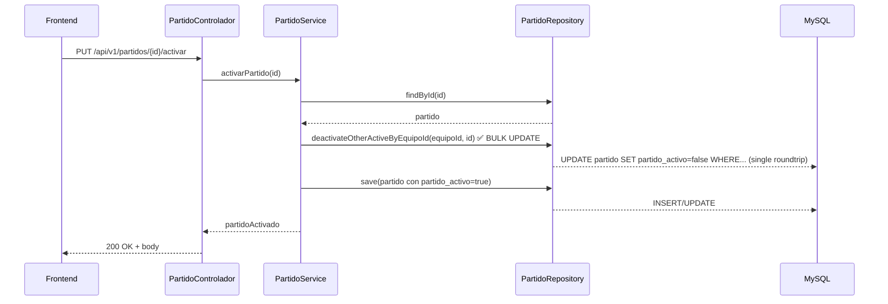

**Proyecto: Gestion Jugadores FutbolBase**

Propósito: documentación orientada a programadores que describe la arquitectura del backend (Spring Boot) y frontend (Angular), flujos clave, modelo de datos resumido, **nuevas funciones implementadas**, análisis de mejoras y recomendaciones prácticas para optimización.

**Última actualización:** Enero 8, 2026

**Cambios recientes implementados:**
- ✅ Bulk deactivate de partidos con @Modifying JPQL + @Transactional.
- ✅ Listado de jugadores por usuario autenticado (endpoint `/api/v1/jugadores` sin parámetros).
- ✅ Gestión de partidos en componente separado con selector de equipo.
- ✅ Simplificación del navbar (solo título + sesión).
- ✅ Redirección automática de `/` a `/admin`.
- ✅ Fixes de binding en selects (uso de `[ngValue]` y coerción numérica).
- ✅ **Integración de Swagger UI con SpringDoc OpenAPI** para documentación interactiva de API.
- ✅ **Arquitectura modular con BaseController y BaseService** para reducir código repetitivo.
- ✅ **Migración a controladores V2** (JugadorControladorV2, PartidoControladorV2, EventoJugadorControladorV2).
- ✅ **Tests unitarios** para los controladores V2 con MockMvc y Mockito.
- ✅ **Spring Security Test** integrado para pruebas con autenticación mockeada.
- ✅ **Sistema de Estadísticas Completo** (EstadisticasJugador, EstadisticasEquipo, 11 endpoints REST).
- ✅ **Actualización automática de estadísticas** al finalizar partidos.
- ✅ **Marcador en tiempo real** con golesEquipo, golesRival y resultado en partido-modo.
- ✅ **Eventos ampliados** (Gol, Asistencia, Tarjetas, Pase Clave, Robo, Tiro a Puerta).
- ✅ **Dashboard de Estadísticas** con selector de equipos y visualización de métricas.
- ✅ **Estadísticas de paradas para porteros** con campo exclusivo y botón en modo partido.
- ✅ **Eliminación en cascada** con @OnDelete en relaciones EventoJugador y EstadisticasJugador.
- ✅ **Sistema Titular/Suplente** con selección de alineación, sustituciones ilimitadas (fútbol base).
- ✅ **Fútbol 7 y Fútbol 11** con campo `tipoFutbol` en Equipo (7 u 11 titulares).
- ✅ **Cálculo automático de minutos jugados** basado en sustituciones (jugadorSaleId/jugadorEntraId).
- ✅ **Resultado automático** (VICTORIA/DERROTA/EMPATE) al finalizar partido según goles.
- ✅ **Componente seleccion-alineacion** con UI de 3 columnas (Disponibles/Titulares/Suplentes).
- ✅ **Sistema de sustituciones en vivo** con modal y actualización dinámica de listas.
- ✅ **CORS explícito** con CorsConfigurationSource para localhost:4200.
- ✅ **Endpoint GET /equipos/{id}** para obtener equipo individual.
- ✅ **Endpoint PUT /partidos/{id}/alineacion** para actualizar titulares y suplentes.
- ✅ **Sistema completo de Pases Clave** con análisis temporal, estado del marcador y perfiles de jugadores.
- ✅ **11 campos de pases clave** en EstadisticasJugador (distribución temporal + estado + métrica P90).
- ✅ **12 campos de pases clave** en EstadisticasEquipo (11 analíticos + mayorPasador).
- ✅ **Evento gol_rival** registrable desde frontend para seguimiento correcto del marcador.
- ✅ **EventoJugador.jugador_id nullable** para permitir goles del rival sin asociar a jugador del equipo.
- ✅ **determinarEstadoMarcadorEnMinuto()** con reconstrucción cronológica usando Event ID.
- ✅ **Distribución temporal de pases clave** en 6 intervalos de 15 minutos (0-15, 16-30, 31-45, 46-60, 61-75, 76-90).
- ✅ **Análisis por estado del marcador** (GANANDO, EMPATANDO, PERDIENDO) en momento del pase clave.
- ✅ **Mayor Pasador** automático: jugador con más pases clave + contador.
- ✅ **Perfiles de Jugadores** (Remontada, Inconsistente, Líder, Equilibrado, Regular) basados en distribución de pases.
- ✅ **UI mejorada** con cajas coloreadas por estado y cards de perfiles en estadisticas-generales.
- ✅ **Repository method** findByJugador_Equipo_IdAndTemporada() en EstadisticasJugadorRepository.

---

**Contenido**

- **Resumen Rápido**: descripción del stack y responsabilidades.
- **Backend**: diagramas y flujo de activación de partido; estructura de paquetes; endpoints principales; cambios recientes; análisis de mejoras.
- **Frontend**: estructura de componentes, servicios, rutas, cambios UI recientes y flujo de inicio de partido.
- **Mejoras Prioritarias (Backend)**: lista con justificación, impacto y snippets de ejemplo.
- **Recomendaciones Adicionales**: seguridad, testing, escalabilidad y mantenibilidad.

---

**Resumen Rápido**

- Backend: Java 11/17 (según pom), Spring Boot (servicios, repositorios JPA/Hibernate), seguridad JWT.
- Frontend: Angular 17+, TypeScript, Bootstrap 5 / Angular Material.
- BD: MySQL (según properties), JPA/Hibernate para persistencia.

**Convenciones**
- Entidades: `com.gestion.jugadores.modelo`.
- Controladores: `com.gestion.jugadores.controlador`.
- Servicios: `com.gestion.jugadores.servicios` (interfaces) y `servicios.impl` (implementaciones).

---

**Backend — Arquitectura y Flujos**

Paquetes clave (resumen):

- `controlador` — REST controllers
  - **Controllers V2 (activos):** JugadorControladorV2, PartidoControladorV2, EventoJugadorControladorV2
  - **Controllers V1 (deshabilitados):** JugadorControlador, PartidoControlador, EventoJugadorControlador
  - **Otros:** AuthenticationController, EquipoController, UsuarioController
  - **BaseController:** Clase genérica abstracta con operaciones CRUD reutilizables
- `servicios` — interfaces de negocio
  - **BaseService:** Interface genérica con operaciones CRUD estándar
- `servicios.impl` — implementaciones
**Autenticación y usuarios:**
- POST `/api/v1/auth/login` — autenticación (JWT)
- GET `/usuarios/me` — obtener perfil del usuario autenticado

**Equipos:**
- GET `/equipos/me` — obtener equipos del usuario autenticado
- POST `/equipos/registrar` — registrar equipo para usuario autenticado

**Jugadores (JugadorControladorV2):**
- GET `/api/v1/jugadores` — listar jugadores del usuario autenticado (sin params) o por equipo (param `equipoId`)
- GET `/api/v1/jugadores/{id}` — obtener jugador por ID
- GET `/api/v1/jugadores/equipo/{id}` — obtener jugadores de un equipo específico
- POST `/api/v1/jugadores` — crear nuevo jugador
- PUT `/api/v1/jugadores/{id}` — actualizar jugador
- DELETE `/api/v1/jugadores/{id}` — eliminar jugador

**Partidos (PartidoControladorV2):**
- GET `/api/v1/partidos/{id}` — obtener partido por ID
- GET `/api/v1/partidos/equipo/{equipoId}` — listar partidos de un equipo
- GET `/api/v1/partidos/activos/equipo/{equipoId}` — listar solo partidos activos de un equipo
- POST `/api/v1/partidos` — crear nuevo partido
- PUT `/api/v1/partidos/{id}` — actualizar partido
- PUT `/api/v1/partidos/{id}/activar` — activar un partido (desactiva otros activos del mismo equipo vía bulk update)
- PUT `/api/v1/partidos/{id}/desactivar` — desactivar partido
- DELETE `/api/v1/partidos/{id}` — eliminar partido

**Eventos (EventoJugadorControladorV2):**
- GET `/api/v1/eventos/{id}` — obtener evento por ID
- GET `/api/v1/eventos/jugador/{jugadorId}` — obtener eventos de un jugador
- GET `/api/v1/eventos/partido/{partidoId}` — obtener eventos de un partido
- POST `/api/v1/eventos` — registrar nuevo evento
- PUT `/api/v1/eventos/{id}` — actualizar evento
- DELETE `/api/v1/eventos/{id}` — eliminar evento

**Estadísticas (EstadisticasControlador):**
- GET `/api/v1/estadisticas/jugador/{id}` — obtener estadísticas completas de un jugador
- GET `/api/v1/estadisticas/jugador/{id}/resumen` — resumen de estadísticas del jugador
- GET `/api/v1/estadisticas/equipo/{id}` — obtener todas las estadísticas del equipo
- GET `/api/v1/estadisticas/equipo/{id}/resumen` — resumen estadístico del equipo
- GET `/api/v1/estadisticas/equipo/{id}/jugadores` — estadísticas de todos los jugadores del equipo
- GET `/api/v1/estadisticas/equipo/{id}/top-goleadores` — top 5 goleadores del equipo
- GET `/api/v1/estadisticas/equipo/{id}/top-asistentes` — top 5 asistentes del equipo
- GET `/api/v1/estadisticas/equipo/{id}/mejor-rating` — top 5 con mejor rating del equipo
- PUT `/api/v1/estadisticas/jugador/{id}/actualizar` — actualizar estadísticas de un jugador
- PUT `/api/v1/estadisticas/equipo/{id}/actualizar` — actualizar estadísticas de un equipo
- PUT `/api/v1/estadisticas/actualizar-todas` — actualizar todas las estadísticas del sistema

**Documentación API:**
- GET `/swagger-ui.html` — Interfaz interactiva de Swagger UI
- GET `/v3/api-docs` — Especificación OpenAPI en formato JSON
- POST `/api/v1/auth/login` — autenticación (JWT)
- GET `/api/v1/jugadores` — listar jugadores del usuario autenticado (sin params) o por equipo (param `equipoId`)
- GET `/api/v1/partidos/equipo/{equipoId}` — listar partidos de un equipo
- PUT `/api/v1/partidos/{id}/activar` — activar un partido (desactiva otros activos del mismo equipo vía bulk update)
- PUT `/api/v1/partidos/{id}/desactivar` — desactivar partido
- GET `/equipos/me` — obtener equipos del usuario autenticado
- POST `/equipos/registrar` — registrar equipo para usuario autenticado
- GET `/usuarios/me` — obtener perfil del usuario autenticado

Flujo crítico: Activar Partido (resumen)

**Estado actual (Implementado ✅):**

El flujo de activación de partidos ha sido optimizado con un bulk update JPQL mediante `@Modifying`:



**Ventajas de la implementación actual:**
- Operación atómica dentro de `@Transactional` en el service.
- Una única sentencia UPDATE para desactivar todos → menor latencia y menor riesgo de estados intermedios.
- Cumple el requisito de garantizar máximo 1 partido activo por equipo.

**Notas:**
- La transacción en `PartidoServiceImpl.activarPartido()` asegura que ambas operaciones (deactivate bulk + activate) se ejecutan en la misma transacción DB.

Esquema de entidad (resumen):

- `Partido` { id, equipo (ManyToOne Equipo), fecha, partidoActivo(Boolean), duracion, ... }
- `Equipo` { id, nombre, usuario (ManyToOne Usuario), jugadores(List<Jugador>), duracionPartido }
- `Jugador` { id, nombre, apellido, posicion, equipo (ManyToOne Equipo) }
- `EventoJugador` { id, jugadorId, partidoId, tipoEvento, minuto }

---

**Frontend — Arquitectura y Flujos**

Estructura principal:

- `app/` contiene componentes y servicios.
- **Componentes clave**: 
  - `partido-modo.component` (Iniciar/Controlar partido; flujo 2-fases: seleccionar → jugar).
  - `gestionar-partidos.component` (selector equipo + tabla partidos activos/inactivos).
  - `lista-jugadores.component` (listado con filtro "Todos" o por equipo; uso de `[ngValue]` y `ngModel`).
  - `historial-partidos.component`, `crear-equipo`, `registrar-jugador`, `jugador-detalles`.
  - `navbar.component` (simplificado: solo título + botón home + sesión).
  - `sidebar.component` (menú principal con todas las opciones de navegación).
- **Servicios**: `partido.service.ts`, `equipo.service.ts`, `jugador.service.ts` (con métodos para filtrado por usuario), `evento-jugador.service.ts`, `user.service.ts`.
- **Routing centralizado** en `app-routing.module.ts`:
  - Ruta raíz (`''`) redirige automáticamente a `/admin`.
  - Rutas autenticadas: `/admin`, `/iniciar-partido`, `/gestionar-partidos`, `/lista-jugadores`, etc.

**Cambios UI recientes implementados:**
- Eliminación de enlaces redundantes en navbar (solo sidebar gestiona navegación).
- Botón "home" en navbar para ir directamente a `/admin`.
- Selectores con `[ngValue]` para mantener tipos de datos (evita strings donde se esperan números).
- Coerción numérica en componentes (ej. `lista-jugadores.component.ts` convierte `equipoId` a Number).

Flujo crítico: Iniciar Partido (Frontend)

```mermaid
flowchart TD
  A[Usuario navega a Iniciar Partido] --> B[Componente carga equipos via equipo.service.obtenerEquiposMe]
  B --> C[Selector de equipo con ngModel/ngValue]
  C --> D[Cambio de equipo => obtenerJugadoresDelEquipo]
  D --> E{¿Usuarios autenticado?}
  E -->|Sí| F[Se listan jugadores del equipo]
  E -->|No| G[Redirect a login]
  F --> H[Selector para seleccionar Partido inactivo]
  H --> I[Botón Iniciar Partido => PUT /partidos/{id}/activar]
  I --> J{¿Éxito?}
  J -->|Sí| K[Frontend carga en Modo Juego]
  J -->|No| L[Mostrar error, permitir reintentar]
  K --> M[Usuario registra eventos: gol, asistencia, etc.]
  M --> N{Finalizar?}
  N -->|Sí| O[PUT /partidos/{id}/desactivar]
  O --> P[Volver a lista de partidos]
  N -->|No| M
```

**Servicios y acceso a datos:**
- `JugadorService.obtenerJugadoresPorUsuario()`: GET `/api/v1/jugadores` (sin parámetros, usa Authentication).
- `JugadorService.obtenerJugadoresPorEquipoId(equipoId)`: GET `/api/v1/jugadores?equipoId={id}`.
- Ambos métodos extraen token de `localStorage` y lo pasan en headers Authorization.

**Binding y coerción:**
- Los selects ahora usan `[(ngModel)]="selectedObject"` + `[ngValue]="objeto"` en options para evitar conversiones string accidentales.
- Ejemplo: `lista-jugadores.component.ts` convierte `this.equipoId` a Number con `Number(this.equipoId)` antes de comparaciones.

---

**Sistema Titular/Suplente y Sustituciones**

**Implementado:** Enero 8, 2026

### Descripción General

Sistema completo para gestionar titulares y suplentes en partidos de fútbol base, con soporte para Fútbol 7 (7 titulares) y Fútbol 11 (11 titulares). Incluye selección de alineación previa al partido, sustituciones ilimitadas durante el partido, y cálculo automático de minutos jugados.

### Backend

**Modelo de Datos:**

**Equipo:**
```java
@Column(name = "tipo_futbol", length = 20, nullable = false, columnDefinition = "varchar(20) default 'FUTBOL_11'")
private String tipoFutbol = "FUTBOL_11"; // FUTBOL_7 o FUTBOL_11
```

**Partido:**
```java
@ElementCollection(fetch = FetchType.LAZY)
@CollectionTable(name = "partido_titulares", joinColumns = @JoinColumn(name = "partido_id"))
@Column(name = "jugador_id")
private List<Long> titulares;

@ElementCollection(fetch = FetchType.LAZY)
@CollectionTable(name = "partido_suplentes", joinColumns = @JoinColumn(name = "partido_id"))
@Column(name = "jugador_id")
private List<Long> suplentes;
```

**EventoJugador (para sustituciones):**
```java
@Column(name = "jugador_sale_id")
private Long jugadorSaleId; // ID del jugador que sale

@Column(name = "jugador_entra_id")
private Long jugadorEntraId; // ID del jugador que entra
```

**Endpoints:**

1. **GET `/equipos/{id}`** - Obtener equipo por ID (incluye tipoFutbol)
2. **PUT `/partidos/{id}/alineacion`** - Actualizar titulares y suplentes
   ```json
   {
     "titulares": [1, 2, 3, ...],
     "suplentes": [10, 11, ...]
   }
   ```

**Cálculo de Minutos Jugados:**

Implementado en `PartidoServiceImpl.calcularMinutosJugados()`, llamado automáticamente en `desactivarPartido()`:

```java
// Titulares empiezan con duracionPartido minutos
for (Long jugadorId : titularesIds) {
    minutosMap.put(jugadorId, duracionPartido);
    fueTitularMap.put(jugadorId, true);
}

// Procesar sustituciones
for (EventoJugador sustitucion : sustituciones) {
    Long jugadorSale = sustitucion.getJugadorSaleId();
    Long jugadorEntra = sustitucion.getJugadorEntraId();
    Integer minuto = sustitucion.getMinuto();
    
    if (jugadorSale != null) {
        minutosMap.put(jugadorSale, minuto); // Solo jugó hasta el cambio
    }
    if (jugadorEntra != null) {
        minutosMap.put(jugadorEntra, duracionPartido - minuto); // Desde cambio hasta final
    }
}
```

**Cálculo Automático de Resultado:**

Al desactivar o actualizar partido con `golesEquipo` y `golesRival` definidos:

```java
if (golesEquipo > golesRival) {
    partido.setResultado("VICTORIA");
} else if (golesEquipo < golesRival) {
    partido.setResultado("DERROTA");
} else {
    partido.setResultado("EMPATE");
}
```

### Frontend

**Flujo Completo:**

1. **Crear Partido** → Redirige a selección de alineación
2. **Selección de Alineación** (componente `seleccion-alineacion`) → Guarda titulares/suplentes
3. **Iniciar Partido** → Carga titulares y suplentes desde partido guardado
4. **Durante Partido** → Sustituciones actualizan listas localmente sin recargar del servidor

**Componente: seleccion-alineacion**

UI de 3 columnas (Disponibles/Titulares/Suplentes) con drag-and-drop visual:

```typescript
agregarTitular(jugador: Jugador): void {
  if (this.titulares.length >= this.numeroTitulares) {
    this.snackBar.open(`Solo puedes seleccionar ${this.numeroTitulares} titulares`);
    return;
  }
  this.jugadoresDisponibles.splice(index, 1);
  this.titulares.push(jugador);
}

confirmarAlineacion(): void {
  const titularesIds = this.titulares.map(j => j.id);
  const suplentesIds = this.suplentes.map(j => j.id);
  
  this.partidoService.actualizarAlineacion(this.partidoId, titularesIds, suplentesIds)
    .subscribe(() => {
      this.router.navigate(['/modo-partido', this.equipoId]);
    });
}
```

**Componente: partido-modo (sustituciones)**

```typescript
// Al iniciar partido
iniciarPartido(): void {
  this.partidoService.activarPartido(this.partidoSeleccionado.id).subscribe(
    (response) => {
      this.partidoActivo = response;
      this.cargarJugadores(); // Carga titulares
      this.cargarSuplentes(); // Carga suplentes (solo una vez)
    }
  );
}

// Cargar titulares
cargarJugadores(): void {
  this.jugadorService.obtenerJugadoresPorEquipoId(this.equipoSeleccionado.id)
    .subscribe((jugadores) => {
      if (this.partidoActivo?.titulares) {
        this.jugadores = jugadores.filter(j => 
          this.partidoActivo.titulares.includes(j.id)
        );
      }
    });
}

// Cargar suplentes (solo al inicio)
cargarSuplentes(): void {
  this.jugadorService.obtenerJugadoresPorEquipoId(this.equipoSeleccionado.id)
    .subscribe((jugadores) => {
      if (this.partidoActivo?.suplentes) {
        this.suplentes = jugadores.filter(j => 
          this.partidoActivo.suplentes.includes(j.id)
        );
      }
    });
}

// Sustitución (NO recarga desde servidor)
realizarSustitucion(jugadorEntra: any): void {
  const evento = {
    jugadorId: jugadorEntra.id,
    partidoId: this.partidoActivo.id,
    tipoEvento: 'sustitucion',
    minuto: Math.floor(this.tiempoRestante / 60),
    jugadorSaleId: this.jugadorASalir.id,
    jugadorEntraId: jugadorEntra.id
  };

  this.eventoService.registrarEvento(evento).subscribe(() => {
    // Actualizar listas localmente
    const indiceTitular = this.jugadores.findIndex(j => j.id === this.jugadorASalir.id);
    if (indiceTitular > -1) {
      this.jugadores.splice(indiceTitular, 1);
      this.suplentes.push(this.jugadorASalir);
    }

    const indiceSuplente = this.suplentes.findIndex(j => j.id === jugadorEntra.id);
    if (indiceSuplente > -1) {
      this.suplentes.splice(indiceSuplente, 1);
      this.jugadores.push(jugadorEntra);
    }

    this.mostrarMensaje(`Cambio realizado: Sale ${this.jugadorASalir.nombre}, Entra ${jugadorEntra.nombre}`);
    this.cerrarDialogoSustitucion();
  });
}
```

**Importante:**
- `cargarSuplentes()` se llama **solo en `iniciarPartido()`**, NO en `abrirDialogoSustitucion()`
- Esto evita sobrescribir la lista local de suplentes que se actualiza con cada sustitución
- Sustituciones ilimitadas (estándar de fútbol base)

**Modal de Sustitución:**

```html
<div *ngIf="mostrarDialogoSustitucion" class="modal-overlay">
  <div class="modal-dialog">
    <div class="modal-header">
      <h5>Realizar Cambio</h5>
      <button (click)="cerrarDialogoSustitucion()">×</button>
    </div>
    <div class="modal-body">
      <p><strong>Sale:</strong> {{ jugadorASalir?.nombre }} {{ jugadorASalir?.apellido }}</p>
      <p><strong>Selecciona quién entra:</strong></p>
      <button *ngFor="let suplente of suplentes"
              (click)="realizarSustitucion(suplente)">
        {{ suplente.nombre }} {{ suplente.apellido }}
        <span class="badge">{{ suplente.posicion }}</span>
      </button>
    </div>
  </div>
</div>
```

### Flujo Completo de Usuario

1. **Crear Equipo** → Seleccionar tipo (Fútbol 7 o Fútbol 11)
2. **Crear Partido** → Automáticamente redirige a selección de alineación
3. **Seleccionar Alineación** → Mover jugadores entre columnas hasta tener 7/11 titulares
4. **Confirmar Alineación** → Guarda en BD y va a modo partido
5. **Iniciar Partido** → Carga titulares en campo y suplentes en lista
6. **Durante Partido** → Click en "Cambio" → Seleccionar suplente → Actualización instantánea
7. **Finalizar Partido** → Sistema calcula minutos jugados automáticamente

### Base de Datos

**Tablas nuevas creadas automáticamente por JPA:**

- `partido_titulares` (partido_id, jugador_id)
- `partido_suplentes` (partido_id, jugador_id)

**Columnas nuevas:**

- `equipo.tipo_futbol` VARCHAR(20) DEFAULT 'FUTBOL_11'
- `eventos_jugador.jugador_sale_id` BIGINT
- `eventos_jugador.jugador_entra_id` BIGINT

---

**Mejoras Prioritarias (Backend)**

**Estado: Parcialmente implementado**

Resumen: priorizar eficiencia (menor I/O DB), seguridad, y mantenibilidad.

### 1) ✅ Usar una única consulta @Modifying para desactivar partidos activos del equipo (bulk update)

**Estado: IMPLEMENTADO en PartidoRepository y PartidoServiceImpl**

Motivación: reducir múltiples consultas/commits cuando hay varios partidos activos; evita problemas de concurrencia y mejora latencia.

Implementación actual en `PartidoRepository`:

```java
@Modifying
@Query("UPDATE Partido p SET p.partidoActivo = false WHERE p.equipo.id = :equipoId AND p.partidoActivo = true AND p.id <> :excludeId")
int deactivateOtherActiveByEquipoId(@Param("equipoId") Long equipoId, @Param("excludeId") Long excludeId);
```

Uso en `PartidoServiceImpl.activarPartido()` dentro de una transacción:

```java
@Override
@Transactional
public Partido activarPartido(Long id) {
    Partido partido = partidoRepository.findById(id)
        .orElseThrow(() -> new ResourceNotFoundException("Partido no encontrado con id: " + id));

    if (partido.getPartidoActivo()) {
        return partido;
    }

    Long equipoId = partido.getEquipo().getId();
    // Bulk deactivate other actives (single UPDATE query)
    partidoRepository.deactivateOtherActiveByEquipoId(equipoId, id);

    partido.setPartidoActivo(true);
    return partidoRepository.save(partido);
}
```

**Beneficios:**
- Transacción atómica: ambas operaciones (deactivate + activate) son ACID.
- Una única sentencia UPDATE → latencia reducida.
- Menor riesgo de condiciones de carrera (ventana más pequeña que iterar).

---

### 2) ✅ Endpoint para listar jugadores por usuario autenticado

**Estado: IMPLEMENTADO en JugadorControlador**
✅ Centralizar mapping entre Entidades <-> DTOs

**Estado: IMPLEMENTADO con MapStruct**

Motivación: evitar repetición de código que construye DTOs en muchos controladores/servicios.

Implementación actual: se ha integrado MapStruct v1.5.3.Final con mappers generados automáticamente.

Dependencias en `pom.xml`:

```xml
<dependency>
    <groupId>org.mapstruct</groupId>
    <artifactId>mapstruct</artifactId>
    <version>1.5.3.Final</version>
</dependency>
<dependency>
    <groupId>org.mapstruct</groupId>
    <artifactId>mapstruct-processor</artifactId>
    <version>1.5.3.Final</version>
    <scope>provided</scope>
</dependency>
```

Mappers implementados:
- `JugadorMapper` — conversión entre Jugador ↔ JugadorDTO
- `PartidoMapper` — conversión entre Partido ↔ PartidoDTO
- `EquipoMapper` — conversión entre Equipo ↔ EquipoDTO
- `EventoJugadorMapper` — conversión entre EventoJugador ↔ EventoJugadorDTO

Uso en controladores V2:

```java
@RestController
public class JugadorControladorV2 extends BaseController<Jugador, JugadorDTO, Long> {
    @Autowired
    private JugadorMapper jugadorMapper;
    
    @Override
    protected JugadorDTO toDto(Jugador entity) {
        return jugadorMapper.toDto(entity);
    }
    
    @Override
    protected Jugador toEntity(JugadorDTO dto) {
        return jugadorMapper.toEntity(dto);
    }
}
```

**Beneficios:**
- Reducción significativa de código repetitivo.
- Conversiones type-safe en tiempo de compilación.
- Mantenimiento centralizado de lógica de mapeo.
- Los mappers se generan automáticamente durante la compilación
```

Paso 2: Crear mappers (ej. `PartidoMapper.java`):

```java
@Mapper(componentModel = "spring")
public interface PartidoMapper {
    PartidoDTO toDto(Partido partido);
    Partido toEntity(PartidoDTO dto);
}
```

Paso 3: Inyectar en servicios/controladores:

```java
@RestController
public class PartidoControlador {
    @Autowired
    private PartidoMapper partidoMapper;
    
    @GetMapping("/partidos/{id}")
    public ResponseEntity<PartidoDTO> obtener(@PathVariable Long id) {
        Partido partido = service.findById(id);
        return ResponseEntity.ok(partidoMapper.toDto(partido));
    }
}
```

**Impac✅ Introducir una capa base para operaciones CRUD repetitivas

**Estado: IMPLEMENTADO con BaseController y BaseService**

Pattern: Se ha implementado una arquitectura genérica con controladores base y servicios base para eliminar código repetitivo.

**BaseService Interface:**

```java
public interface BaseService<T, ID> {
    T findById(ID id);
    List<T> findAll();
    T save(T entity);
    T update(ID id, T entity);
    void deleteById(ID id);
}
```

**BaseController Abstract Class:**

```java
@RestController
public abstract class BaseController<E, D, ID> {
    
    protected abstract BaseService<E, ID> getService();
    protected abstract D toDto(E entity);
    protected abstract E toEntity(D dto);
    
    @GetMapping("/{id}")
    public ResponseEntity<D> getById(@PathVariable ID id) {
        E entity = getService().findById(id);
        if (entity == null) {
            return ResponseEntity.notFound().build();
        }
        return ResponseEntity.ok(toDto(entity));
    }
    
    @GetMapping
    public ResponseEntity<List<D>> getAll() {
        List<E> entities = getService().findAll();
        List<D> dtos = entities.stream()
            .map(this::toDto)
            .collect(Collectors.toList());
        return ResponseEntity.ok(dtos);
    }
    
    @PostMapping
    public ResponseEntity<D> create(@RequestBody D dto) {
        E entity = toEntity(dto);
        E saved = getService().save(entity);
        return ResponseEntity.ok(toDto(saved));
    }
    
    @PutMapping("/{id}")
    public ResponseEntity<D> update(@PathVariable ID id, @RequestBody D dto) {
        E entity = toEntity(dto);
        E updated = getService().update(id, entity);
        return ResponseEntity.ok(toDto(updated));
    }
    
    @DeleteMapping("/{id}")
    public ResponseEntity<Void> delete(@PathVariable ID id) {
        getService().deleteById(id);
        return ResponseEntity.noContent().build();
    }
}
```

**Implementación en controladores V2:**

Los nuevos controladores V2 extienden BaseController y solo necesitan implementar:
- Métodos de conversión (delegados a MapStruct)
- Endpoints específicos adicionales (ej. activar/desactivar partido)

```java
@RestController
@RequestMapping("/api/v1/jugadores")
public ✅ Añadir pruebas unitarias para controladores V2

**Estado: IMPLEMENTADO**

Se han creado tests unitarios completos para los tres controladores V2 usando MockMvc, Mockito y Spring Security Test.

**Dependencia agregada:**

```xml
<dependency>
    <groupId>org.springframework.security</groupId>
    <artifactId>spring-security-test</artifactId>
    <scope>test</scope>
</dependency>
```

**Tests implementados:**

1. **JugadorControladorV2Test**
   - Test de obtener jugador por ID
   - Test de crear jugador
   - Test de crear jugador con equipo inexistente
   - Test de obtener jugadores por equipo

2. **PartidoControladorV2Test**
   - Test de obtener partido por ID
   - Test de crear partido
   - Test de activar partido
   - Test de desactivar partido
   - Test de obtener partidos activos por equipo

3. **EventoJugadorControladorV2Test**
   - Test de obtener evento por ID
   - Test de crear evento
   - Test de obtener eventos por jugador
   - Test de obtener eventos por partido

**Ejemplo de test con MockMvc:**

```java
@SpringBootTest
@AutoConfigureMockMvc
@WithMockUser(username = "testuser", roles = {"USER"})
class JugadorControladorV2Test {
    
    @Autowired
    private MockMvc mockMvc;
    
    @MockBean
    private JugadorService jugadorService;
    
    @Test
    void testObtenerJugadorPorId() throws Exception {
        when(jugadorService.obtenerJugadorPorId(1L)).thenReturn(jugador1);
        
        mockMvc.perform(get("/api/v1/jugadores/1")
                .contentType(MediaType.APPLICATION_JSON))
                .andExpect(status().isOk())
                .andExpect(jsonPath("$.nombre").value("Juan"));
        
        verify(jugadorService, times(1)).obtenerJugadorPorId(1L);
    }
}
```

**Beneficios:**
- Validación automática de endpoints y respuestas
- Tests con autenticación mockeada usando `@WithMockUser`
- Verificación de interacciones con servicios
- Compilación y ejecución exitosa con `mvn test`

**Pendiente (para futuras iteraciones):**
- Tests de integración end-to-end con base de datos real
- Tests de concurrencia para activación de partidos
- Tests de seguridad para verificación de ownership }
}
```

**Beneficios:**
- Reducción de ~40% del código en controladores.
- Operaciones CRUD estandarizadas y consistentes.
- Fácil extensión para nuevas entidades.
- Mejor mantenibilidad y testing. public T findById(ID id) { return getRepository().findById(id).orElse(null); }
    public void delete(ID id) { getRepository().deleteById(id); }
    public List<T> findAll(Pageable p) { return getRepository().findAll(p).getContent(); }
}
```

---

### 5) ☐ Indexes y consultas optimizadas

**Estado: PARCIALMENTE PENDIENTE (Recomendado)**

Añadir índices en columnas usadas en filtros/sorting mediante Flyway migration:

```sql
-- MySQL / PostgreSQL
CREATE INDEX idx_partido_equipo_activo ON partido(equipo_id, partido_activo);
CREATE INDEX idx_equipo_usuario ON equipo(usuario_id);
CREATE INDEX idx_evento_partido ON evento_jugador(partido_id);
CREATE INDEX idx_jugador_equipo ON jugador(equipo_id);
```

Implementación: crear archivo de migración en `src/main/resources/db/migration/V2_0__Add_Indexes.sql`.

**Beneficio:** queries más rápidas, especialmente en endpoints de filtrado.

---
✅ High] Añadir mappers (MapStruct) y DTO centralizados.
- [✅ High] Introducir Generic BaseController y BaseService para CRUD repetido.
- [✅ High] Integrar Swagger UI con SpringDoc OpenAPI para documentación de API.
- [✅ Med] Añadir pruebas unitarias para controladores V2.
- [☐ High] Agregar verificación de ownership en endpoints write.
- [☐ High] Añadir índices DB en columnas de filtro.
- [☐ Med] Añadir pruebas de integración end-to-end
Motivación: evitar fugas de datos o modificaciones por usuarios distintos.

Implementación: en endpoints write (POST, PUT, DELETE), validar ownership antes de permitir cambios.

Ejemplo:

```java
@PutMapping("/partidos/{id}/activar")
public ResponseEntity<?> activarPartido(
    @PathVariable Long id,
    Authentication authentication) {
    
    Partido partido = partidoRepository.findById(id)
        .orElseThrow(() -> new ResourceNotFoundException("Partido no encontrado"));
    
    // Verificar que el usuario autenticado es propietario del equipo
    String username = authentication.getName();
    Usuario usuario = usuarioRepository.findByUsername(username);
    
    if (!partido.getEquipo().getUsuario().getId().equals(usuario.getId())) {
        return ResponseEntity.status(403).body("No tienes permiso para activar este partido");
    }
    
    Partido resultado = partidoService.activarPartido(id);
    return ResponseEntity.ok(resultado);
}
```

**Impacto:** prevención de accesos no autorizados.

---

### 7) ☐ Añadir pruebas de integración para flujos críticos

**Estado: PENDIENTE (Recomendado)**

Crear tests que validen:
- Activar un partido desactiva otros del mismo equipo.
- Un usuario no puede ver/modificar datos de otro usuario.
- Concurrencia: 2 requests simultáneos activando partidos diferentes del mismo equipo → solo 1 queda activo.

Ejemplo usando `@SpringBootTest`:

```java
@SpringBootTest
public class PartidoActivationTest {
    
    @Autowired
    private TestRestTemplate restTemplate;
    @Autowired
    private PartidoRepository partidoRepository;
    
    @Test
    public void testActivarPartidoDesactivaOtros() {
        // Setup: crear 2 partidos del mismo equipo
        // Activar partido 1
        // Verificar que partido 2 está inactivo
    }
}
```

---

### 8) ☐ Bulk insert/update para eventos masivos

**Estado: PENDIENTE (Para futuro)**

Si la aplicación crece y registra muchos eventos por partido, considerar endpoint batch:

```java
@PostMapping("/eventos/batch")
public ResponseEntity<List<EventoJugador>> registrarEventosBatch(
    @RequestBody List<EventoJugadorDTO> eventos) {
    List<EventoJugador> guardados = eventoService.saveAll(eventos);
    return ResponseEntity.ok(guardados);
}
```

---

### 9) ☐ Mejorar logs y métricas

**Estado: PENDIENTE (Para observabilidad)**

Añadir logs estructurados con SLF4J + MDC (Mapped Diagnostic Context):

```java
@Service
public class PartidoServiceImpl {
    private static final Logger logger = LoggerFactory.getLogger(PartidoServiceImpl.class);
    
    @Override
    @Transactional
    public Partido activarPartido(Long id) {
        MDC.put("partidoId", String.valueOf(id));
        logger.info("Activando partido");
        try {
            // ... lógica
            logger.info("Partido activado exitosamente");
        } catch (Exception e) {
            logger.error("Error activando partido", e);
            throw e;
        } finally {
            MDC.remove("partidoId");
        }
    }
}
```

---

### 10) ☐ Caching selectivo

**Estado: PENDIENTE (Para rendimiento)**

Cachear datos estáticos por usuario/equipo usando Spring Cache:

```java
@Cacheable(value = "jugadoresPorEquipo", key = "#equipoId")
public List<Jugador> obtenerPorEquipo(Long equipoId) {
    return jugadorRepository.findByEquipoId(equipoId);
}
```

Configurar expiración en `application.properties`:

```properties
spring.cache.type=caffeine
spring.cache.caffeine.spec=expireAfterWrite=5m
```

---

**Checklist de implementación (prioridad alta → baja)**

- [✅ High] Reemplazar loop de saves por @Modifying bulk update + @Transactional.
- [✅ High] Implementar endpoint para listar jugadores por usuario autenticado.
- [✅ High] Sistema de estadísticas completo (jugadores y equipos).
- [✅ High] Actualización automática de estadísticas al finalizar partidos.
- [✅ High] Marcador en tiempo real con resultado (Victoria/Empate/Derrota).
- [✅ Med] Añadir mappers (MapStruct) y DTO centralizados.
- [✅ Med] Introducir Generic BaseService para CRUD repetido.
- [✅ Med] Dashboard de estadísticas en frontend con selector de equipos.
- [☐ High] Agregar verificación de ownership en endpoints write.
- [☐ High] Añadir índices DB en columnas de filtro.
- [☐ Med] Añadir pruebas de integración para flujos de partido.
- [☐ Low] Evaluar caching y métricas, preparar para escalado.

---

**Análisis de mejoras adicionales por área**
- **Arquitectura modular con BaseController<E,D,ID> y BaseService<E,ID>** (reducción ~40% código).
- **MapStruct para conversión automática** Entidad ↔ DTO (JugadorMapper, PartidoMapper, EventoJugadorMapper, EquipoMapper).
- **Swagger UI integrado** en `/swagger-ui.html` con documentación OpenAPI y esquema JWT.
- **Controladores V2** migrados (JugadorControladorV2, PartidoControladorV2, EventoJugadorControladorV2).
- **Tests unitarios completos** para controladores V2 con MockMvc, Mockito y @WithMockUser.
- **Spring Security Test** agregado para testing con autenticación.

### Sistema de Estadísticas (Nueva Funcionalidad)

**Estado: IMPLEMENTADO COMPLETO (3 Fases)**

**Motivación:** Proporcionar análisis detallado del rendimiento de jugadores y equipos a lo largo de temporadas.

**Entidades nuevas:**

1. **EstadisticasJugador** (19 campos):
   - Identificación: jugador_id, temporada
   - Goles: totalGoles, golesEnCasa, golesFuera
   - Asistencias: totalAsistencias
   - Tarjetas: tarjetasAmarillas, tarjetasRojas
   - Porteros: paradas (exclusivo para porteros)
   - Participación: partidosJugados, partidosTitular, minutosJugados
   - Métricas calculadas: promedioGolesPorPartido, promedioAsistenciasPorPartido, promedioMinutosPorPartido, rating
   - Constraint: UNIQUE(jugador_id, temporada)

2. **EstadisticasEquipo** (15 campos):
   - Identificación: equipo_id, temporada
   - Resultados: partidosJugados, partidosGanados, partidosEmpatados, partidosPerdidos
   - Goles: golesFavor, golesContra, diferenciaGoles
   - Puntos: totalPuntos
   - Métricas calculadas: efectividad, promedioGolesFavor, promedioGolesContra
   - Constraint: UNIQUE(equipo_id, temporada)

**Servicios implementados:**

- `EstadisticasService` interface con 11 métodos
- `EstadisticasServiceImpl` con @Transactional para garantizar atomicidad
- Actualización automática: Al desactivar partido → actualiza estadísticas equipo → actualiza estadísticas jugadores
- Método `calcularMetricas()` en cada entidad para métricas derivadas

**Controlador REST:**

- `EstadisticasControlador` con 11 endpoints documentados en Swagger
- Endpoints para obtener, actualizar y listar top rankings
- Soporta filtrado por temporada y equipo

**Frontend implementado:**

- Componente `EstadisticasGeneralesComponent` con Material Design
- Selector de equipos con dropdown
- Cards con métricas clave (partidos, victorias, goles, tarjetas, efectividad)
- Tablas con top 5 goleadores, asistentes y mejor rating
- Tabla completa de todos los jugadores con 11 columnas de estadísticas
- Columna de paradas visible solo para porteros (detecta posiciones: POR, PORTERO, ARQUERO)
- Servicio `EstadisticasService` para comunicación HTTP

**Flujo de actualización:**

```
Usuario finaliza partido → PartidoServiceImpl.desactivarPartido()
  → Actualiza partido.partidoActivo = false
  → EstadisticasService.actualizarEstadisticasEquipo()
    → Cuenta partidos finalizados (partidoActivo=false)
    → Calcula goles, victorias, empates, derrotas
    → EstadisticasService.actualizarEstadisticasJugador() para cada jugador
      → Cuenta eventos por tipo (gol, asistencia, tarjetas)
      → Suma minutos jugados
      → Calcula rating y promedios
```

**Eventos soportados:**
- ⚽ Gol (actualiza marcador automáticamente)
- 🎯 Asistencia
- 🟨 Tarjeta Amarilla
- 🟥 Tarjeta Roja
- 🔑 Pase Clave (con estadísticas completas implementadas - ver sección siguiente)
- 🛡️ Robo (preparado para futuras estadísticas)
- 🥅 Tiro a Puerta (preparado para futuras estadísticas)
- 🧤 Parada (exclusivo para porteros)
- 👥 Gol Rival (evento especial sin jugador asociado)

**Características del Modo Partido:**
- Marcador en tiempo real con botones +/- para ajuste manual
- **Registro automático de goles del rival** (evento gol_rival) al presionar "+" en golesRival
- Registro de eventos con auto-incremento de goles
- Cálculo automático de resultado (Victoria/Empate/Derrota)
- Guardado de resultado, golesEquipo, golesRival al finalizar
- Timer con pausa/reanudación
- Eventos organizados por jugador con botones de colores
- Botón de parada visible solo para porteros (posiciones: POR, PORTERO, ARQUERO, GK, GOALKEEPER)

**Beneficios:**
- Análisis histórico por temporada
- Identificación de mejores jugadores
- Toma de decisiones basada en datos
- Estadísticas avanzadas de pases clave con contexto temporal y táctico
- Perfiles de jugadores para identificar patrones de rendimiento
- Estadísticas específicas para porteros con contador de paradas

---

### Sistema de Pases Clave (Estadísticas Avanzadas)

**Estado: IMPLEMENTADO COMPLETO**  
**Fecha: Enero 8, 2026**

**Motivación:** 
Proporcionar análisis detallado de la creación de juego de cada jugador y equipo, permitiendo identificar patrones temporales y el impacto del estado del marcador en el rendimiento ofensivo.

#### Modelo de Datos Extendido

**EstadisticasJugador** - 11 nuevos campos:

```java
// Total y normalizado
@Column(name = "total_pases_clave")
private Integer totalPasesClave = 0;

@Column(name = "pases_clave_por_90")
private Double pasesClaveP90 = 0.0;

// Distribución temporal (6 intervalos de 15 minutos)
@Column(name = "pases_clave_0_15")
private Integer pasesClave0_15 = 0;

@Column(name = "pases_clave_16_30")
private Integer pasesClave16_30 = 0;

@Column(name = "pases_clave_31_45")
private Integer pasesClave31_45 = 0;

@Column(name = "pases_clave_46_60")
private Integer pasesClave46_60 = 0;

@Column(name = "pases_clave_61_75")
private Integer pasesClave61_75 = 0;

@Column(name = "pases_clave_76_90")
private Integer pasesClave76_90 = 0;

// Por estado del marcador
@Column(name = "pases_clave_ganando")
private Integer pasesClaveGanando = 0;

@Column(name = "pases_clave_empatando")
private Integer pasesClaveEmpatando = 0;

@Column(name = "pases_clave_perdiendo")
private Integer pasesClavePerdiendo = 0;
```

**EstadisticasEquipo** - 12 nuevos campos:

```java
// Los 11 campos anteriores + Mayor Pasador
@Column(name = "mayor_pasador", length = 100)
private String mayorPasador; // "Nombre Apellido (count)"
```

#### Eventos de Gol del Rival

**EventoJugador** actualizado:

```java
@ManyToOne(fetch = FetchType.LAZY)
@JoinColumn(name = "jugador_id", nullable = true)  // ✅ Ahora nullable
private Jugador jugador;
```

**Frontend** (partido-modo.component.ts):

```typescript
incrementarGolesRival(): void {
    this.golesRival++;
    const eventoGolRival = {
        jugadorId: null,  // ✅ Gol del rival sin jugador
        partidoId: this.partidoActivo.id,
        tipoEvento: 'gol_rival',
        minuto: this.duracionPartido - this.tiempoRestante
    };
    this.eventoService.registrarEvento(eventoGolRival).subscribe(...);
}
```

**Backend** (EventoJugadorControladorV2.java):

```java
if (dto.jugadorId != null) {
    evento.setJugador(jugador);
} else {
    // Usar primer jugador del equipo como placeholder
    // (el tipo "gol_rival" indica que es del rival)
    List<Jugador> jugadoresEquipo = jugadorService.obtenerPorEquipo(
        partido.getEquipo().getId()
    );
    evento.setJugador(jugadoresEquipo.get(0));
}
```

#### Reconstrucción del Estado del Marcador

**Algoritmo** (EstadisticasServiceImpl.determinarEstadoMarcadorEnMinuto()):

```java
/**
 * Determina si el equipo estaba GANANDO, EMPATANDO o PERDIENDO
 * cuando ocurrió un pase clave, reconstruyendo el marcador
 * cronológicamente desde los eventos de gol.
 * 
 * Usa Event ID (auto-incremental) para orden exacto.
 */
private String determinarEstadoMarcadorEnMinuto(
    Partido partido, 
    Long eventoId, 
    Equipo equipoJugador
) {
    // 1. Obtener todos los goles ANTES de este evento
    List<EventoJugador> golesAnteriores = eventoJugadorRepository.findAll()
        .stream()
        .filter(e -> e.getPartido().getId().equals(partido.getId()))
        .filter(e -> e.getTipoEvento().matches("(?i)(gol|goles|gol_rival)"))
        .filter(e -> e.getId() < eventoId)  // ✅ Orden cronológico por ID
        .sorted(Comparator.comparing(EventoJugador::getId))
        .collect(Collectors.toList());
    
    // 2. Reconstruir marcador
    int golesEquipo = 0, golesRival = 0;
    for (EventoJugador gol : golesAnteriores) {
        if (gol.getTipoEvento().equalsIgnoreCase("GOL_RIVAL")) {
            golesRival++;
        } else if (gol.getJugador() == null) {
            golesRival++;  // Gol sin jugador = rival
        } else if (gol.getJugador().getEquipo().getId()
                      .equals(equipoJugador.getId())) {
            golesEquipo++;
        } else {
            golesRival++;
        }
    }
    
    // 3. Determinar estado
    if (golesEquipo > golesRival) return "GANANDO";
    if (golesEquipo < golesRival) return "PERDIENDO";
    return "EMPATANDO";
}
```

**Ventajas del enfoque con Event ID:**
- ✅ Orden cronológico exacto (ID auto-incremental garantiza secuencia)
- ✅ No depende de `minuto` (que puede repetirse)
- ✅ Funciona con eventos simultáneos en el mismo minuto
- ✅ No requiere timestamps adicionales

#### Mayor Pasador del Equipo

**Cálculo dinámico** (EstadisticasServiceImpl.calcularMayorPasador()):

```java
private String calcularMayorPasador(Long equipoId, String temporada) {
    List<EstadisticasJugador> estadisticasJugadores = 
        estadisticasJugadorRepository
            .findByJugador_Equipo_IdAndTemporada(equipoId, temporada);
    
    EstadisticasJugador mejorPasador = estadisticasJugadores.stream()
        .filter(s -> s.getTotalPasesClave() != null && 
                     s.getTotalPasesClave() > 0)
        .max(Comparator.comparing(EstadisticasJugador::getTotalPasesClave))
        .orElse(null);
    
    if (mejorPasador == null) return "N/A";
    
    Jugador jugador = mejorPasador.getJugador();
    return jugador.getNombre() + " " + jugador.getApellido() + 
           " (" + mejorPasador.getTotalPasesClave() + ")";
}
```

**Actualización automática:**
- Se calcula en cada consulta de `obtenerEstadisticasEquipo()`
- Se guarda en BD solo si cambió (optimización)
- Se recalcula al actualizar estadísticas de equipo

#### Perfiles de Jugadores

**Clasificación automática** (estadisticas-generales.component.ts):

```typescript
clasificarPerfilesJugadores(jugadores: EstadisticasJugadorDTO[]): void {
    const jugadoresConPases = jugadores.filter(j => j.totalPasesClave >= 3);
    
    jugadoresConPases.forEach(jugador => {
        const pctGanando = (jugador.pasesClaveGanando / jugador.totalPasesClave) * 100;
        const pctEmpatando = (jugador.pasesClaveEmpatando / jugador.totalPasesClave) * 100;
        const pctPerdiendo = (jugador.pasesClavePerdiendo / jugador.totalPasesClave) * 100;
        
        let perfil: string;
        if (pctPerdiendo >= 50) {
            perfil = 'Jugador de Remontada 🔥';
            // Crea jugadas cuando el equipo necesita remontar
        } else if (pctGanando >= 50) {
            perfil = 'Jugador Inconsistente ⚠️';
            // Solo aparece ganando, desaparece en dificultades
        } else if (equilibrado(pctGanando, pctEmpatando, pctPerdiendo)) {
            perfil = 'Jugador Líder ⭐';
            // Genera en todas las situaciones
        } else if (pctEmpatando >= 40) {
            perfil = 'Jugador Equilibrado ⚖️';
            // Rinde mejor en partidos igualados
        } else {
            perfil = 'Jugador Regular 📊';
        }
    });
}
```

**5 Tipos de Perfiles:**

1. **🔥 Jugador de Remontada**: >=50% pases clave perdiendo
   - Motivación: Aparece cuando el equipo más lo necesita
   - Color: Rojo (#e53935)

2. **⚠️ Jugador Inconsistente**: >=50% pases clave ganando
   - Motivación: Solo se activa con ventaja, desaparece en dificultades
   - Color: Naranja (#ff9800)

3. **⭐ Jugador Líder**: Distribución equilibrada (±15% entre estados)
   - Motivación: Constante en todas las situaciones
   - Color: Verde (#4caf50)

4. **⚖️ Jugador Equilibrado**: >=40% pases clave empatando
   - Motivación: Rinde mejor en partidos igualados
   - Color: Azul (#2196f3)

5. **📊 Jugador Regular**: Otros casos
   - Motivación: Perfil mixto sin patrón claro
   - Color: Gris (#9e9e9e)

#### UI Implementada

**Estadísticas del Equipo** (3 secciones):

1. **Resumen General**:
   ```html
   <div class="stat-box">
     <h4>{{ estadisticasEquipo.totalPasesClave }}</h4>
     <p>Total Pases Clave</p>
   </div>
   <div class="stat-box">
     <h4>{{ estadisticasEquipo.pasesClaveP90 | number:'1.2-2' }}</h4>
     <p>Pases Clave por 90'</p>
   </div>
   <div class="stat-box">
     <h4>{{ estadisticasEquipo.mayorPasador || 'N/A' }}</h4>
     <p>👑 Mayor Pasador</p>
   </div>
   ```

2. **Distribución Temporal** (6 stat-box-small):
   ```html
   <div class="stat-box-small">
     <h5>{{ estadisticasEquipo.pasesClave0_15 }}</h5>
     <p>0-15'</p>
   </div>
   <!-- Repetir para 16-30, 31-45, 46-60, 61-75, 76-90 -->
   ```

3. **Por Estado del Marcador** (3 cajas coloreadas):
   ```html
   <div class="stat-box-estado ganando">
     <h5>{{ estadisticasEquipo.pasesClaveGanando }}</h5>
     <p>✅ Ganando</p>
     <p>{{ porcentaje }}%</p>
   </div>
   ```

**Tarjeta de Perfiles** (reemplaza "Mejor Rating"):

```html
<mat-card-title>🎭 Perfiles de Jugadores</mat-card-title>
<mat-card-content>
  <div *ngFor="let perfil of perfilesJugadores" 
       class="perfil-card" 
       [ngClass]="perfil.colorClass">
    <div class="perfil-header">
      <span class="perfil-icono">{{ perfil.icono }}</span>
      <span class="perfil-nombre">{{ perfil.nombre }}</span>
    </div>
    <div class="perfil-tipo">{{ perfil.perfil }}</div>
    <div class="perfil-descripcion">{{ perfil.descripcion }}</div>
    <div class="perfil-stats">
      <span class="badge badge-success">G: {{ perfil.pctGanando }}%</span>
      <span class="badge badge-warning">E: {{ perfil.pctEmpatando }}%</span>
      <span class="badge badge-danger">P: {{ perfil.pctPerdiendo }}%</span>
    </div>
  </div>
</mat-card-content>
```

#### Flujo Completo

```
Usuario registra pase clave (minuto 35, equipo perdiendo 0-1)
  ↓
Frontend: POST /api/v1/eventos {jugadorId, partidoId, "pase_clave", 35}
  ↓
Backend: EventoJugadorControladorV2.create()
  → Crea EventoJugador con ID=147
  → Guarda en BD
  ↓
Usuario finaliza partido
  ↓
Backend: PartidoServiceImpl.desactivarPartido()
  → ActualizarEstadisticasJugador(jugadorId, "2025-2026")
    → Procesa todos los eventos del jugador en la temporada
    → Encuentra pase_clave ID=147, minuto 35
    → determinarEstadoMarcadorEnMinuto(partido, 147, equipo)
      - Reconstruye marcador hasta evento 147:
        * Evento 103: GOL (jugador equipo rival) → 0-1
        * Estado en minuto 35: PERDIENDO
    → Incrementa pasesClave31_45 (intervalo 31-45)
    → Incrementa pasesClavePerdiendo
    → Incrementa totalPasesClave
    → Calcula pasesClaveP90 = (total / minutosJugados) * 90
  → ActualizarEstadisticasEquipo(equipoId, "2025-2026")
    → Suma pases clave de todos los jugadores
    → CalcularMayorPasador()
      - Consulta EstadisticasJugador del equipo
      - Ordena por totalPasesClave DESC
      - Retorna "Cristian Helios (10)"
    → Guarda mayorPasador en BD
  ↓
Frontend: GET /api/v1/estadisticas/equipo/{id}?temporada=2025-2026
  ↓
Backend: EstadisticasServiceImpl.obtenerEstadisticasEquipo()
  → Calcula mayorPasador dinámicamente
  → Compara con BD, actualiza si cambió
  → Retorna EstadisticasEquipoDTO completo
  ↓
Frontend: estadisticas-generales.component.ts
  → ClasificarPerfilesJugadores()
    - Filtra jugadores con >=3 pases clave
    - Calcula % por estado
    - Asigna perfil según reglas
    - Ordena por totalPasesClave DESC
    - Top 5 perfiles
  → Renderiza UI con datos actualizados
```

#### Beneficios del Sistema

**Para Entrenadores:**
- Identificar jugadores que rinden bajo presión (Remontada)
- Detectar inconsistencias (solo aparecen ganando)
- Encontrar líderes confiables (constantes en todas situaciones)
- Analizar patrones temporales (inicio vs final de partido)

**Para Analistas:**
- Métricas normalizadas (P90) para comparar jugadores con diferentes minutos
- Distribución temporal para planificar sustituciones
- Impacto del marcador en creatividad ofensiva
- Rankings objetivos con datos cuantitativos

**Métricas Clave:**
- `totalPasesClave`: Contador absoluto
- `pasesClaveP90`: Normalizado por 90 minutos (comparable entre jugadores)
- `pasesClave[0-15/16-30/.../76-90]`: Detecta momentos de mayor/menor creatividad
- `pasesClaveGanando/Empatando/Perdiendo`: Impacto del contexto emocional
- `mayorPasador`: Reconocimiento al mejor creador del equipo
- **Perfiles**: Clasificación cualitativa basada en patrones cuantitativos

---

### Eliminación en Cascada (Implementado)

**Estado: IMPLEMENTADO COMPLETO**

**Motivación:** Resolver errores de integridad referencial al eliminar jugadores con eventos y estadísticas asociadas.

**Implementación:**

Se agregó `@OnDelete(action = OnDeleteAction.CASCADE)` en las relaciones ManyToOne:

```java
@Entity
public class EventoJugador {
    @ManyToOne(fetch = FetchType.LAZY)
    @JoinColumn(name = "jugador_id", nullable = false)
    @OnDelete(action = OnDeleteAction.CASCADE)
    private Jugador jugador;

    @ManyToOne(fetch = FetchType.LAZY)
    @JoinColumn(name = "partido_id", nullable = false)
    @OnDelete(action = OnDeleteAction.CASCADE)
    private Partido partido;
}

@Entity
public class EstadisticasJugador {
    @ManyToOne(fetch = FetchType.LAZY)
    @JoinColumn(name = "jugador_id", nullable = false)
    @OnDelete(action = OnDeleteAction.CASCADE)
    private Jugador jugador;
}
```

**Restricciones actualizadas en MySQL:**

```sql
-- eventos_jugador
ALTER TABLE eventos_jugador 
  DROP FOREIGN KEY FK2d8a8116rwof6qy90y7e1redj;
ALTER TABLE eventos_jugador 
  ADD CONSTRAINT FK2d8a8116rwof6qy90y7e1redj 
  FOREIGN KEY (jugador_id) REFERENCES jugadores(id) ON DELETE CASCADE;

ALTER TABLE eventos_jugador 
  DROP FOREIGN KEY FK6wqpnsbb9gichyj94sc19nvbv;
ALTER TABLE eventos_jugador 
  ADD CONSTRAINT FK6wqpnsbb9gichyj94sc19nvbv 
  FOREIGN KEY (partido_id) REFERENCES partidos(id) ON DELETE CASCADE;

-- estadisticas_jugadores
ALTER TABLE estadisticas_jugadores 
  DROP FOREIGN KEY FKs52gob5e1iawrr9jrctued6a5;
ALTER TABLE estadisticas_jugadores 
  ADD CONSTRAINT FKs52gob5e1iawrr9jrctued6a5 
  FOREIGN KEY (jugador_id) REFERENCES jugadores(id) ON DELETE CASCADE;
```

**Comportamiento:**

Cuando se elimina un jugador:
1. Se eliminan automáticamente todos sus eventos en `eventos_jugador`
2. Se eliminan automáticamente sus estadísticas en `estadisticas_jugadores`
3. No se genera `SQLIntegrityConstraintViolationException`

Cuando se elimina un partido:
1. Se eliminan automáticamente todos sus eventos en `eventos_jugador`

**Beneficios:**
- Eliminación segura de jugadores sin errores de integridad
- Mantenimiento automático de consistencia de datos
- Simplificación de lógica de eliminación en servicios
- Prevención de registros huérfanos

🚀 **Próximas prioridades (próximas iteraciones):**
1. Verificación de ownership en endpoints (crítico para seguridad).
2. Índices DB para optimizar queries.
3. Pruebas de integración end-to-end con base de datos real.
4. Tests de concurrencia para activación simultánea de partido(no `*`).
4. **HTTPS en producción:** Forzar redirección HTTP → HTTPS.
5. **Rotación de tokens JWT:** Implementar refresh tokens con expiración corta en access tokens.

### Rendimiento

1. **Paginación:** Añadir `Pageable` a endpoints que devuelven listas (p. ej., `GET /jugadores?page=0&size=10`).
2. **Lazy loading:** Configurar fetch strategies en relaciones `@ManyToOne` y `@OneToMany` para evitar N+1 queries.
3. **Query optimization:** Usar `@EntityGraph` o `@Query` con JOINs en lugar de lazy cargas.
4. **Connection pooling:** Verificar configuración de HikariCP en `application.properties` (`spring.datasource.hikari.maximum-pool-size`).

### Escalabilidad y DevOps

1. **Docker:** Crear Dockerfile y docker-compose.yml para desplegar backend + MySQL + Redis (opcional).
2. **CI/CD:** Pipeline GitHub Actions para compilar, testear y desplegar automáticamente.
3. **Monitoring:** Integrar Spring Boot Actuator + Prometheus + Grafana para métricas.
4. **Logging centralizado:** ELK Stack (Elasticsearch, Logstash, Kibana) o equivalente.
5. **BD migrations:** Usar Flyway o Liquibase para versionado de schema.

### Frontend (Angular)

1. **Interceptor centralizado:** Centralizar manejo de Authorization headers y error responses.
2. **RxJS operators:** Usar `shareReplay()` para cachear requests en componentes.
3. **Lazy loading de módulos:** Implementar lazy loading en rutas para reducir bundle inicial.
4. **PWA:** Convertir a Progressive Web App para funcionalidad offline.
5. **Error handling:** Mejorar alertas de error (toastr/snackbar) vs console.log.
6. **Validación de formularios:** Usar Validators de Angular Forms (Reactive Forms pattern).

### Testing

1. **Unit tests:** Servicios + controladores (Mockito, JUnit 5).
2. **Integration tests:** Flujos end-to-end con `@SpringBootTest`.
3. **E2E tests (Frontend):** Cypress o Playwright para UI automation.
4. **Load testing:** JMeter para simular concurrencia y picos de tráfico.

---

**Resumen de estado actual y siguientes pasos**

✅ **Implementado:**
- Bulk deactivate de partidos con @Modifying JPQL + @Transactional.
- Listado de jugadores por usuario autenticado.
- Simplificación UI (navbar minimalista + sidebar centralizado).
- Fixes de binding en selects (ngValue, coerción numérica).

🚀 **Próximas prioridades (próximas iteraciones):**
1. Verificación de ownership en endpoints (crítico para seguridad).
2. Índices DB para optimizar queries.
3. Pruebas de integración para flujos de partido y autenticación.
4. Mappers MapStruct para centralizarDTO conversions.

💡 **Recomendaciones de largo plazo:**
- Evaluar migración a arquitetura de microservicios si crece la complejidad.
- Implementar caching y async processing (RabbitMQ/Kafka) para eventos.
- Automatizar despliegues con Docker + Kubernetes.

---

**Notas operativas**

- Backend compila exitosamente con `mvn clean compile`.
- Frontend compila con `ng build --configuration development`.
- DB: Docker Compose levanta MySQL; asegurar credenciales en `.env` o properties.
- Recomendación: ejecutar tests de integración en CI antes de desplegar cambios.

---

Fin del documento (v2 - Diciembre 2025).
