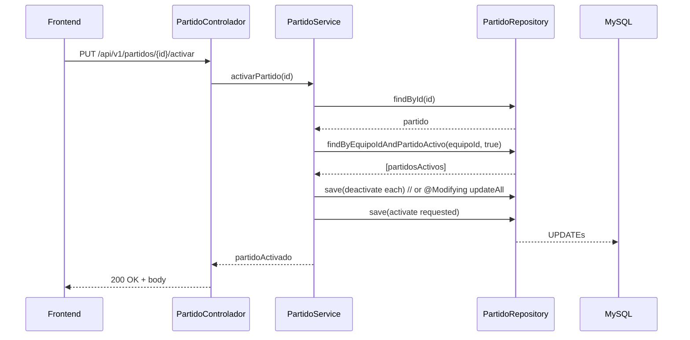

**Proyecto: Gestion Jugadores FutbolBase**

Propósito: documentación orientada a programadores que describe la arquitectura del backend (Spring Boot) y frontend (Angular), flujos clave, modelo de datos resumido y una lista priorizada de mejoras para el backend enfocadas en rendimiento, mantenimiento y reducción de código duplicado.

---

**Contenido**

- **Resumen Rápido**: descripción del stack y responsabilidades.
- **Backend**: diagramas y flujo de activación de partido; estructura de paquetes; endpoints principales; sugerencias de mejoras con ejemplos de código.
- **Frontend**: estructura de componentes, servicios, rutas y flujo de inicio de partido.
- **Mejoras Prioritarias (Backend)**: lista con justificación, impacto y snippets de ejemplo.

---

**Resumen Rápido**

- Backend: Java 11/17 (según pom), Spring Boot (servicios, repositorios JPA/Hibernate), seguridad JWT.
- Frontend: Angular 17+, TypeScript, Bootstrap 5 / Angular Material.
- BD: MySQL (según properties), JPA/Hibernate para persistencia.

**Convenciones**
- Entidades: `com.gestion.jugadores.modelo`.
- Controladores: `com.gestion.jugadores.controlador`.
- Servicios: `com.gestion.jugadores.servicios` (interfaces) y `servicios.impl` (implementaciones).

---

**Backend — Arquitectura y Flujos**

Paquetes clave (resumen):

- `controlador` — REST controllers (AuthenticationController, EquipoController, PartidoControlador, UsuarioController, EventoJugadorControlador, JugadorControlador)
- `servicios` — interfaces de negocio
- `servicios.impl` — implementaciones
- `repositorio` — Spring Data JPA repositories (EquipoRepository, PartidoRepository, etc.)
- `modelo` — entidades JPA (Partido, Equipo, Jugador, EventoJugador, Usuario, Rol)

Endpoints principales (ejemplos):

- POST `/api/v1/auth/login` — autenticación (JWT)
- GET `/api/v1/partidos/equipo/{equipoId}` — listar partidos de un equipo
- PUT `/api/v1/partidos/{id}/activar` — activar un partido (debe desactivar otros activos del mismo equipo)
- PUT `/api/v1/partidos/{id}/desactivar` — desactivar partido
- GET `/equipos/me` — obtener equipos del usuario autenticado
- POST `/equipos/registrar` — registrar equipo para usuario autenticado

Flujo crítico: Activar Partido (resumen)

Mermaid sequence diagram:



Notas sobre el flujo:

- La implementación actual itera sobre partidas activas y las guarda una a una; es correcto funcionalmente pero puede mejorarse con una actualización bulk (single UPDATE) dentro de una transacción para reducir roundtrips y concurrencia indeseada.
- Asegurar @Transactional en el service para evitar estados intermedios visibles.

Esquema de entidad (resumen):

- `Partido` { id, equipo (ManyToOne Equipo), fecha, partidoActivo(Boolean), duracion, ... }
- `Equipo` { id, nombre, usuario (ManyToOne Usuario), jugadores(List<Jugador>), duracionPartido }
- `Jugador` { id, nombre, apellido, posicion, equipo (ManyToOne Equipo) }
- `EventoJugador` { id, jugadorId, partidoId, tipoEvento, minuto }

---

**Frontend — Arquitectura y Flujos**

Estructura principal:

- `app/` contiene componentes y servicios.
- Componentes relevantes: `partido-modo.component` (Iniciar/Controlar partido), `historial-partidos.component`, `gestionar-partidos.component`, `crear-equipo`, `registrar-jugador`, `lista-jugadores`, `jugador-detalles`.
- Servicios: `partido.service.ts`, `equipo.service.ts`, `jugador.service.ts`, `evento-jugador.service.ts`, `user.service.ts`.
- Routing centralizado en `app-routing.module.ts` con rutas como `/iniciar-partido`, `/gestionar-partidos`, `/historial-partidos`.

Flujo crítico: Iniciar Partido (Frontend)

Mermaid flowchart (user interaction):

```mermaid
flowchart TD
  A[Usuario abre Iniciar Partido] --> B[Selecciona Equipo]
  B --> C[Se listan Partidos inactivos]
  C --> D[Selecciona Partido]
  D --> E[Botón "Iniciar Partido" => llamar API PUT /partidos/{id}/activar]
  E --> F[API responde con partido activo]
  F --> G[Frontend carga jugadores y entra en Modo Juego]
  G --> H[Usuario registra eventos (gol, asistencia, etc.) => POST evento]
  H --> I[Botón Finalizar => PUT /partidos/{id}/desactivar]
  I --> J[Partido desactivado; volver a lista de partidos]
```

Estado del UI y decisiones:

- El componente `partido-modo` fue reescrito en 2 fases: Selección y Modo Juego.
- Evitar usar pipes en event bindings (correcciones aplicadas) y usar `ngModelChange` o pasar objetos con `[ngValue]` en los `option`.

---

**Mejoras Prioritarias (Backend)**

Resumen: priorizar eficiencia (menor I/O DB, menos código repetido), seguridad y mantenibilidad.

1) Usar una única consulta @Modifying para desactivar partidos activos del equipo (bulk update)

Motivación: reducir múltiples consultas/commits cuando hay varios partidos activos; evita problemas de concurrencia y mejora latencia.

Ejemplo (PartidoRepository):

```java
public interface PartidoRepository extends JpaRepository<Partido, Long> {
  @Modifying
  @Query("UPDATE Partido p SET p.partidoActivo = false WHERE p.equipo.id = :equipoId AND p.partidoActivo = true AND p.id <> :excludeId")
  int deactivateOtherActiveByEquipoId(@Param("equipoId") Long equipoId, @Param("excludeId") Long excludeId);
}
```

Uso en `PartidoServiceImpl` dentro de una transacción:

```java
@Transactional
public Partido activarPartido(Long id) {
    Partido partido = partidoRepository.findById(id)
        .orElseThrow(() -> new ResourceNotFoundException("Partido", "id", id));

    Long equipoId = partido.getEquipo().getId();
    partidoRepository.deactivateOtherActiveByEquipoId(equipoId, id);

    partido.setPartidoActivo(true);
    return partidoRepository.save(partido);
}
```

Impacto: una única sentencia UPDATE seguida de un UPDATE/INSERT reduce I/O, es atómico si está en la misma transacción.

2) Centralizar mapping entre Entidades <-> DTOs

Motivación: evitar repetición de código que construye DTOs en muchos controladores/servicios.

Solución: utilizar `MapStruct` o `ModelMapper` con mappers (interface-based) para convertir entidades a DTOs y viceversa.

Ejemplo con MapStruct:

```java
@Mapper(componentModel = "spring")
public interface PartidoMapper {
  PartidoDTO toDto(Partido partido);
  Partido toEntity(PartidoDTO dto);
}
```

3) Introducir una capa base para operaciones CRUD repetitivas (BaseService + BaseRepository)

Motivación: eliminar copy/paste en servicios que solo delegan al repositorio.

Pattern: `GenericService<T, ID>` con métodos comunes: save, findById, delete, findAll(Pageable)`.

4) Indexes y consultas optimizadas

- Añadir índices en columnas usadas en filtros/sorting: `partido.partidoActivo`, `partido.equipo_id`, `equipo.usuario_id`, `evento_jugador.partido_id`.
- Usar consultas paginadas para endpoints que devuelven listas potencialmente grandes (paginación y filtros).

5) Forzar verificación de ownership en controladores

Motivación: evitar fugas de datos o modificaciones por usuarios distintos.

Implementación: en endpoints que reciben `equipoId` o `partidoId`, validar que `equipo.usuario.username == authentication.getName()` antes de permitir cambios.

6) Añadir pruebas de integración para flujos críticos

- Tests que activen/desactiven partidos, validen que solo uno queda activo por equipo, prueben concurrencia con `@SpringBootTest` y `TestRestTemplate`.

7) Uso de SQL/BD para garantizar unicidad del partido activo por equipo (opcional según BD)

- Postgres permite `UNIQUE (equipo_id) WHERE partido_activo` (partial index). En MySQL < 8 no hay partial indexes; usar trigger o columna generada y unique index, o mantener la lógica en la aplicación.

8) Bulk insert/update para eventos masivos

- Si se registran muchos eventos por partido, considere endpoints batch (aceptar lista de eventos) y `saveAll()` para reducir overhead.

9) Mejorar logs y métricas

- Añadir logs estructurados (SLF4J + MDC) y métricas (Micrometer) en puntos clave (activar/desactivar, errores de validación, latencia DB).

10) Caching selectivo

- Cachear datos relativamente estáticos por usuario/equipo (por ejemplo, lista de jugadores de un equipo) usando `@Cacheable` con expiración corta. Evitar cachear datos que se actualizan en vivo sin invalidación.

---

**Ejemplo: Activar partido con optimización y manejo de concurrencia**

```java
@Service
public class PartidoServiceImpl implements PartidoService {

  private final PartidoRepository partidoRepository;

  @Autowired
  public PartidoServiceImpl(PartidoRepository partidoRepository) {
    this.partidoRepository = partidoRepository;
  }

  @Override
  @Transactional
  public Partido activarPartido(Long id) {
    Partido partido = partidoRepository.findById(id)
      .orElseThrow(() -> new ResourceNotFoundException("Partido", "id", id));

    Long equipoId = partido.getEquipo().getId();
    // Bulk deactivate
    partidoRepository.deactivateOtherActiveByEquipoId(equipoId, id);

    partido.setPartidoActivo(true);
    return partidoRepository.save(partido);
  }
}
```

---

**Checklist de implementación (prioridad alta → baja)**

- [High] Reemplazar loop de saves por @Modifying bulk update + @Transactional.
- [High] Agregar verificación de ownership en endpoints write.
- [High] Añadir índices DB en columnas de filtro.
- [Med] Añadir mappers (MapStruct) y DTO centralizados.
- [Med] Introducir Generic BaseService para CRUD repetido.
- [Med] Añadir pruebas de integración para flujos de partido.
- [Low] Evaluar caching y métricas, preparar para escalado.

---

**Notas operativas y siguientes pasos**

- Archivos con cambios principales ya compilan para backend y frontend; sin embargo, recomiendo ejecutar tests de integración en CI antes de desplegar cambios en producción.
- Si quieres, genero PRs con las refactorizaciones propuestas: (1) `PartidoRepository` con método @Modifying, (2) `PartidoServiceImpl` con la nueva implementación transaction-safe, (3) MapStruct mappers y ejemplos de tests.

---

Fin del documento. Si quieres que lo divida en `docs/backend.md` y `docs/frontend.md`, o que genere PRs con cambios de código propuestos, dime y lo hago.
