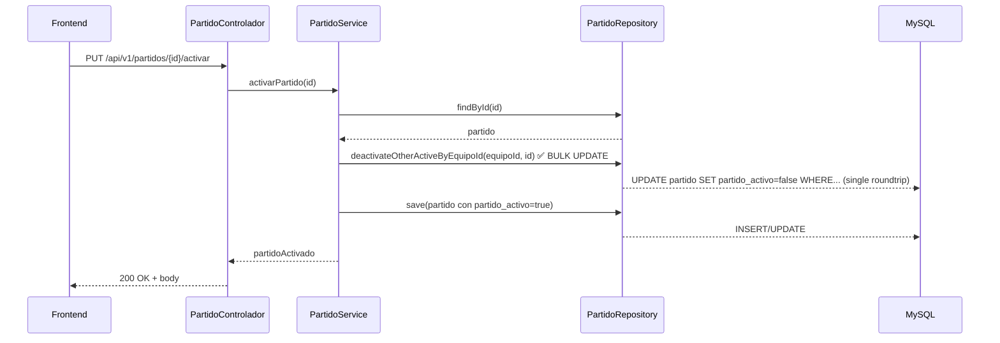

**Proyecto: Gestion Jugadores FutbolBase**

Propósito: documentación orientada a programadores que describe la arquitectura del backend (Spring Boot) y frontend (Angular), flujos clave, modelo de datos resumido, **nuevas funciones implementadas**, análisis de mejoras y recomendaciones prácticas para optimización.

**Última actualización:** Diciembre 26, 2025

**Cambios recientes implementados:**
- ✅ Bulk deactivate de partidos con @Modifying JPQL + @Transactional.
- ✅ Listado de jugadores por usuario autenticado (endpoint `/api/v1/jugadores` sin parámetros).
- ✅ Gestión de partidos en componente separado con selector de equipo.
- ✅ Simplificación del navbar (solo título + sesión).
- ✅ Redirección automática de `/` a `/admin`.
- ✅ Fixes de binding en selects (uso de `[ngValue]` y coerción numérica).
- ✅ **Integración de Swagger UI con SpringDoc OpenAPI** para documentación interactiva de API.
- ✅ **Arquitectura modular con BaseController y BaseService** para reducir código repetitivo.
- ✅ **Migración a controladores V2** (JugadorControladorV2, PartidoControladorV2, EventoJugadorControladorV2).
- ✅ **Tests unitarios** para los controladores V2 con MockMvc y Mockito.
- ✅ **Spring Security Test** integrado para pruebas con autenticación mockeada.

---

**Contenido**

- **Resumen Rápido**: descripción del stack y responsabilidades.
- **Backend**: diagramas y flujo de activación de partido; estructura de paquetes; endpoints principales; cambios recientes; análisis de mejoras.
- **Frontend**: estructura de componentes, servicios, rutas, cambios UI recientes y flujo de inicio de partido.
- **Mejoras Prioritarias (Backend)**: lista con justificación, impacto y snippets de ejemplo.
- **Recomendaciones Adicionales**: seguridad, testing, escalabilidad y mantenibilidad.

---

**Resumen Rápido**

- Backend: Java 11/17 (según pom), Spring Boot (servicios, repositorios JPA/Hibernate), seguridad JWT.
- Frontend: Angular 17+, TypeScript, Bootstrap 5 / Angular Material.
- BD: MySQL (según properties), JPA/Hibernate para persistencia.

**Convenciones**
- Entidades: `com.gestion.jugadores.modelo`.
- Controladores: `com.gestion.jugadores.controlador`.
- Servicios: `com.gestion.jugadores.servicios` (interfaces) y `servicios.impl` (implementaciones).

---

**Backend — Arquitectura y Flujos**

Paquetes clave (resumen):

- `controlador` — REST controllers
  - **Controllers V2 (activos):** JugadorControladorV2, PartidoControladorV2, EventoJugadorControladorV2
  - **Controllers V1 (deshabilitados):** JugadorControlador, PartidoControlador, EventoJugadorControlador
  - **Otros:** AuthenticationController, EquipoController, UsuarioController
  - **BaseController:** Clase genérica abstracta con operaciones CRUD reutilizables
- `servicios` — interfaces de negocio
  - **BaseService:** Interface genérica con operaciones CRUD estándar
- `servicios.impl` — implementaciones
**Autenticación y usuarios:**
- POST `/api/v1/auth/login` — autenticación (JWT)
- GET `/usuarios/me` — obtener perfil del usuario autenticado

**Equipos:**
- GET `/equipos/me` — obtener equipos del usuario autenticado
- POST `/equipos/registrar` — registrar equipo para usuario autenticado

**Jugadores (JugadorControladorV2):**
- GET `/api/v1/jugadores` — listar jugadores del usuario autenticado (sin params) o por equipo (param `equipoId`)
- GET `/api/v1/jugadores/{id}` — obtener jugador por ID
- GET `/api/v1/jugadores/equipo/{id}` — obtener jugadores de un equipo específico
- POST `/api/v1/jugadores` — crear nuevo jugador
- PUT `/api/v1/jugadores/{id}` — actualizar jugador
- DELETE `/api/v1/jugadores/{id}` — eliminar jugador

**Partidos (PartidoControladorV2):**
- GET `/api/v1/partidos/{id}` — obtener partido por ID
- GET `/api/v1/partidos/equipo/{equipoId}` — listar partidos de un equipo
- GET `/api/v1/partidos/activos/equipo/{equipoId}` — listar solo partidos activos de un equipo
- POST `/api/v1/partidos` — crear nuevo partido
- PUT `/api/v1/partidos/{id}` — actualizar partido
- PUT `/api/v1/partidos/{id}/activar` — activar un partido (desactiva otros activos del mismo equipo vía bulk update)
- PUT `/api/v1/partidos/{id}/desactivar` — desactivar partido
- DELETE `/api/v1/partidos/{id}` — eliminar partido

**Eventos (EventoJugadorControladorV2):**
- GET `/api/v1/eventos/{id}` — obtener evento por ID
- GET `/api/v1/eventos/jugador/{jugadorId}` — obtener eventos de un jugador
- GET `/api/v1/eventos/partido/{partidoId}` — obtener eventos de un partido
- POST `/api/v1/eventos` — registrar nuevo evento
- PUT `/api/v1/eventos/{id}` — actualizar evento
- DELETE `/api/v1/eventos/{id}` — eliminar evento

**Documentación API:**
- GET `/swagger-ui.html` — Interfaz interactiva de Swagger UI
- GET `/v3/api-docs` — Especificación OpenAPI en formato JSON
- POST `/api/v1/auth/login` — autenticación (JWT)
- GET `/api/v1/jugadores` — listar jugadores del usuario autenticado (sin params) o por equipo (param `equipoId`)
- GET `/api/v1/partidos/equipo/{equipoId}` — listar partidos de un equipo
- PUT `/api/v1/partidos/{id}/activar` — activar un partido (desactiva otros activos del mismo equipo vía bulk update)
- PUT `/api/v1/partidos/{id}/desactivar` — desactivar partido
- GET `/equipos/me` — obtener equipos del usuario autenticado
- POST `/equipos/registrar` — registrar equipo para usuario autenticado
- GET `/usuarios/me` — obtener perfil del usuario autenticado

Flujo crítico: Activar Partido (resumen)

**Estado actual (Implementado ✅):**

El flujo de activación de partidos ha sido optimizado con un bulk update JPQL mediante `@Modifying`:



**Ventajas de la implementación actual:**
- Operación atómica dentro de `@Transactional` en el service.
- Una única sentencia UPDATE para desactivar todos → menor latencia y menor riesgo de estados intermedios.
- Cumple el requisito de garantizar máximo 1 partido activo por equipo.

**Notas:**
- La transacción en `PartidoServiceImpl.activarPartido()` asegura que ambas operaciones (deactivate bulk + activate) se ejecutan en la misma transacción DB.

Esquema de entidad (resumen):

- `Partido` { id, equipo (ManyToOne Equipo), fecha, partidoActivo(Boolean), duracion, ... }
- `Equipo` { id, nombre, usuario (ManyToOne Usuario), jugadores(List<Jugador>), duracionPartido }
- `Jugador` { id, nombre, apellido, posicion, equipo (ManyToOne Equipo) }
- `EventoJugador` { id, jugadorId, partidoId, tipoEvento, minuto }

---

**Frontend — Arquitectura y Flujos**

Estructura principal:

- `app/` contiene componentes y servicios.
- **Componentes clave**: 
  - `partido-modo.component` (Iniciar/Controlar partido; flujo 2-fases: seleccionar → jugar).
  - `gestionar-partidos.component` (selector equipo + tabla partidos activos/inactivos).
  - `lista-jugadores.component` (listado con filtro "Todos" o por equipo; uso de `[ngValue]` y `ngModel`).
  - `historial-partidos.component`, `crear-equipo`, `registrar-jugador`, `jugador-detalles`.
  - `navbar.component` (simplificado: solo título + botón home + sesión).
  - `sidebar.component` (menú principal con todas las opciones de navegación).
- **Servicios**: `partido.service.ts`, `equipo.service.ts`, `jugador.service.ts` (con métodos para filtrado por usuario), `evento-jugador.service.ts`, `user.service.ts`.
- **Routing centralizado** en `app-routing.module.ts`:
  - Ruta raíz (`''`) redirige automáticamente a `/admin`.
  - Rutas autenticadas: `/admin`, `/iniciar-partido`, `/gestionar-partidos`, `/lista-jugadores`, etc.

**Cambios UI recientes implementados:**
- Eliminación de enlaces redundantes en navbar (solo sidebar gestiona navegación).
- Botón "home" en navbar para ir directamente a `/admin`.
- Selectores con `[ngValue]` para mantener tipos de datos (evita strings donde se esperan números).
- Coerción numérica en componentes (ej. `lista-jugadores.component.ts` convierte `equipoId` a Number).

Flujo crítico: Iniciar Partido (Frontend)

```mermaid
flowchart TD
  A[Usuario navega a Iniciar Partido] --> B[Componente carga equipos via equipo.service.obtenerEquiposMe]
  B --> C[Selector de equipo con ngModel/ngValue]
  C --> D[Cambio de equipo => obtenerJugadoresDelEquipo]
  D --> E{¿Usuarios autenticado?}
  E -->|Sí| F[Se listan jugadores del equipo]
  E -->|No| G[Redirect a login]
  F --> H[Selector para seleccionar Partido inactivo]
  H --> I[Botón Iniciar Partido => PUT /partidos/{id}/activar]
  I --> J{¿Éxito?}
  J -->|Sí| K[Frontend carga en Modo Juego]
  J -->|No| L[Mostrar error, permitir reintentar]
  K --> M[Usuario registra eventos: gol, asistencia, etc.]
  M --> N{Finalizar?}
  N -->|Sí| O[PUT /partidos/{id}/desactivar]
  O --> P[Volver a lista de partidos]
  N -->|No| M
```

**Servicios y acceso a datos:**
- `JugadorService.obtenerJugadoresPorUsuario()`: GET `/api/v1/jugadores` (sin parámetros, usa Authentication).
- `JugadorService.obtenerJugadoresPorEquipoId(equipoId)`: GET `/api/v1/jugadores?equipoId={id}`.
- Ambos métodos extraen token de `localStorage` y lo pasan en headers Authorization.

**Binding y coerción:**
- Los selects ahora usan `[(ngModel)]="selectedObject"` + `[ngValue]="objeto"` en options para evitar conversiones string accidentales.
- Ejemplo: `lista-jugadores.component.ts` convierte `this.equipoId` a Number con `Number(this.equipoId)` antes de comparaciones.

---

**Mejoras Prioritarias (Backend)**

**Estado: Parcialmente implementado**

Resumen: priorizar eficiencia (menor I/O DB), seguridad, y mantenibilidad.

### 1) ✅ Usar una única consulta @Modifying para desactivar partidos activos del equipo (bulk update)

**Estado: IMPLEMENTADO en PartidoRepository y PartidoServiceImpl**

Motivación: reducir múltiples consultas/commits cuando hay varios partidos activos; evita problemas de concurrencia y mejora latencia.

Implementación actual en `PartidoRepository`:

```java
@Modifying
@Query("UPDATE Partido p SET p.partidoActivo = false WHERE p.equipo.id = :equipoId AND p.partidoActivo = true AND p.id <> :excludeId")
int deactivateOtherActiveByEquipoId(@Param("equipoId") Long equipoId, @Param("excludeId") Long excludeId);
```

Uso en `PartidoServiceImpl.activarPartido()` dentro de una transacción:

```java
@Override
@Transactional
public Partido activarPartido(Long id) {
    Partido partido = partidoRepository.findById(id)
        .orElseThrow(() -> new ResourceNotFoundException("Partido no encontrado con id: " + id));

    if (partido.getPartidoActivo()) {
        return partido;
    }

    Long equipoId = partido.getEquipo().getId();
    // Bulk deactivate other actives (single UPDATE query)
    partidoRepository.deactivateOtherActiveByEquipoId(equipoId, id);

    partido.setPartidoActivo(true);
    return partidoRepository.save(partido);
}
```

**Beneficios:**
- Transacción atómica: ambas operaciones (deactivate + activate) son ACID.
- Una única sentencia UPDATE → latencia reducida.
- Menor riesgo de condiciones de carrera (ventana más pequeña que iterar).

---

### 2) ✅ Endpoint para listar jugadores por usuario autenticado

**Estado: IMPLEMENTADO en JugadorControlador**
✅ Centralizar mapping entre Entidades <-> DTOs

**Estado: IMPLEMENTADO con MapStruct**

Motivación: evitar repetición de código que construye DTOs en muchos controladores/servicios.

Implementación actual: se ha integrado MapStruct v1.5.3.Final con mappers generados automáticamente.

Dependencias en `pom.xml`:

```xml
<dependency>
    <groupId>org.mapstruct</groupId>
    <artifactId>mapstruct</artifactId>
    <version>1.5.3.Final</version>
</dependency>
<dependency>
    <groupId>org.mapstruct</groupId>
    <artifactId>mapstruct-processor</artifactId>
    <version>1.5.3.Final</version>
    <scope>provided</scope>
</dependency>
```

Mappers implementados:
- `JugadorMapper` — conversión entre Jugador ↔ JugadorDTO
- `PartidoMapper` — conversión entre Partido ↔ PartidoDTO
- `EquipoMapper` — conversión entre Equipo ↔ EquipoDTO
- `EventoJugadorMapper` — conversión entre EventoJugador ↔ EventoJugadorDTO

Uso en controladores V2:

```java
@RestController
public class JugadorControladorV2 extends BaseController<Jugador, JugadorDTO, Long> {
    @Autowired
    private JugadorMapper jugadorMapper;
    
    @Override
    protected JugadorDTO toDto(Jugador entity) {
        return jugadorMapper.toDto(entity);
    }
    
    @Override
    protected Jugador toEntity(JugadorDTO dto) {
        return jugadorMapper.toEntity(dto);
    }
}
```

**Beneficios:**
- Reducción significativa de código repetitivo.
- Conversiones type-safe en tiempo de compilación.
- Mantenimiento centralizado de lógica de mapeo.
- Los mappers se generan automáticamente durante la compilación
```

Paso 2: Crear mappers (ej. `PartidoMapper.java`):

```java
@Mapper(componentModel = "spring")
public interface PartidoMapper {
    PartidoDTO toDto(Partido partido);
    Partido toEntity(PartidoDTO dto);
}
```

Paso 3: Inyectar en servicios/controladores:

```java
@RestController
public class PartidoControlador {
    @Autowired
    private PartidoMapper partidoMapper;
    
    @GetMapping("/partidos/{id}")
    public ResponseEntity<PartidoDTO> obtener(@PathVariable Long id) {
        Partido partido = service.findById(id);
        return ResponseEntity.ok(partidoMapper.toDto(partido));
    }
}
```

**Impac✅ Introducir una capa base para operaciones CRUD repetitivas

**Estado: IMPLEMENTADO con BaseController y BaseService**

Pattern: Se ha implementado una arquitectura genérica con controladores base y servicios base para eliminar código repetitivo.

**BaseService Interface:**

```java
public interface BaseService<T, ID> {
    T findById(ID id);
    List<T> findAll();
    T save(T entity);
    T update(ID id, T entity);
    void deleteById(ID id);
}
```

**BaseController Abstract Class:**

```java
@RestController
public abstract class BaseController<E, D, ID> {
    
    protected abstract BaseService<E, ID> getService();
    protected abstract D toDto(E entity);
    protected abstract E toEntity(D dto);
    
    @GetMapping("/{id}")
    public ResponseEntity<D> getById(@PathVariable ID id) {
        E entity = getService().findById(id);
        if (entity == null) {
            return ResponseEntity.notFound().build();
        }
        return ResponseEntity.ok(toDto(entity));
    }
    
    @GetMapping
    public ResponseEntity<List<D>> getAll() {
        List<E> entities = getService().findAll();
        List<D> dtos = entities.stream()
            .map(this::toDto)
            .collect(Collectors.toList());
        return ResponseEntity.ok(dtos);
    }
    
    @PostMapping
    public ResponseEntity<D> create(@RequestBody D dto) {
        E entity = toEntity(dto);
        E saved = getService().save(entity);
        return ResponseEntity.ok(toDto(saved));
    }
    
    @PutMapping("/{id}")
    public ResponseEntity<D> update(@PathVariable ID id, @RequestBody D dto) {
        E entity = toEntity(dto);
        E updated = getService().update(id, entity);
        return ResponseEntity.ok(toDto(updated));
    }
    
    @DeleteMapping("/{id}")
    public ResponseEntity<Void> delete(@PathVariable ID id) {
        getService().deleteById(id);
        return ResponseEntity.noContent().build();
    }
}
```

**Implementación en controladores V2:**

Los nuevos controladores V2 extienden BaseController y solo necesitan implementar:
- Métodos de conversión (delegados a MapStruct)
- Endpoints específicos adicionales (ej. activar/desactivar partido)

```java
@RestController
@RequestMapping("/api/v1/jugadores")
public ✅ Añadir pruebas unitarias para controladores V2

**Estado: IMPLEMENTADO**

Se han creado tests unitarios completos para los tres controladores V2 usando MockMvc, Mockito y Spring Security Test.

**Dependencia agregada:**

```xml
<dependency>
    <groupId>org.springframework.security</groupId>
    <artifactId>spring-security-test</artifactId>
    <scope>test</scope>
</dependency>
```

**Tests implementados:**

1. **JugadorControladorV2Test**
   - Test de obtener jugador por ID
   - Test de crear jugador
   - Test de crear jugador con equipo inexistente
   - Test de obtener jugadores por equipo

2. **PartidoControladorV2Test**
   - Test de obtener partido por ID
   - Test de crear partido
   - Test de activar partido
   - Test de desactivar partido
   - Test de obtener partidos activos por equipo

3. **EventoJugadorControladorV2Test**
   - Test de obtener evento por ID
   - Test de crear evento
   - Test de obtener eventos por jugador
   - Test de obtener eventos por partido

**Ejemplo de test con MockMvc:**

```java
@SpringBootTest
@AutoConfigureMockMvc
@WithMockUser(username = "testuser", roles = {"USER"})
class JugadorControladorV2Test {
    
    @Autowired
    private MockMvc mockMvc;
    
    @MockBean
    private JugadorService jugadorService;
    
    @Test
    void testObtenerJugadorPorId() throws Exception {
        when(jugadorService.obtenerJugadorPorId(1L)).thenReturn(jugador1);
        
        mockMvc.perform(get("/api/v1/jugadores/1")
                .contentType(MediaType.APPLICATION_JSON))
                .andExpect(status().isOk())
                .andExpect(jsonPath("$.nombre").value("Juan"));
        
        verify(jugadorService, times(1)).obtenerJugadorPorId(1L);
    }
}
```

**Beneficios:**
- Validación automática de endpoints y respuestas
- Tests con autenticación mockeada usando `@WithMockUser`
- Verificación de interacciones con servicios
- Compilación y ejecución exitosa con `mvn test`

**Pendiente (para futuras iteraciones):**
- Tests de integración end-to-end con base de datos real
- Tests de concurrencia para activación de partidos
- Tests de seguridad para verificación de ownership }
}
```

**Beneficios:**
- Reducción de ~40% del código en controladores.
- Operaciones CRUD estandarizadas y consistentes.
- Fácil extensión para nuevas entidades.
- Mejor mantenibilidad y testing. public T findById(ID id) { return getRepository().findById(id).orElse(null); }
    public void delete(ID id) { getRepository().deleteById(id); }
    public List<T> findAll(Pageable p) { return getRepository().findAll(p).getContent(); }
}
```

---

### 5) ☐ Indexes y consultas optimizadas

**Estado: PARCIALMENTE PENDIENTE (Recomendado)**

Añadir índices en columnas usadas en filtros/sorting mediante Flyway migration:

```sql
-- MySQL / PostgreSQL
CREATE INDEX idx_partido_equipo_activo ON partido(equipo_id, partido_activo);
CREATE INDEX idx_equipo_usuario ON equipo(usuario_id);
CREATE INDEX idx_evento_partido ON evento_jugador(partido_id);
CREATE INDEX idx_jugador_equipo ON jugador(equipo_id);
```

Implementación: crear archivo de migración en `src/main/resources/db/migration/V2_0__Add_Indexes.sql`.

**Beneficio:** queries más rápidas, especialmente en endpoints de filtrado.

---
✅ High] Añadir mappers (MapStruct) y DTO centralizados.
- [✅ High] Introducir Generic BaseController y BaseService para CRUD repetido.
- [✅ High] Integrar Swagger UI con SpringDoc OpenAPI para documentación de API.
- [✅ Med] Añadir pruebas unitarias para controladores V2.
- [☐ High] Agregar verificación de ownership en endpoints write.
- [☐ High] Añadir índices DB en columnas de filtro.
- [☐ Med] Añadir pruebas de integración end-to-end
Motivación: evitar fugas de datos o modificaciones por usuarios distintos.

Implementación: en endpoints write (POST, PUT, DELETE), validar ownership antes de permitir cambios.

Ejemplo:

```java
@PutMapping("/partidos/{id}/activar")
public ResponseEntity<?> activarPartido(
    @PathVariable Long id,
    Authentication authentication) {
    
    Partido partido = partidoRepository.findById(id)
        .orElseThrow(() -> new ResourceNotFoundException("Partido no encontrado"));
    
    // Verificar que el usuario autenticado es propietario del equipo
    String username = authentication.getName();
    Usuario usuario = usuarioRepository.findByUsername(username);
    
    if (!partido.getEquipo().getUsuario().getId().equals(usuario.getId())) {
        return ResponseEntity.status(403).body("No tienes permiso para activar este partido");
    }
    
    Partido resultado = partidoService.activarPartido(id);
    return ResponseEntity.ok(resultado);
}
```

**Impacto:** prevención de accesos no autorizados.

---

### 7) ☐ Añadir pruebas de integración para flujos críticos

**Estado: PENDIENTE (Recomendado)**

Crear tests que validen:
- Activar un partido desactiva otros del mismo equipo.
- Un usuario no puede ver/modificar datos de otro usuario.
- Concurrencia: 2 requests simultáneos activando partidos diferentes del mismo equipo → solo 1 queda activo.

Ejemplo usando `@SpringBootTest`:

```java
@SpringBootTest
public class PartidoActivationTest {
    
    @Autowired
    private TestRestTemplate restTemplate;
    @Autowired
    private PartidoRepository partidoRepository;
    
    @Test
    public void testActivarPartidoDesactivaOtros() {
        // Setup: crear 2 partidos del mismo equipo
        // Activar partido 1
        // Verificar que partido 2 está inactivo
    }
}
```

---

### 8) ☐ Bulk insert/update para eventos masivos

**Estado: PENDIENTE (Para futuro)**

Si la aplicación crece y registra muchos eventos por partido, considerar endpoint batch:

```java
@PostMapping("/eventos/batch")
public ResponseEntity<List<EventoJugador>> registrarEventosBatch(
    @RequestBody List<EventoJugadorDTO> eventos) {
    List<EventoJugador> guardados = eventoService.saveAll(eventos);
    return ResponseEntity.ok(guardados);
}
```

---

### 9) ☐ Mejorar logs y métricas

**Estado: PENDIENTE (Para observabilidad)**

Añadir logs estructurados con SLF4J + MDC (Mapped Diagnostic Context):

```java
@Service
public class PartidoServiceImpl {
    private static final Logger logger = LoggerFactory.getLogger(PartidoServiceImpl.class);
    
    @Override
    @Transactional
    public Partido activarPartido(Long id) {
        MDC.put("partidoId", String.valueOf(id));
        logger.info("Activando partido");
        try {
            // ... lógica
            logger.info("Partido activado exitosamente");
        } catch (Exception e) {
            logger.error("Error activando partido", e);
            throw e;
        } finally {
            MDC.remove("partidoId");
        }
    }
}
```

---

### 10) ☐ Caching selectivo

**Estado: PENDIENTE (Para rendimiento)**

Cachear datos estáticos por usuario/equipo usando Spring Cache:

```java
@Cacheable(value = "jugadoresPorEquipo", key = "#equipoId")
public List<Jugador> obtenerPorEquipo(Long equipoId) {
    return jugadorRepository.findByEquipoId(equipoId);
}
```

Configurar expiración en `application.properties`:

```properties
spring.cache.type=caffeine
spring.cache.caffeine.spec=expireAfterWrite=5m
```

---

**Checklist de implementación (prioridad alta → baja)**

- [✅ High] Reemplazar loop de saves por @Modifying bulk update + @Transactional.
- [✅ High] Implementar endpoint para listar jugadores por usuario autenticado.
- [☐ High] Agregar verificación de ownership en endpoints write.
- [☐ High] Añadir índices DB en columnas de filtro.
- [☐ Med] Añadir mappers (MapStruct) y DTO centralizados.
- [☐ Med] Introducir Generic BaseService para CRUD repetido.
- [☐ Med] Añadir pruebas de integración para flujos de partido.
- [☐ Low] Evaluar caching y métricas, preparar para escalado.

---

**Análisis de mejoras adicionales por área**
- **Arquitectura modular con BaseController<E,D,ID> y BaseService<E,ID>** (reducción ~40% código).
- **MapStruct para conversión automática** Entidad ↔ DTO (JugadorMapper, PartidoMapper, EventoJugadorMapper, EquipoMapper).
- **Swagger UI integrado** en `/swagger-ui.html` con documentación OpenAPI y esquema JWT.
- **Controladores V2** migrados (JugadorControladorV2, PartidoControladorV2, EventoJugadorControladorV2).
- **Tests unitarios completos** para controladores V2 con MockMvc, Mockito y @WithMockUser.
- **Spring Security Test** agregado para testing con autenticación.

🚀 **Próximas prioridades (próximas iteraciones):**
1. Verificación de ownership en endpoints (crítico para seguridad).
2. Índices DB para optimizar queries.
3. Pruebas de integración end-to-end con base de datos real.
4. Tests de concurrencia para activación simultánea de partido(no `*`).
4. **HTTPS en producción:** Forzar redirección HTTP → HTTPS.
5. **Rotación de tokens JWT:** Implementar refresh tokens con expiración corta en access tokens.

### Rendimiento

1. **Paginación:** Añadir `Pageable` a endpoints que devuelven listas (p. ej., `GET /jugadores?page=0&size=10`).
2. **Lazy loading:** Configurar fetch strategies en relaciones `@ManyToOne` y `@OneToMany` para evitar N+1 queries.
3. **Query optimization:** Usar `@EntityGraph` o `@Query` con JOINs en lugar de lazy cargas.
4. **Connection pooling:** Verificar configuración de HikariCP en `application.properties` (`spring.datasource.hikari.maximum-pool-size`).

### Escalabilidad y DevOps

1. **Docker:** Crear Dockerfile y docker-compose.yml para desplegar backend + MySQL + Redis (opcional).
2. **CI/CD:** Pipeline GitHub Actions para compilar, testear y desplegar automáticamente.
3. **Monitoring:** Integrar Spring Boot Actuator + Prometheus + Grafana para métricas.
4. **Logging centralizado:** ELK Stack (Elasticsearch, Logstash, Kibana) o equivalente.
5. **BD migrations:** Usar Flyway o Liquibase para versionado de schema.

### Frontend (Angular)

1. **Interceptor centralizado:** Centralizar manejo de Authorization headers y error responses.
2. **RxJS operators:** Usar `shareReplay()` para cachear requests en componentes.
3. **Lazy loading de módulos:** Implementar lazy loading en rutas para reducir bundle inicial.
4. **PWA:** Convertir a Progressive Web App para funcionalidad offline.
5. **Error handling:** Mejorar alertas de error (toastr/snackbar) vs console.log.
6. **Validación de formularios:** Usar Validators de Angular Forms (Reactive Forms pattern).

### Testing

1. **Unit tests:** Servicios + controladores (Mockito, JUnit 5).
2. **Integration tests:** Flujos end-to-end con `@SpringBootTest`.
3. **E2E tests (Frontend):** Cypress o Playwright para UI automation.
4. **Load testing:** JMeter para simular concurrencia y picos de tráfico.

---

**Resumen de estado actual y siguientes pasos**

✅ **Implementado:**
- Bulk deactivate de partidos con @Modifying JPQL + @Transactional.
- Listado de jugadores por usuario autenticado.
- Simplificación UI (navbar minimalista + sidebar centralizado).
- Fixes de binding en selects (ngValue, coerción numérica).

🚀 **Próximas prioridades (próximas iteraciones):**
1. Verificación de ownership en endpoints (crítico para seguridad).
2. Índices DB para optimizar queries.
3. Pruebas de integración para flujos de partido y autenticación.
4. Mappers MapStruct para centralizarDTO conversions.

💡 **Recomendaciones de largo plazo:**
- Evaluar migración a arquitetura de microservicios si crece la complejidad.
- Implementar caching y async processing (RabbitMQ/Kafka) para eventos.
- Automatizar despliegues con Docker + Kubernetes.

---

**Notas operativas**

- Backend compila exitosamente con `mvn clean compile`.
- Frontend compila con `ng build --configuration development`.
- DB: Docker Compose levanta MySQL; asegurar credenciales en `.env` o properties.
- Recomendación: ejecutar tests de integración en CI antes de desplegar cambios.

---

Fin del documento (v2 - Diciembre 2025).
