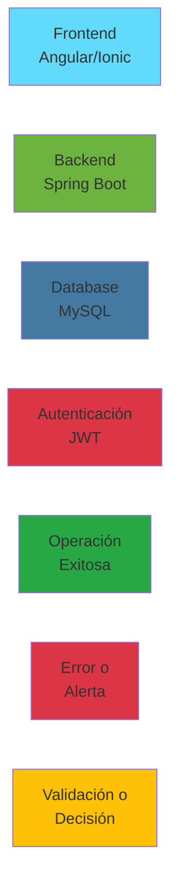

# 📚 Índice de Diagramas Mermaid

Esta página contiene un índice de todos los diagramas de flujo y arquitectura disponibles en la documentación.

## 🏗️ Arquitectura General

### Sistema Completo
- [Arquitectura General del Sistema](README.md#arquitectura-general-del-sistema) - Vista de 3 capas: Web, Mobile, Backend
- [Stack Tecnológico](modulos/integracion/README.md#stack-tecnológico-completo) - Mindmap de tecnologías
- [Arquitectura de Despliegue](modulos/integracion/README.md#arquitectura-de-despliegue-con-docker) - Docker Compose

## 🔧 Backend

### Arquitectura
- [Arquitectura de Capas Backend](modulos/backend/README.md#arquitectura-general) - Presentación, Negocio, Persistencia
- [Estructura de Paquetes](modulos/backend/README.md#estructura-de-paquetes) - Organización del código
- [Diagrama de Clases Controladores](modulos/backend/README.md#arquitectura-de-controladores-v2) - BaseController y herencia

### Modelo de Datos
- [Diagrama de Entidades](modulos/backend/README.md#diagrama-de-entidades) - ERD completo con relaciones

### Flujos de Negocio
- [Flujo de Autenticación](modulos/backend/README.md#1-flujo-de-autenticación) - Login con JWT
- [Flujo de Creación de Partido](modulos/backend/README.md#2-flujo-de-creación-de-partido) - CRUD partido
- [Flujo de Registro de Eventos](modulos/backend/README.md#3-flujo-de-registro-de-eventos) - Eventos en partido
- [Flujo de Finalización de Partido](modulos/backend/README.md#4-flujo-de-finalización-de-partido) - Cálculo de estadísticas
- [Flujo de Cálculo de Estadísticas](modulos/backend/README.md#5-flujo-de-cálculo-de-estadísticas) - Algoritmo completo
- [Flujo de Seguridad JWT](modulos/backend/README.md#flujo-de-seguridad-jwt) - Validación de tokens

### Servicios
- [Flujo de Servicio Genérico](modulos/backend/README.md#flujo-de-servicio-genérico) - Patrón de llamadas

## 🌐 Frontend Web

### Arquitectura
- [Arquitectura General Frontend](modulos/frontend/README.md#arquitectura-general) - Componentes y servicios
- [Arquitectura de Componentes](modulos/frontend/README.md#arquitectura-de-componentes) - Jerarquía de componentes
- [Estructura de Paquetes](modulos/frontend/README.md#estructura-de-componentes) - Organización del código

### Servicios
- [AuthService](modulos/frontend/README.md#authservice) - Flujo de autenticación
- [JugadorService](modulos/frontend/README.md#jugadorservice) - CRUD jugadores

### Guards e Interceptores
- [AuthGuard](modulos/frontend/README.md#authguard) - Protección de rutas
- [GuestGuard](modulos/frontend/README.md#guestguard) - Redirección autenticados
- [AuthInterceptor](modulos/frontend/README.md#authinterceptor) - Inyección de token

### Rutas
- [Configuración de Rutas](modulos/frontend/README.md#configuración-de-rutas) - Mapa de navegación
- [Tabla de Rutas](modulos/frontend/README.md#tabla-de-rutas) - Listado completo

### Flujos de Usuario
- [Flujo de Login](modulos/frontend/README.md#1-flujo-de-login) - Autenticación paso a paso
- [Flujo de Gestión de Jugadores](modulos/frontend/README.md#2-flujo-de-gestión-de-jugadores) - CRUD completo
- [Flujo de Creación de Partido](modulos/frontend/README.md#3-flujo-de-creación-de-partido) - Crear partido
- [Flujo de Modo Partido](modulos/frontend/README.md#4-flujo-de-modo-partido-en-vivo) - Partido en tiempo real
- [Flujo de Registro de Eventos](modulos/frontend/README.md#5-flujo-de-registro-de-eventos) - Eventos en vivo
- [Flujo de Sustituciones](modulos/frontend/README.md#6-flujo-de-sustituciones) - Cambios de jugadores
- [Flujo de Estadísticas](modulos/frontend/README.md#7-flujo-de-visualización-de-estadísticas) - Dashboard

## 📱 Mobile

### Arquitectura
- [Arquitectura General Mobile](modulos/mobile/README.md#arquitectura-general) - Ionic/Capacitor
- [Arquitectura de Navegación](modulos/mobile/README.md#arquitectura-de-navegación) - Tabs y páginas
- [Estructura de Tabs](modulos/mobile/README.md#estructura-de-tabs) - Navegación inferior

### Servicios Core
- [AuthService Mobile](modulos/mobile/README.md#authservice-mobile) - Login con Storage
- [StorageService](modulos/mobile/README.md#storageservice) - Persistencia con Capacitor

### Componentes Ionic
- [Layout Components](modulos/mobile/README.md#layout-components) - Estructura de páginas
- [Gestos Táctiles](modulos/mobile/README.md#1-gestos-táctiles) - Swipe, Pull to Refresh, Drag & Drop

### Flujos Mobile
- [Flujo de Login Mobile](modulos/mobile/README.md#1-flujo-de-login-mobile) - Autenticación móvil
- [Flujo de Gestión de Jugadores Mobile](modulos/mobile/README.md#2-flujo-de-gestión-de-jugadores-mobile) - CRUD con gestos
- [Flujo de Creación de Partido Mobile](modulos/mobile/README.md#3-flujo-de-creación-de-partido-mobile) - Modal formulario
- [Flujo de Modo Partido Mobile](modulos/mobile/README.md#4-flujo-de-modo-partido-mobile) - Partido en móvil
- [Flujo de Estadísticas Mobile](modulos/mobile/README.md#5-flujo-de-estadísticas-mobile) - Dashboard móvil
- [Flujo de Sincronización Offline](modulos/mobile/README.md#6-flujo-de-sincronización-offline) - Modo sin conexión

## 🔗 Integración

### Arquitectura Completa
- [Sistema Completo](modulos/integracion/README.md#arquitectura-de-sistema-completa) - Todos los módulos
- [Comunicación REST](modulos/integracion/README.md#diagrama-de-comunicación-rest) - Web, Mobile, Backend

### Autenticación
- [Flujo de Autenticación Unificado](modulos/integracion/README.md#flujo-de-autenticación-unificado) - JWT completo
- [Estructura del JWT Token](modulos/integracion/README.md#estructura-del-jwt-token) - Header, Payload, Signature
- [Configuración de Seguridad](modulos/integracion/README.md#configuración-de-seguridad) - Filters y Guards

### Sincronización
- [Flujo de Creación de Entidades](modulos/integracion/README.md#1-flujo-de-creación-de-entidades) - CRUD distribuido
- [Flujo de Actualización en Tiempo Real](modulos/integracion/README.md#2-flujo-de-actualización-en-tiempo-real) - Sincronización
- [Flujo de Manejo de Conflictos](modulos/integracion/README.md#3-flujo-de-manejo-de-conflictos) - Optimistic Locking

### Flujos de Negocio Integrados
- [Flujo Completo: Partido](modulos/integracion/README.md#1-flujo-completo-partido-de-inicio-a-fin) - De inicio a estadísticas
- [Flujo de Cálculo de Estadísticas](modulos/integracion/README.md#2-flujo-de-cálculo-de-estadísticas) - Algoritmo detallado
- [Flujo de Distribución Temporal](modulos/integracion/README.md#3-flujo-de-distribución-temporal-de-eventos) - Intervalos de 15 min

### Seguridad
- [Roles y Permisos](modulos/integracion/README.md#roles-y-permisos) - RBAC
- [Configuración CORS](modulos/integracion/README.md#configuración-cors) - Orígenes permitidos

### Monitoreo
- [Monitoreo y Observabilidad](modulos/integracion/README.md#monitoreo-y-observabilidad) - Logs, Métricas, Health

## 🚀 Inicio Rápido

### Instalación
- [Flujo Básico de Uso](QUICK_START.md#flujo-básico-de-uso) - De login a estadísticas

## 📖 Convenciones de Diagramas

### Colores Utilizados

### Significado de Colores

| Color | Hex | Uso |
|-------|-----|-----|
| 🔵 Azul claro | `#61dafb` | Frontend Web (Angular) |
| 🔵 Azul oscuro | `#3880ff` | Mobile (Ionic) |
| 🟢 Verde | `#6db33f` | Backend (Spring Boot) |
| 🔵 Azul DB | `#4479a1` | Base de datos (MySQL) |
| 🟢 Verde éxito | `#28a745` | Operaciones exitosas |
| 🔴 Rojo | `#dc3545` | Errores / Seguridad |
| 🟡 Amarillo | `#ffc107` | Validaciones / Decisiones |
| 🟡 Dorado | `#ffd700` | Servicios / Lógica de negocio |
| 🔴 Rojo claro | `#ff6b6b` | Alertas / Modo partido |

## 🔍 Buscar Diagramas por Tema

### Por Componente
- **Autenticación**: 6 diagramas
- **Jugadores**: 4 diagramas
- **Partidos**: 8 diagramas
- **Eventos**: 5 diagramas
- **Estadísticas**: 7 diagramas
- **Arquitectura**: 12 diagramas

### Por Tipo
- **Diagramas de Secuencia**: 15 diagramas
- **Diagramas de Flujo**: 18 diagramas
- **Diagramas de Arquitectura**: 10 diagramas
- **Diagramas ER**: 1 diagrama
- **Diagramas de Clases**: 1 diagrama
- **Mindmaps**: 1 diagrama

### Por Módulo
- **Backend**: 11 diagramas
- **Frontend Web**: 10 diagramas
- **Mobile**: 9 diagramas
- **Integración**: 12 diagramas

## 📝 Notas

- Todos los diagramas están en formato Mermaid
- Los diagramas son renderizables en GitHub, VS Code y viewers compatibles
- Cada diagrama incluye leyendas de colores cuando es necesario
- Los diagramas están optimizados para visualización en pantallas de escritorio y móvil
