# 🎯 Guía de Inicio Rápido

## Configuración del Proyecto

### 1️⃣ Requisitos Previos

```bash
# Backend
- Java 11 o 17
- Maven 3.6+
- MySQL 8.0+

# Frontend Web
- Node.js 16+
- npm 8+
- Angular CLI 17+

# Mobile
- Node.js 16+
- npm 8+
- Ionic CLI 7+
- Android Studio (para Android)
- Xcode (para iOS)
```

### 2️⃣ Instalación Backend

```bash
cd gestion-jugadores-futbolBase

# Configurar base de datos
mysql -u root -p
CREATE DATABASE gestion_jugadores;

# Actualizar application.properties
spring.datasource.url=jdbc:mysql://localhost:3306/gestion_jugadores
spring.datasource.username=tu_usuario
spring.datasource.password=tu_password

# Compilar y ejecutar
mvn clean install
mvn spring-boot:run

# El backend estará en http://localhost:8080
# Swagger UI: http://localhost:8080/swagger-ui.html
```

### 3️⃣ Instalación Frontend Web

```bash
cd gestion-jugadores-frontend

# Instalar dependencias
npm install

# Configurar URL de API (si es necesario)
# Editar: src/environments/environment.ts
export const environment = {
  production: false,
  apiUrl: 'http://localhost:8080/api'
};

# Ejecutar en desarrollo
ng serve

# La aplicación estará en http://localhost:4200
```

### 4️⃣ Instalación Mobile

```bash
cd gestion-jugadores-mobile

# Instalar dependencias
npm install

# Configurar URL de API
# Editar: src/environments/environment.ts
export const environment = {
  production: false,
  apiUrl: 'http://localhost:8080/api'
};

# Ejecutar en navegador
ionic serve

# Ejecutar en dispositivo Android
ionic capacitor run android

# Ejecutar en dispositivo iOS
ionic capacitor run ios
```

## 🚀 Despliegue con Docker

```bash
# En la raíz del proyecto
docker-compose up -d

# Esto levantará:
# - MySQL en puerto 3306
# - Backend en puerto 8080
# - Nginx en puerto 80
```

## 📝 Usuario por Defecto

```
Username: admin
Password: admin123
```

## 🔗 URLs Importantes

| Servicio | URL | Descripción |
|----------|-----|-------------|
| Backend API | http://localhost:8080 | API REST |
| Swagger UI | http://localhost:8080/swagger-ui.html | Documentación API |
| Frontend Web | http://localhost:4200 | Aplicación web |
| Mobile | http://localhost:8100 | Aplicación móvil (browser) |

## 📚 Estructura de Directorios

```
proyecto/
├── docs/                           # 📖 Documentación
│   ├── README.md                  # Índice principal
│   └── modulos/                   # Documentación por módulo
│       ├── backend/               # Documentación backend
│       ├── frontend/              # Documentación frontend web
│       ├── mobile/                # Documentación mobile
│       └── integracion/           # Arquitectura general
│
├── gestion-jugadores-futbolBase/  # ☕ Backend Java
│   ├── src/
│   │   ├── main/java/com/gestion/jugadores/
│   │   │   ├── controlador/
│   │   │   ├── modelo/
│   │   │   ├── servicios/
│   │   │   └── repositorio/
│   │   └── resources/
│   │       └── application.properties
│   └── pom.xml
│
├── gestion-jugadores-frontend/    # 🌐 Frontend Angular
│   ├── src/
│   │   ├── app/
│   │   │   ├── components/
│   │   │   ├── services/
│   │   │   ├── models/
│   │   │   └── pages/
│   │   └── environments/
│   └── package.json
│
└── gestion-jugadores-mobile/      # 📱 Mobile Ionic
    ├── src/
    │   ├── app/
    │   │   ├── core/
    │   │   ├── pages/
    │   │   └── home/
    │   └── environments/
    └── package.json
```

## 🔧 Comandos Útiles

### Backend (Spring Boot)

```bash
# Compilar sin tests
mvn clean install -DskipTests

# Ejecutar tests
mvn test

# Ver logs
tail -f logs/application.log

# Reiniciar aplicación
mvn spring-boot:run
```

### Frontend Web (Angular)

```bash
# Desarrollo con live reload
ng serve

# Build para producción
ng build --prod

# Ejecutar tests
ng test

# Linting
ng lint
```

### Mobile (Ionic)

```bash
# Desarrollo en navegador
ionic serve

# Agregar plataformas
ionic capacitor add android
ionic capacitor add ios

# Sincronizar cambios
ionic capacitor sync

# Build para producción
ionic build --prod

# Abrir en IDE nativo
ionic capacitor open android
ionic capacitor open ios
```

## 🐛 Solución de Problemas Comunes

### Backend no se conecta a MySQL

```bash
# Verificar que MySQL esté corriendo
sudo service mysql status

# Verificar credenciales en application.properties
spring.datasource.username=root
spring.datasource.password=tu_password
```

### Error de CORS en Frontend

```bash
# Verificar CorsConfig.java en backend
# Asegurarse de que http://localhost:4200 esté permitido
```

### Error 401 Unauthorized

```bash
# Verificar que el token JWT esté siendo enviado
# Revisar en DevTools > Network > Headers
# Authorization: Bearer {token}
```

### Mobile no se conecta al backend

```bash
# Si usas dispositivo físico, cambiar localhost por IP de tu PC
export const environment = {
  apiUrl: 'http://192.168.1.100:8080/api'  // Tu IP local
};
```

## 📊 Flujo Básico de Uso

```mermaid
flowchart LR
    A[Login] --> B[Crear Equipo]
    B --> C[Registrar Jugadores]
    C --> D[Crear Partido]
    D --> E[Seleccionar Alineación]
    E --> F[Iniciar Modo Partido]
    F --> G[Registrar Eventos]
    G --> H[Finalizar Partido]
    H --> I[Ver Estadísticas]
    
    style A fill:#ffc107
    style F fill:#61dafb
    style H fill:#dc3545
    style I fill:#6db33f
```



## 🔐 Autenticación JWT

### Obtener Token

```bash
curl -X POST http://localhost:8080/api/auth/generate-token \
  -H "Content-Type: application/json" \
  -d '{"username":"admin","password":"admin123"}'
```

### Usar Token en Requests

```bash
curl -X GET http://localhost:8080/api/v2/jugadores \
  -H "Authorization: Bearer {tu_token_jwt}"
```

## 📈 Próximos Pasos

1. **Explorar la API** con Swagger UI
2. **Crear tu primer equipo** desde el frontend
3. **Registrar jugadores** en el equipo
4. **Iniciar un partido** y probar el modo en vivo
5. **Ver estadísticas** generadas automáticamente

## 🆘 Soporte

- **Documentación completa:** Ver carpeta `/docs`
- **Backend:** [docs/modulos/backend/README.md](modulos/backend/README.md)
- **Frontend:** [docs/modulos/frontend/README.md](modulos/frontend/README.md)
- **Mobile:** [docs/modulos/mobile/README.md](modulos/mobile/README.md)
- **Arquitectura:** [docs/modulos/integracion/README.md](modulos/integracion/README.md)
