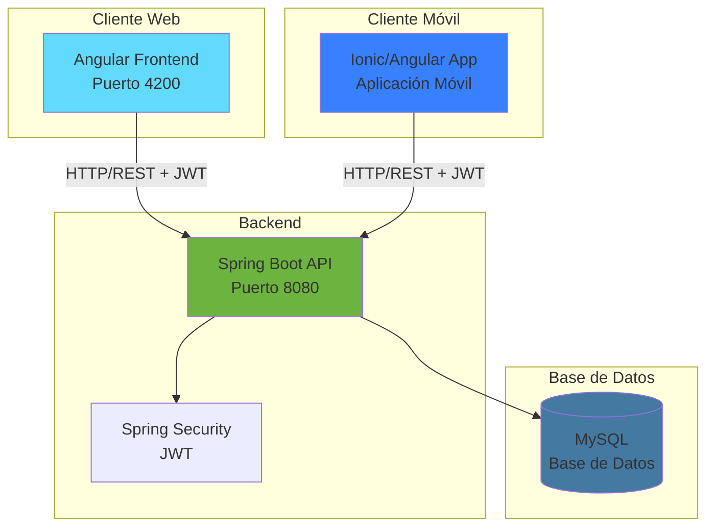

# Documentación del Sistema de Gestión de Jugadores de Fútbol Base

## 📋 Índice General

Este proyecto está compuesto por tres módulos principales que trabajan de forma integrada:

### 🗂️ Estructura de Documentación

1. **[Backend (Spring Boot)](./modulos/backend/README.md)**
   - Arquitectura y componentes
   - Endpoints REST API
   - Flujos de negocio
   - Modelo de datos

2. **[Frontend Web (Angular)](./modulos/frontend/README.md)**
   - Estructura de componentes
   - Servicios y guards
   - Rutas y navegación
   - Flujos de usuario

3. **[Mobile (Ionic/Angular)](./modulos/mobile/README.md)**
   - Arquitectura móvil
   - Páginas y componentes
   - Flujos de navegación
   - Características específicas

4. **[Integración y Arquitectura](./modulos/integracion/README.md)**
   - Comunicación entre módulos
   - Flujo de autenticación
   - Sincronización de datos
   - Diagramas de arquitectura general

## 🏗️ Arquitectura General del Sistema

## 🎯 Características Principales

### ✅ Gestión de Jugadores
- Registro y actualización de jugadores
- Asignación a equipos
- Seguimiento de estadísticas individuales

### ✅ Gestión de Partidos
- Creación y configuración de partidos
- Selección de alineación (titulares/suplentes)
- Registro de eventos en tiempo real
- Sustituciones durante el partido

### ✅ Sistema de Eventos
- Goles, asistencias, tarjetas
- Pases clave, tiros a puerta, robos
- Paradas (porteros)
- Goles del rival

### ✅ Estadísticas Avanzadas
- Estadísticas por jugador
- Estadísticas por equipo
- Análisis temporal (6 intervalos de 15 min)
- Análisis por estado del marcador
- Perfiles de rendimiento

### ✅ Seguridad
- Autenticación JWT
- Guards en rutas protegidas
- Interceptores HTTP
- Control de acceso por usuario

## 🚀 Stack Tecnológico

### Backend
- **Framework:** Spring Boot 2.7+
- **Lenguaje:** Java 11/17
- **Base de Datos:** MySQL
- **ORM:** JPA/Hibernate
- **Seguridad:** Spring Security + JWT
- **Documentación API:** Swagger/OpenAPI 3

### Frontend Web
- **Framework:** Angular 17+
- **Lenguaje:** TypeScript
- **UI:** Bootstrap 5 + Angular Material
- **Estado:** RxJS
- **HTTP:** HttpClient con interceptores

### Mobile
- **Framework:** Ionic 7
- **Base:** Angular + Capacitor
- **UI:** Ionic Components
- **Multiplataforma:** iOS/Android

## 📊 Métricas del Proyecto

- **Controladores REST:** 10+
- **Endpoints:** 50+
- **Entidades JPA:** 8
- **Componentes Angular (Web):** 20+
- **Páginas Ionic:** 7
- **Servicios:** 15+

## 🔗 Enlaces Rápidos

- [Arquitectura Modular Backend](./ARQUITECTURA_MODULAR.txt)
- [Guía de Migración V2](./MIGRACION_CONTROLADORES_V2.txt)
- [Configuración Swagger](./SWAGGER_CONFIG.txt)
- [Documentación Backend Detallada](./ARCHITECTURE.md)
- [Guía de Despliegue](./INSTRUCCIONES_DESPLIEGUE.txt)

## 📝 Última Actualización

**Fecha:** Enero 19, 2026

**Cambios Recientes:**
- ✅ Sistema completo de documentación con diagramas Mermaid
- ✅ Documentación modular por componente
- ✅ Flujos de usuario detallados
- ✅ Diagramas de arquitectura actualizados
