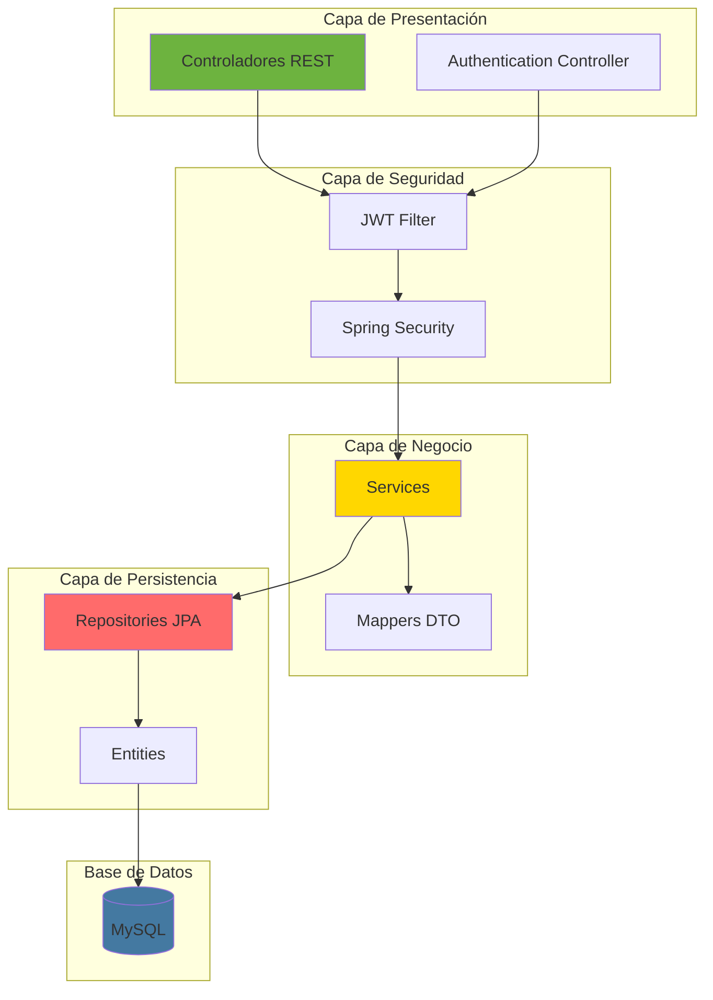
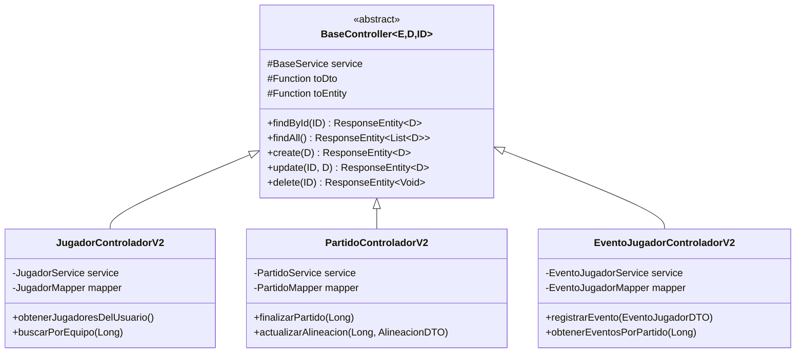
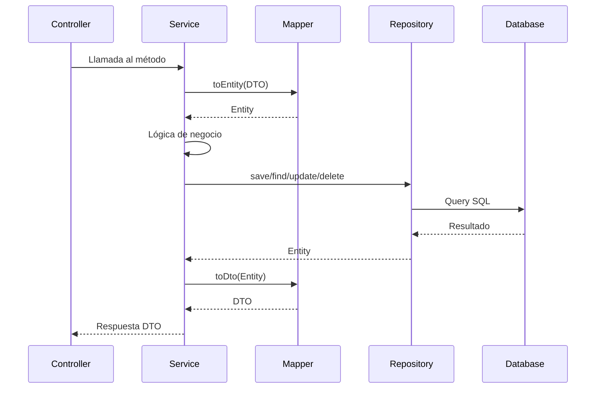
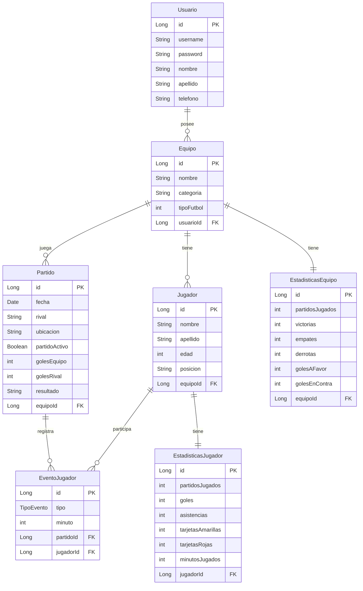
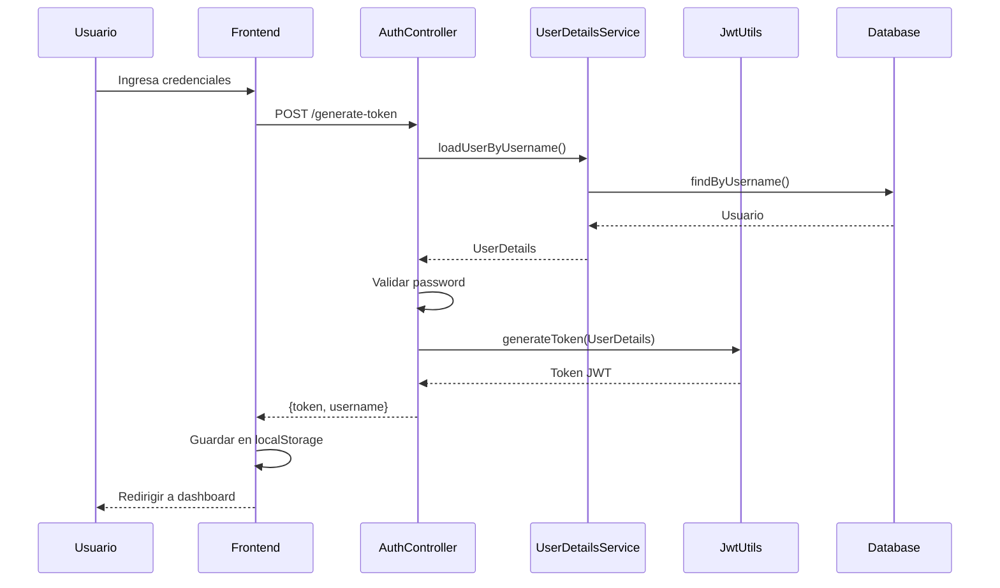
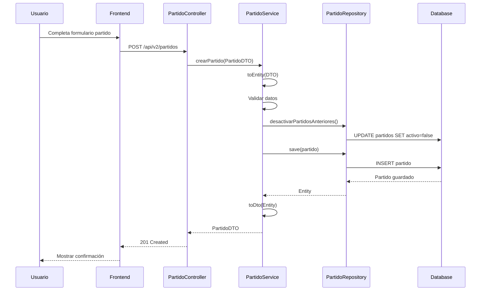
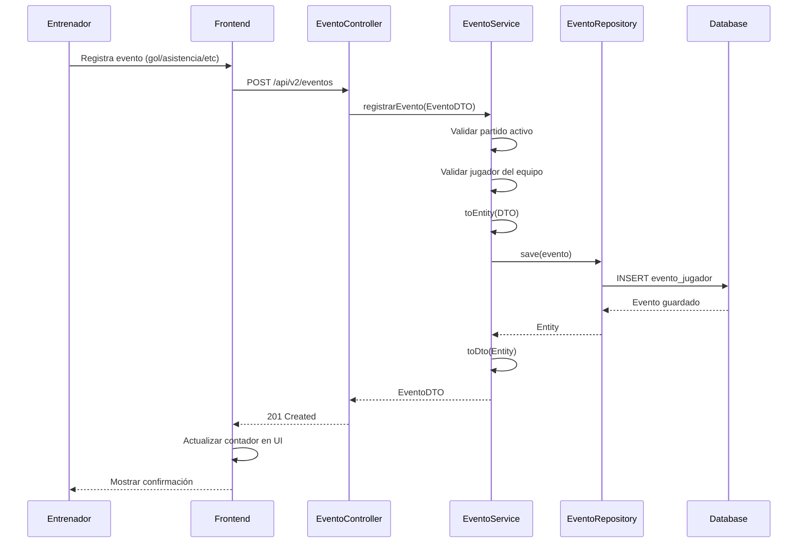
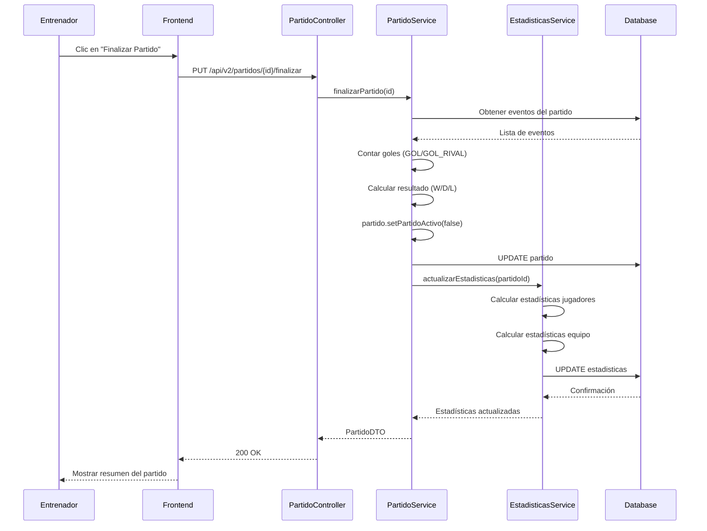
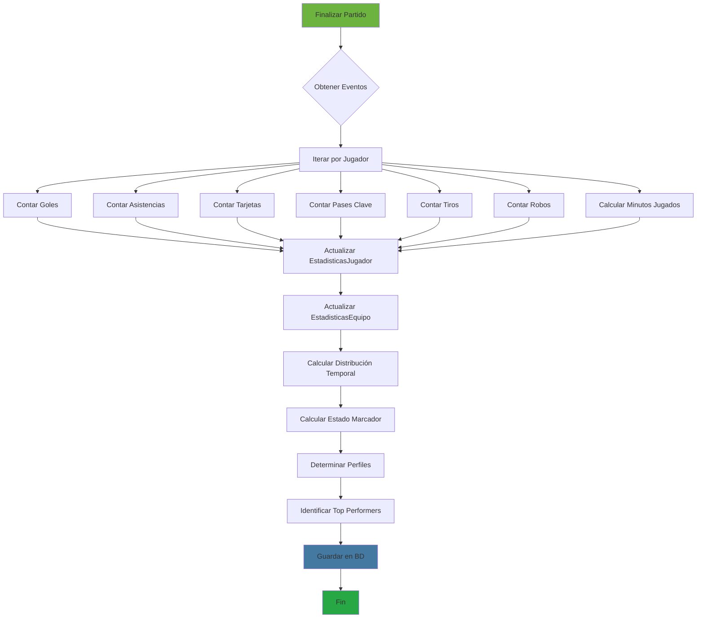
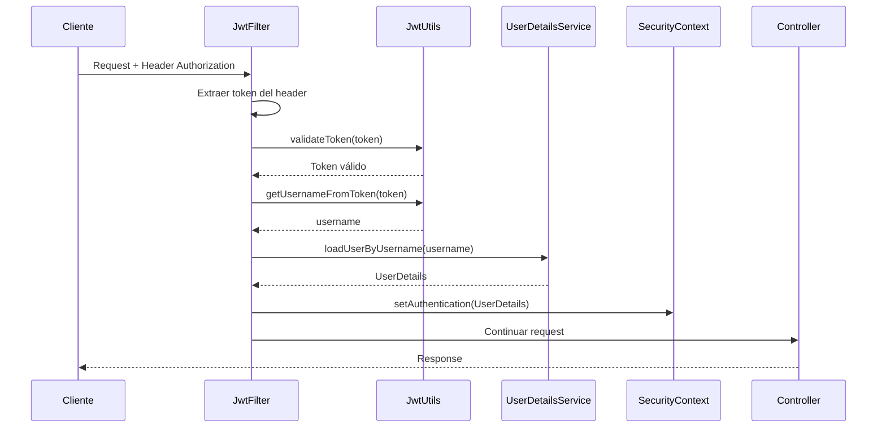

# 🔧 Backend - Sistema de Gestión de Jugadores

## 📋 Índice

1. [Arquitectura General](#arquitectura-general)
2. [Estructura de Paquetes](#estructura-de-paquetes)
3. [Controladores REST](#controladores-rest)
4. [Servicios de Negocio](#servicios-de-negocio)
5. [Modelo de Datos](#modelo-de-datos)
6. [Flujos Principales](#flujos-principales)

## Arquitectura General



## Estructura de Paquetes

```
com.gestion.jugadores/
├── controlador/              # Controladores REST
│   ├── base/                # Controladores genéricos
│   │   ├── BaseController.java
│   │   └── BaseService.java
│   ├── AuthenticationController.java
│   ├── EquipoController.java
│   ├── UsuarioController.java
│   ├── JugadorControladorV2.java
│   ├── PartidoControladorV2.java
│   ├── EventoJugadorControladorV2.java
│   └── EstadisticasControlador.java
│
├── modelo/                   # Entidades JPA
│   ├── Usuario.java
│   ├── Equipo.java
│   ├── Jugador.java
│   ├── Partido.java
│   ├── EventoJugador.java
│   ├── EstadisticasJugador.java
│   └── EstadisticasEquipo.java
│
├── dto/                      # Data Transfer Objects
│   ├── JugadorDTO.java
│   ├── PartidoDTO.java
│   ├── EventoJugadorDTO.java
│   ├── EstadisticasJugadorDTO.java
│   └── EstadisticasEquipoDTO.java
│
├── mapper/                   # Conversores Entity ↔ DTO
│   ├── JugadorMapper.java
│   ├── PartidoMapper.java
│   └── EventoJugadorMapper.java
│
├── servicios/               # Interfaces de servicios
│   ├── UsuarioService.java
│   ├── EquipoService.java
│   ├── JugadorService.java
│   ├── PartidoService.java
│   ├── EventoJugadorService.java
│   └── EstadisticasService.java
│
├── servicios/impl/          # Implementaciones
│   ├── UsuarioServiceImpl.java
│   ├── EquipoServiceImpl.java
│   ├── JugadorServiceImpl.java
│   ├── PartidoServiceImpl.java
│   ├── EventoJugadorServiceImpl.java
│   └── EstadisticasServiceImpl.java
│
├── repositorio/             # Repositorios JPA
│   ├── UsuarioRepository.java
│   ├── EquipoRepository.java
│   ├── JugadorRepository.java
│   ├── PartidoRepository.java
│   ├── EventoJugadorRepository.java
│   ├── EstadisticasJugadorRepository.java
│   └── EstadisticasEquipoRepository.java
│
├── configuraciones/         # Configuraciones
│   ├── JwtUtils.java
│   ├── SecurityConfig.java
│   ├── CorsConfig.java
│   └── SwaggerConfig.java
│
└── excepciones/            # Manejo de errores
    ├── ResourceNotFoundException.java
    └── GlobalExceptionHandler.java
```

## Controladores REST

### 📌 Arquitectura de Controladores V2



### Endpoints Principales

#### 🔐 Autenticación
```
POST   /api/auth/generate-token        # Login y generación JWT
GET    /api/auth/actual-usuario        # Obtener usuario actual
POST   /api/auth/registro              # Registro de nuevo usuario
```

#### 👥 Jugadores
```
GET    /api/v2/jugadores               # Listar todos los jugadores
GET    /api/v2/jugadores/{id}          # Obtener jugador por ID
POST   /api/v2/jugadores               # Crear nuevo jugador
PUT    /api/v2/jugadores/{id}          # Actualizar jugador
DELETE /api/v2/jugadores/{id}          # Eliminar jugador
GET    /api/v2/jugadores/equipo/{id}   # Jugadores por equipo
```

#### ⚽ Partidos
```
GET    /api/v2/partidos                # Listar partidos
GET    /api/v2/partidos/{id}           # Obtener partido por ID
POST   /api/v2/partidos                # Crear partido
PUT    /api/v2/partidos/{id}           # Actualizar partido
DELETE /api/v2/partidos/{id}           # Eliminar partido
PUT    /api/v2/partidos/{id}/finalizar # Finalizar partido
PUT    /api/v2/partidos/{id}/alineacion # Actualizar alineación
```

#### 📊 Eventos
```
POST   /api/v2/eventos                 # Registrar evento
GET    /api/v2/eventos/partido/{id}    # Eventos por partido
GET    /api/v2/eventos/jugador/{id}    # Eventos por jugador
DELETE /api/v2/eventos/{id}            # Eliminar evento
```

#### 📈 Estadísticas
```
GET    /api/estadisticas/jugador/{id}              # Estadísticas de jugador
GET    /api/estadisticas/equipo/{id}               # Estadísticas de equipo
GET    /api/estadisticas/equipo/{id}/jugadores     # Estadísticas todos los jugadores
GET    /api/estadisticas/equipo/{id}/temporada/{t} # Estadísticas por temporada
```

## Servicios de Negocio

### Flujo de Servicio Genérico



### Servicios Clave

#### JugadorService
- `guardarJugador(Jugador)`: Registra nuevo jugador
- `obtenerJugadoresPorEquipo(Long)`: Lista jugadores del equipo
- `actualizarJugador(Long, Jugador)`: Actualiza datos del jugador
- `eliminarJugador(Long)`: Elimina jugador y sus estadísticas

#### PartidoService
- `crearPartido(Partido)`: Crea nuevo partido
- `finalizarPartido(Long)`: Finaliza partido y actualiza estadísticas
- `actualizarAlineacion(Long, List, List)`: Actualiza titulares/suplentes
- `desactivarPartidosAnteriores(Long)`: Desactiva otros partidos del equipo

#### EventoJugadorService
- `registrarEvento(EventoJugador)`: Registra evento en partido
- `obtenerEventosPorPartido(Long)`: Lista eventos del partido
- `eliminarEvento(Long)`: Elimina evento y recalcula estadísticas

#### EstadisticasService
- `obtenerEstadisticasJugador(Long)`: Obtiene estadísticas completas
- `obtenerEstadisticasEquipo(Long)`: Obtiene estadísticas del equipo
- `actualizarEstadisticas(Long)`: Recalcula estadísticas tras finalizar partido

## Modelo de Datos

### Diagrama de Entidades



### Relaciones Principales

1. **Usuario → Equipo (1:N)**
   - Un usuario puede tener múltiples equipos
   - Cada equipo pertenece a un único usuario

2. **Equipo → Jugador (1:N)**
   - Un equipo tiene múltiples jugadores
   - Cada jugador pertenece a un equipo

3. **Equipo → Partido (1:N)**
   - Un equipo juega múltiples partidos
   - Cada partido corresponde a un equipo

4. **Partido → EventoJugador (1:N)**
   - Un partido tiene múltiples eventos
   - Cada evento pertenece a un partido

5. **Jugador ↔ EstadisticasJugador (1:1)**
   - Cada jugador tiene un registro de estadísticas
   - Eliminación en cascada

## Flujos Principales

### 1. Flujo de Autenticación



### 2. Flujo de Creación de Partido



### 3. Flujo de Registro de Eventos



### 4. Flujo de Finalización de Partido



### 5. Flujo de Cálculo de Estadísticas



## 🔒 Seguridad

### Flujo de Seguridad JWT



## 📊 Swagger/OpenAPI

Acceso a documentación interactiva:
- **URL:** http://localhost:8080/swagger-ui.html
- **API Docs:** http://localhost:8080/v3/api-docs

## 🚀 Mejoras Implementadas

- ✅ Arquitectura modular con BaseController
- ✅ Reducción de código duplicado (70-80%)
- ✅ Sistema de estadísticas avanzado
- ✅ Análisis temporal y por estado de marcador
- ✅ Logging completo con SLF4J
- ✅ Tests unitarios con JUnit 5 y Mockito
- ✅ Documentación Swagger completa
- ✅ Validaciones de negocio robustas
- ✅ Manejo global de excepciones
