# 🌐 Frontend Web - Angular

## 📋 Índice

1. [Arquitectura General](#arquitectura-general)
2. [Estructura de Componentes](#estructura-de-componentes)
3. [Servicios](#servicios)
4. [Rutas y Navegación](#rutas-y-navegación)
5. [Flujos de Usuario](#flujos-de-usuario)

## Arquitectura General

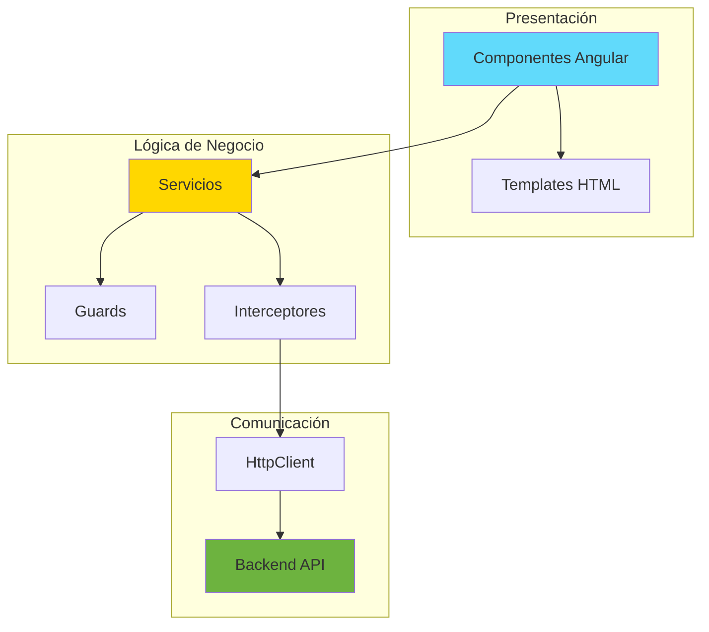

## Estructura de Componentes

```
src/app/
├── components/              # Componentes reutilizables
│   ├── navbar/             # Barra de navegación
│   └── modal/              # Modales reutilizables
│
├── pages/                   # Páginas principales
│   ├── login/              # Página de login
│   ├── perfil/             # Perfil de usuario
│   └── unauthorized/       # Página de acceso denegado
│
├── lista-jugadores/        # Gestión de jugadores
│   ├── lista-jugadores.component.ts
│   ├── lista-jugadores.component.html
│   └── lista-jugadores.component.css
│
├── registrar-jugador/      # Formulario nuevo jugador
│   ├── registrar-jugador.component.ts
│   └── registrar-jugador.component.html
│
├── actualizar-jugador/     # Formulario editar jugador
│   ├── actualizar-jugador.component.ts
│   └── actualizar-jugador.component.html
│
├── jugador-detalles/       # Vista detallada jugador
│   ├── jugador-detalles.component.ts
│   └── jugador-detalles.component.html
│
├── partido-crear/          # Crear nuevo partido
│   ├── partido-crear.component.ts
│   └── partido-crear.component.html
│
├── partido-modo/           # Modo partido (en vivo)
│   ├── partido-modo.component.ts
│   ├── partido-modo.component.html
│   └── partido-modo.component.css
│
├── historial-partidos/     # Lista de partidos
│   ├── historial-partidos.component.ts
│   └── historial-partidos.component.html
│
├── graficos/               # Dashboard de estadísticas
│   ├── graficos.component.ts
│   └── graficos.component.html
│
├── services/               # Servicios
│   ├── auth.service.ts
│   ├── auth.guard.ts
│   ├── auth.interceptor.ts
│   ├── jugador.service.ts
│   ├── equipo.service.ts
│   ├── partido.service.ts
│   └── evento-jugador.service.ts
│
├── models/                 # Modelos TypeScript
│   ├── auth.model.ts
│   ├── jugador.ts
│   ├── equipo.ts
│   ├── partido.ts
│   └── evento-jugador.ts
│
├── app-routing.module.ts   # Configuración de rutas
├── app.module.ts           # Módulo principal
└── app.component.ts        # Componente raíz
```

## Arquitectura de Componentes

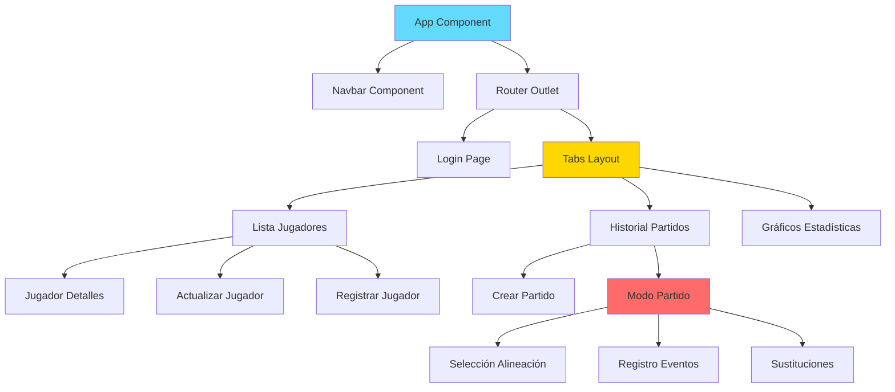

## Servicios

### AuthService

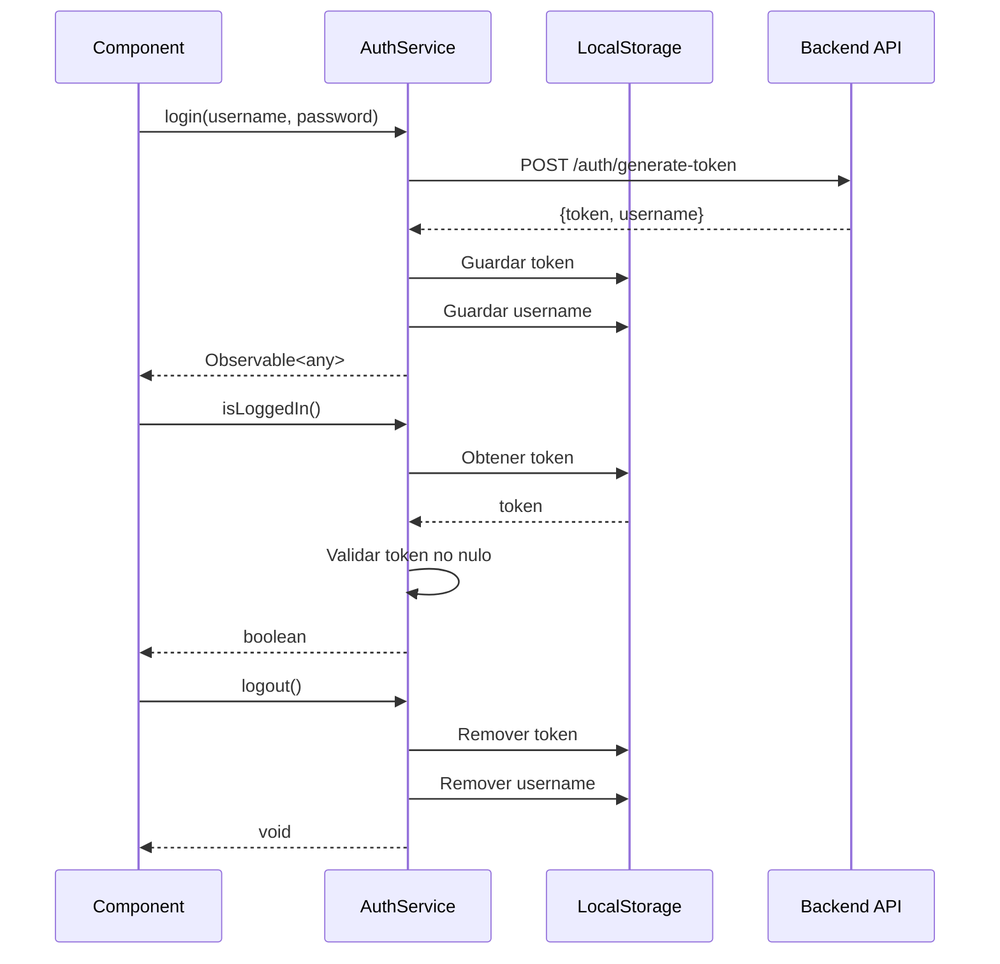

**Métodos principales:**
```typescript
- login(username, password): Observable<any>
- logout(): void
- isLoggedIn(): boolean
- getToken(): string | null
- getUsername(): string | null
- getCurrentUser(): Observable<any>
```

### JugadorService

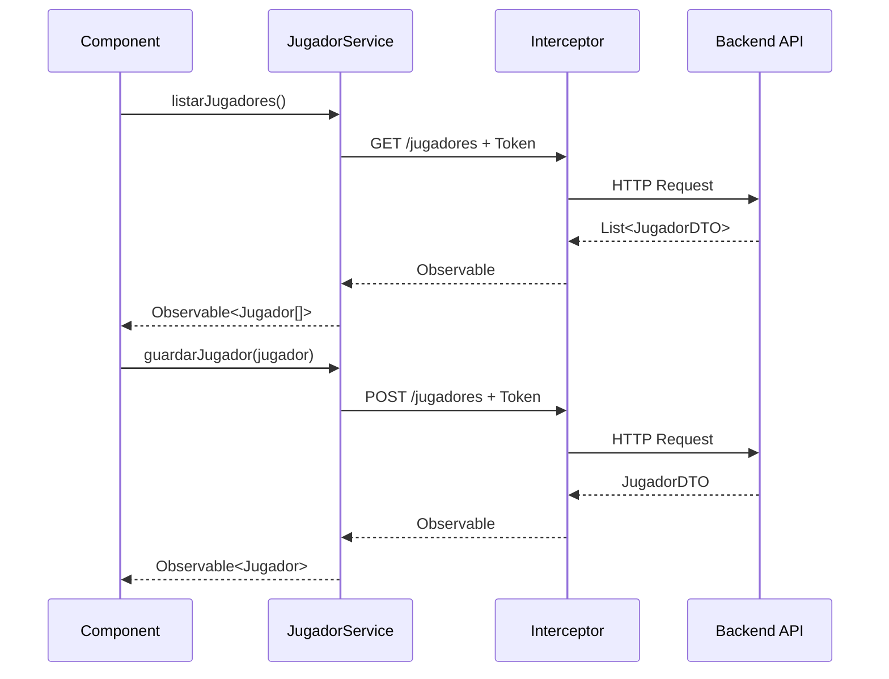

**Métodos principales:**
```typescript
- listarJugadores(): Observable<Jugador[]>
- guardarJugador(jugador: Jugador): Observable<Jugador>
- obtenerJugadorPorId(id: number): Observable<Jugador>
- actualizarJugador(id: number, jugador: Jugador): Observable<Jugador>
- eliminarJugador(id: number): Observable<void>
- obtenerJugadoresPorEquipo(equipoId: number): Observable<Jugador[]>
```

### PartidoService

**Métodos principales:**
```typescript
- crearPartido(partido: Partido): Observable<Partido>
- obtenerPartidos(): Observable<Partido[]>
- obtenerPartidoPorId(id: number): Observable<Partido>
- actualizarPartido(id: number, partido: Partido): Observable<Partido>
- finalizarPartido(id: number): Observable<Partido>
- actualizarAlineacion(id: number, alineacion: any): Observable<Partido>
- eliminarPartido(id: number): Observable<void>
```

### EventoJugadorService

**Métodos principales:**
```typescript
- registrarEvento(evento: EventoJugador): Observable<EventoJugador>
- obtenerEventosPorPartido(partidoId: number): Observable<EventoJugador[]>
- obtenerEventosPorJugador(jugadorId: number): Observable<EventoJugador[]>
- eliminarEvento(id: number): Observable<void>
```

## Guards e Interceptores

### AuthGuard

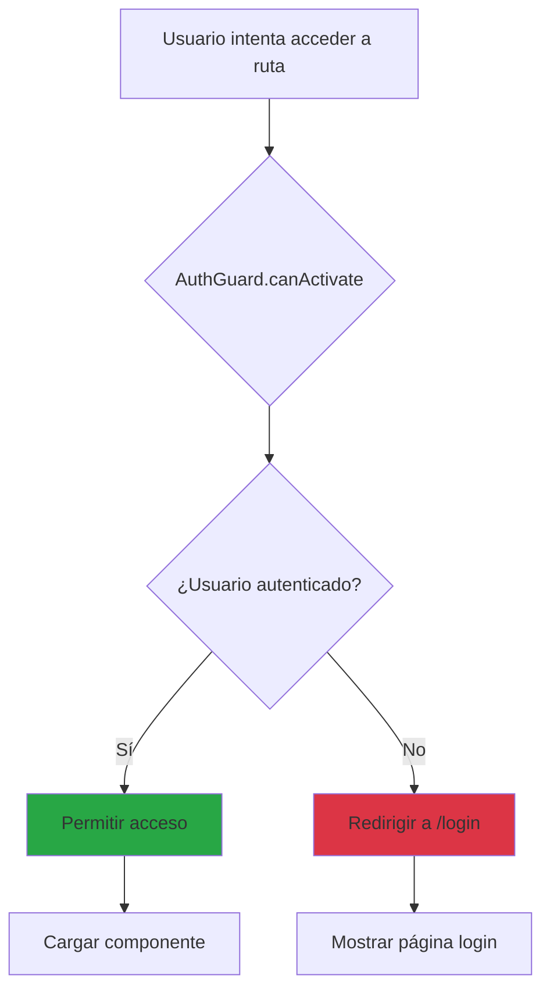

### GuestGuard

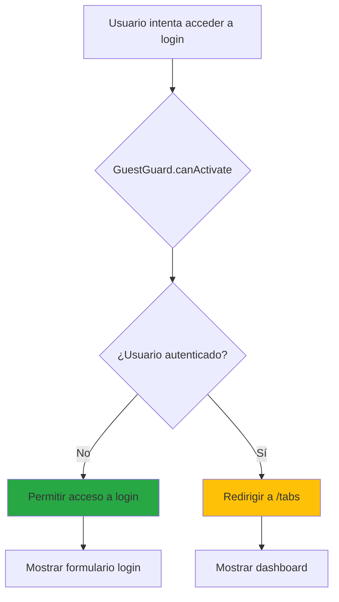

### AuthInterceptor

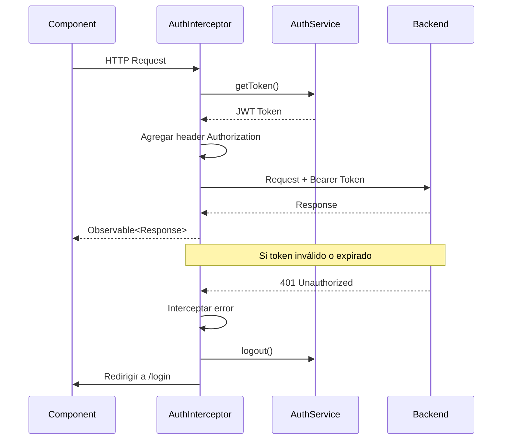

## Rutas y Navegación

### Configuración de Rutas

```mermaid
graph LR
    ROOT[/] --> LOGIN[/login]
    ROOT --> TABS[/tabs]
    
    TABS --> TAB1[/tabs/jugadores]
    TABS --> TAB2[/tabs/partidos]
    TABS --> TAB3[/tabs/estadisticas]
    
    TAB1 --> NEW[/registrar-jugador]
    TAB1 --> EDIT[/actualizar-jugador/:id]
    TAB1 --> DETAIL[/jugador-detalles/:id]
    
    TAB2 --> CREATE[/partido-crear]
    TAB2 --> MODO[/partido-modo/:id]
    
    ROOT --> PERFIL[/perfil]
    ROOT --> UNAUTH[/unauthorized]
    
    style LOGIN fill:#ffc107
    style TABS fill:#61dafb
    style MODO fill:#ff6b6b
```

### Tabla de Rutas

| Ruta | Componente | Guard | Descripción |
|------|-----------|-------|-------------|
| `/` | - | - | Redirige a `/login` |
| `/login` | LoginPage | GuestGuard | Página de autenticación |
| `/tabs` | TabsPage | AuthGuard | Layout principal con tabs |
| `/tabs/jugadores` | ListaJugadores | AuthGuard | Lista de jugadores |
| `/tabs/partidos` | HistorialPartidos | AuthGuard | Historial de partidos |
| `/tabs/estadisticas` | Graficos | AuthGuard | Dashboard estadísticas |
| `/registrar-jugador` | RegistrarJugador | AuthGuard | Formulario nuevo jugador |
| `/actualizar-jugador/:id` | ActualizarJugador | AuthGuard | Formulario editar jugador |
| `/jugador-detalles/:id` | JugadorDetalles | AuthGuard | Vista detallada jugador |
| `/partido-crear` | PartidoCrear | AuthGuard | Formulario nuevo partido |
| `/partido-modo/:id` | PartidoModo | AuthGuard | Modo partido en vivo |
| `/perfil` | PerfilPage | AuthGuard | Perfil del usuario |
| `/unauthorized` | UnauthorizedPage | - | Acceso denegado |

## Flujos de Usuario

### 1. Flujo de Login

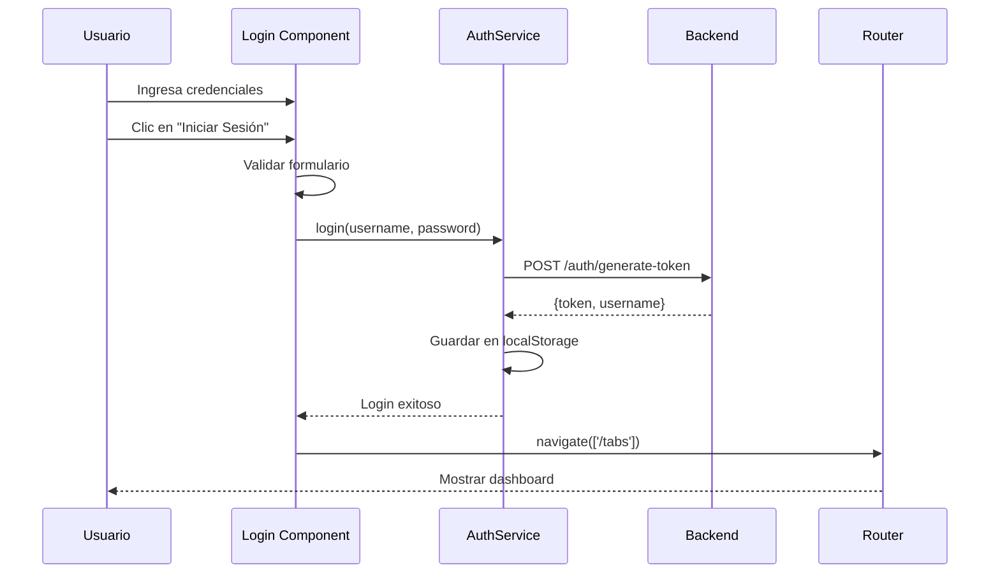

### 2. Flujo de Gestión de Jugadores

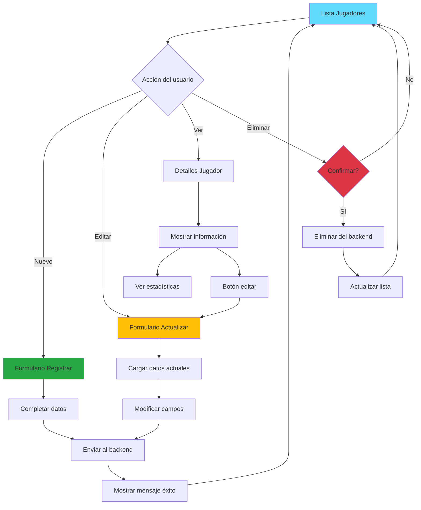

### 3. Flujo de Creación de Partido

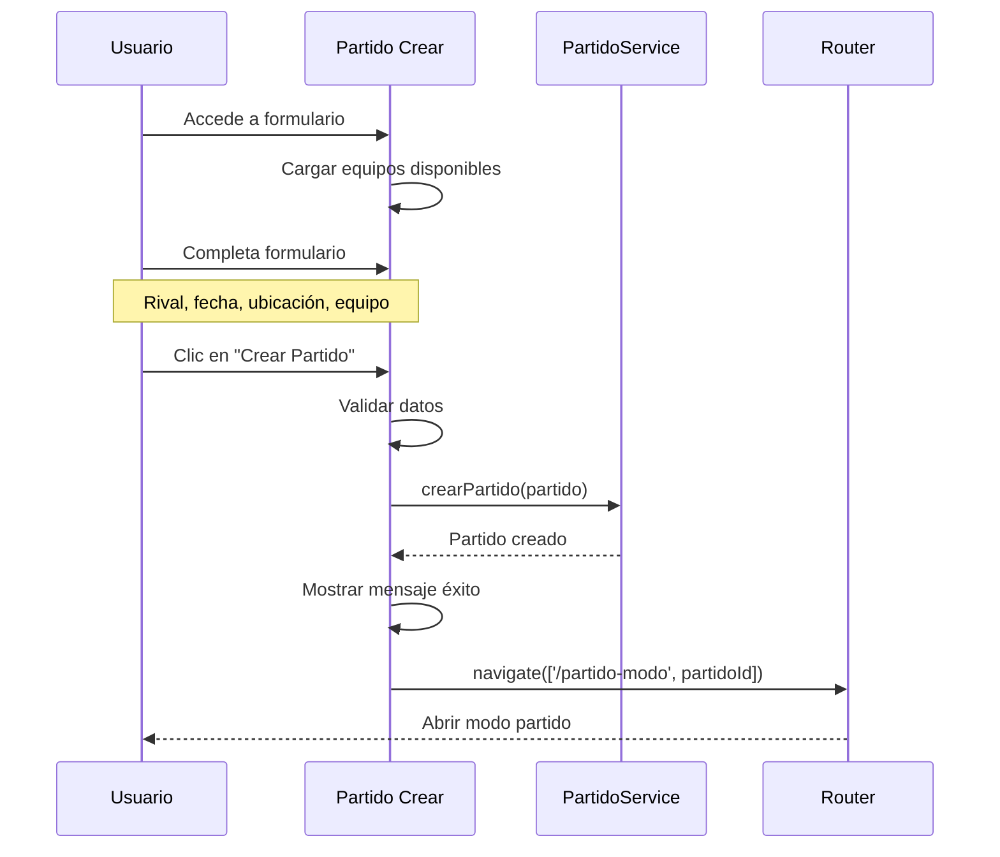

### 4. Flujo de Modo Partido (En Vivo)

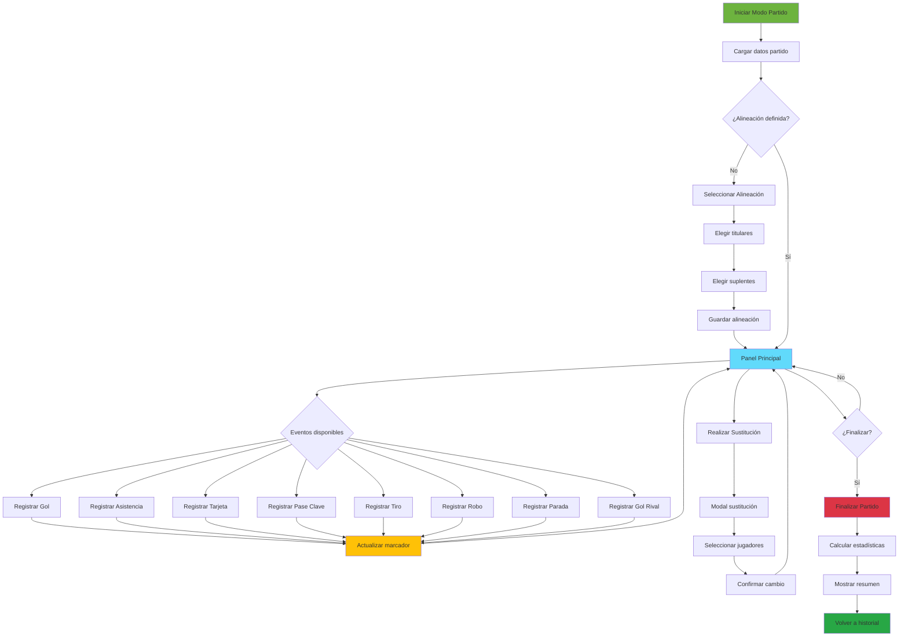

### 5. Flujo de Registro de Eventos

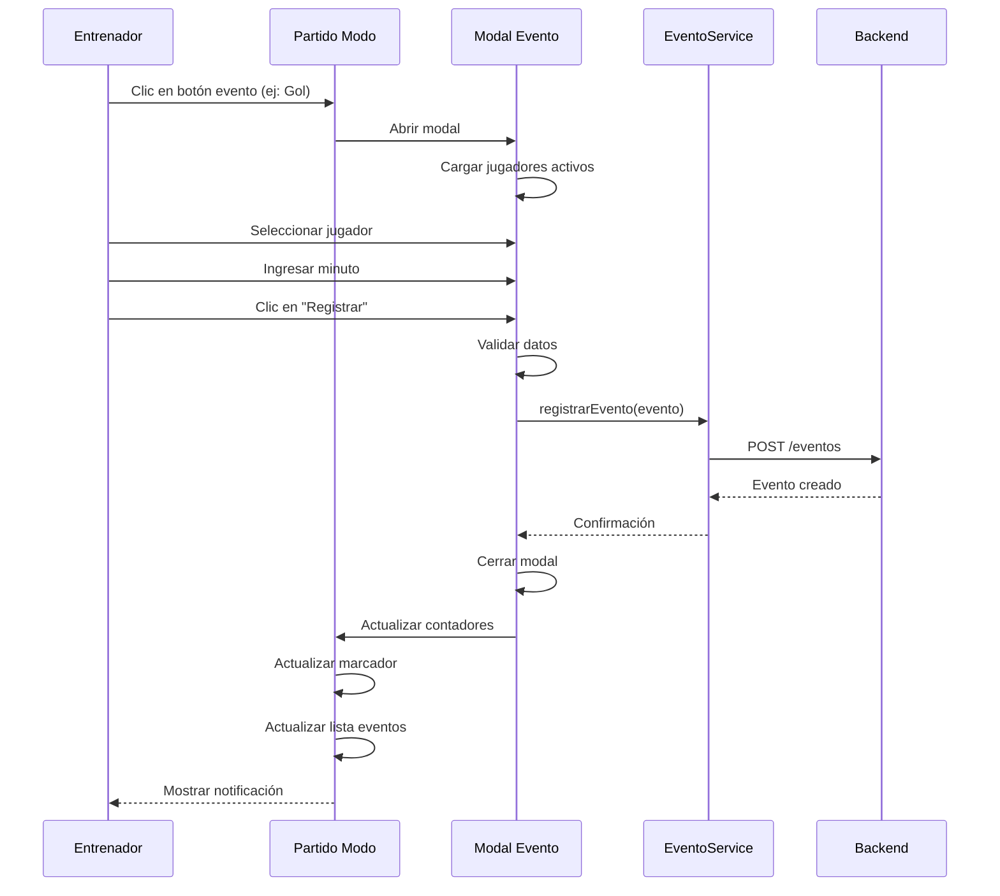

### 6. Flujo de Sustituciones

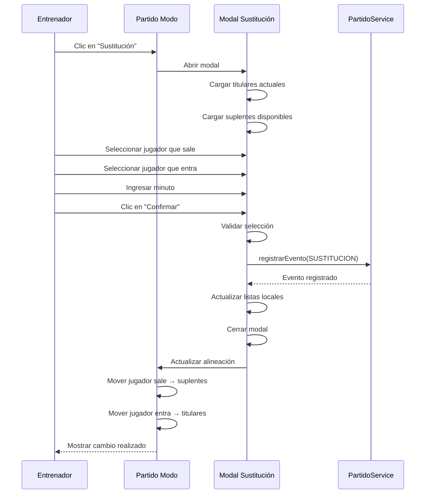

### 7. Flujo de Visualización de Estadísticas

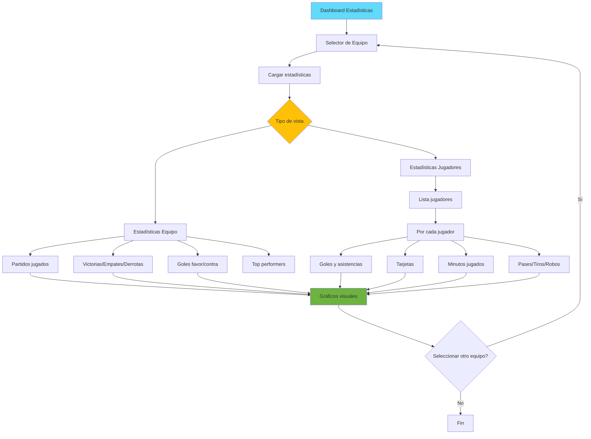

## Componentes Clave

### NavbarComponent

**Responsabilidades:**
- Mostrar logo y título de la aplicación
- Mostrar nombre de usuario actual
- Botón de cerrar sesión
- Navegación entre secciones

### PartidoModoComponent

**Características principales:**
- ⚡ Modo tiempo real con actualización automática
- 📊 Marcador en vivo (goles equipo vs rival)
- 🔄 Sistema de sustituciones ilimitadas
- 📝 Registro de 8 tipos de eventos
- 👥 Gestión de alineación (titulares/suplentes)
- ⏱️ Control de minutos jugados
- 🎯 Botones de acción rápida
- ✅ Finalización y cálculo automático de estadísticas

### GraficosComponent

**Características principales:**
- 📈 Visualización con Chart.js
- 🎯 Selector de equipo dinámico
- 📊 Métricas clave del equipo
- 👤 Estadísticas individuales de jugadores
- 🏆 Rankings y comparativas
- 📅 Filtro por temporada

## 🎨 Estilos y UI

- **Framework CSS:** Bootstrap 5
- **Componentes:** Angular Material (modales, forms)
- **Iconos:** Bootstrap Icons / Font Awesome
- **Responsive:** Mobile-first design
- **Temas:** Colores del club personalizables

## 🚀 Optimizaciones

- ✅ Lazy loading de módulos
- ✅ Preloading strategy de rutas
- ✅ Change detection OnPush en componentes críticos
- ✅ Unsubscribe automático con takeUntil
- ✅ Manejo de errores con toast notifications
- ✅ Caché de datos en servicios
- ✅ Validaciones reactivas en formularios
