# 📱 Mobile - Ionic/Angular

> **Última actualización:** 27 Enero 2026  
> **Versión:** VersionMovil - Sistema de estadísticas + Evento PERDIDA

## 📋 Índice

1. [Arquitectura General](#arquitectura-general)
2. [Estructura de Páginas](#estructura-de-páginas)
3. [Navegación y Tabs](#navegación-y-tabs)
4. [Servicios Core](#servicios-core)
5. [Flujos de Usuario Mobile](#flujos-de-usuario-mobile)
6. [Funcionalidades Implementadas](#funcionalidades-implementadas)
7. [Sistema de Gestión de Partidos](#sistema-de-gestión-de-partidos)
8. [Cambios Recientes](#cambios-recientes)

## Arquitectura General

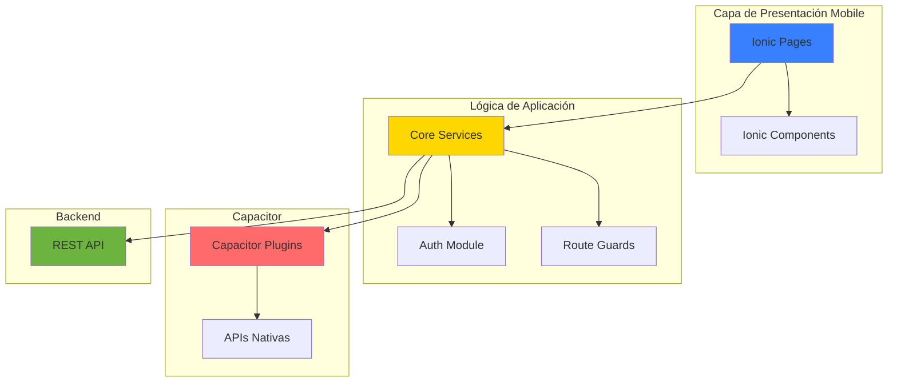

## Estructura de Páginas

```
src/app/
├── core/                       # Módulo core
│   ├── guards/                # Guards de navegación
│   │   ├── auth.guard.ts
│   │   └── guest.guard.ts
│   ├── interceptors/          # Interceptores HTTP
│   │   └── auth.interceptor.ts
│   ├── services/              # Servicios core
│   │   ├── auth.service.ts
│   │   ├── storage.service.ts
│   │   └── api.service.ts
│   └── models/                # Modelos TypeScript
│       ├── user.model.ts
│       ├── jugador.model.ts
│       ├── equipo.model.ts
│       └── partido.model.ts
│
├── pages/                     # Páginas de la app
│   ├── login/                # Autenticación
│   │   ├── login.page.ts
│   │   ├── login.page.html
│   │   └── login.page.scss
│   │
│   ├── jugadores/            # Lista de jugadores
│   │   ├── jugadores.page.ts
│   │   ├── jugadores.page.html
│   │   └── jugadores.page.scss
│   │
│   ├── jugador-form/         # Formulario jugador
│   │   ├── jugador-form.page.ts
│   │   ├── jugador-form.page.html
│   │   └── jugador-form.page.scss
│   │
│   ├── equipos/              # Lista de equipos
│   │   ├── equipos.page.ts
│   │   ├── equipos.page.html
│   │   └── equipos.page.scss
│   │
│   ├── equipo-form/          # Formulario equipo
│   │   ├── equipo-form.page.ts
│   │   ├── equipo-form.page.html
│   │   └── equipo-form.page.scss
│   │
│   ├── partidos/             # Gestión de partidos
│   │   ├── partidos.page.ts
│   │   ├── partidos.page.html
│   │   └── partidos.page.scss
│   │
│   └── estadisticas/         # Estadísticas
│       ├── estadisticas.page.ts
│       ├── estadisticas.page.html
│       └── estadisticas.page.scss
│
├── home/                      # Página de inicio
│   ├── home.page.ts
│   ├── home.page.html
│   └── home.page.scss
│
├── app.component.ts           # Componente raíz
├── app.routes.ts              # Configuración de rutas
└── app.config.ts              # Configuración de la app
```

## Arquitectura de Navegación

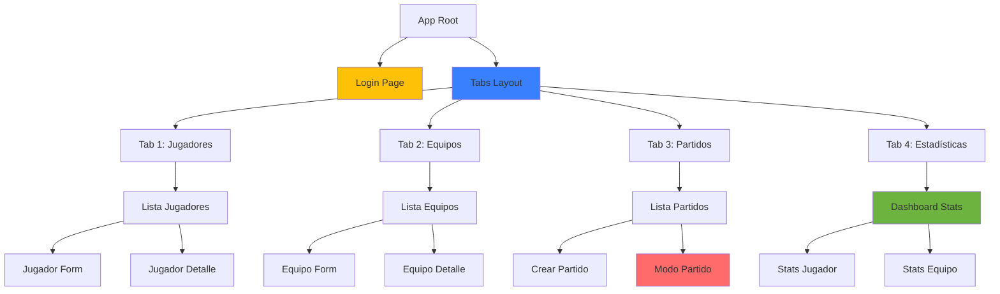

## Navegación y Tabs

### Configuración de Rutas

```typescript
// app.routes.ts
export const routes: Routes = [
  {
    path: '',
    redirectTo: '/login',
    pathMatch: 'full',
  },
  {
    path: 'login',
    loadComponent: () => import('./pages/login/login.page')
      .then(m => m.LoginPage)
  },
  {
    path: 'jugadores',
    loadComponent: () => import('./pages/jugadores/jugadores.page')
      .then(m => m.JugadoresPage),
    canActivate: [AuthGuard]
  },
  {
    path: 'equipos',
    loadComponent: () => import('./pages/equipos/equipos.page')
      .then(m => m.EquiposPage),
    canActivate: [AuthGuard]
  },
  {
    path: 'partidos',
    loadComponent: () => import('./pages/partidos/partidos.page')
      .then(m => m.PartidosPage),
    canActivate: [AuthGuard]
  },
  {
    path: 'estadisticas',
    loadComponent: () => import('./pages/estadisticas/estadisticas.page')
      .then(m => m.EstadisticasPage),
    canActivate: [AuthGuard]
  }
];
```

### Estructura de Tabs

```mermaid
graph LR
    TABS[ion-tabs]
    
    TABS --> TAB1[ion-tab-button<br/>Jugadores<br/>🏃]
    TABS --> TAB2[ion-tab-button<br/>Equipos<br/>⚽]
    TABS --> TAB3[ion-tab-button<br/>Partidos<br/>🏆]
    TABS --> TAB4[ion-tab-button<br/>Estadísticas<br/>📊]
    
    TAB1 --> ROUTE1[/jugadores]
    TAB2 --> ROUTE2[/equipos]
    TAB3 --> ROUTE3[/partidos]
    TAB4 --> ROUTE4[/estadisticas]
    
    style TABS fill:#3880ff
    style TAB1 fill:#61dafb
    style TAB2 fill:#ffd700
    style TAB3 fill:#ff6b6b
    style TAB4 fill:#6db33f
```

## Servicios Core

### AuthService (Mobile)

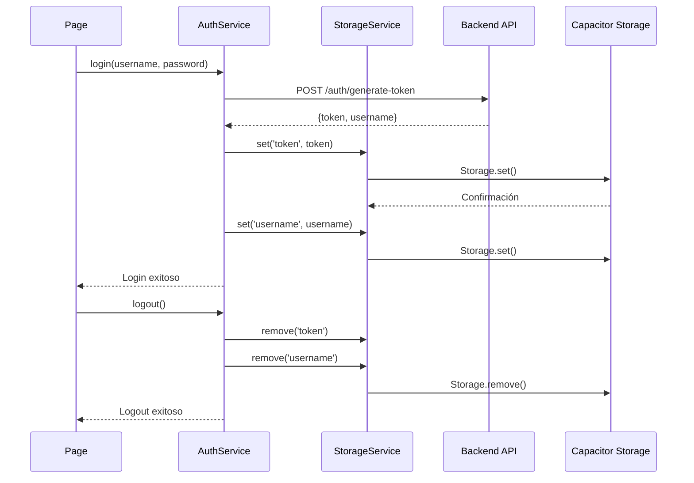

**Características específicas mobile:**
- Persistencia con Capacitor Storage
- Sincronización offline
- Biometría (Face ID / Touch ID)
- Token refresh automático

### StorageService

```typescript
// Métodos principales
- set(key: string, value: any): Promise<void>
- get(key: string): Promise<any>
- remove(key: string): Promise<void>
- clear(): Promise<void>
```

**Implementación con Capacitor:**
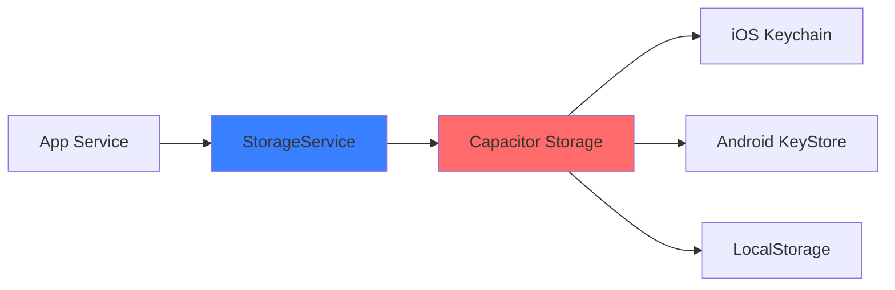

### ApiService

```typescript
// Métodos principales
- get<T>(endpoint: string): Observable<T>
- post<T>(endpoint: string, body: any): Observable<T>
- put<T>(endpoint: string, body: any): Observable<T>
- delete<T>(endpoint: string): Observable<T>
```

## Flujos de Usuario Mobile

### 1. Flujo de Login Mobile

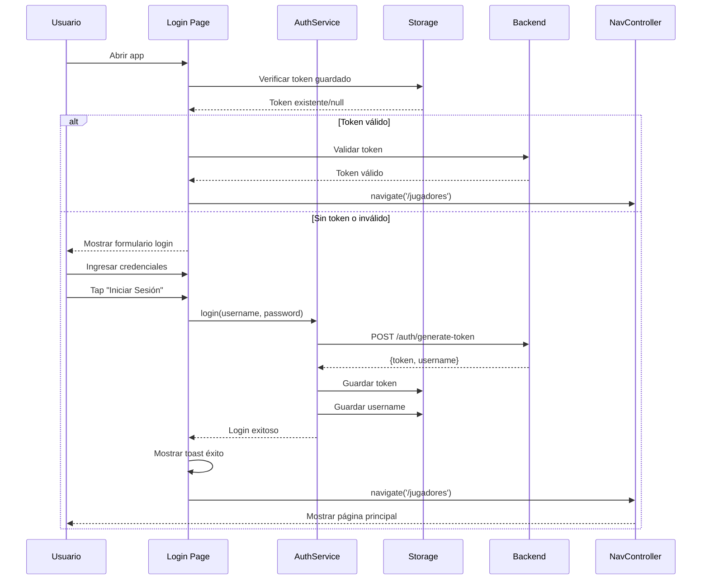

### 2. Flujo de Gestión de Jugadores Mobile

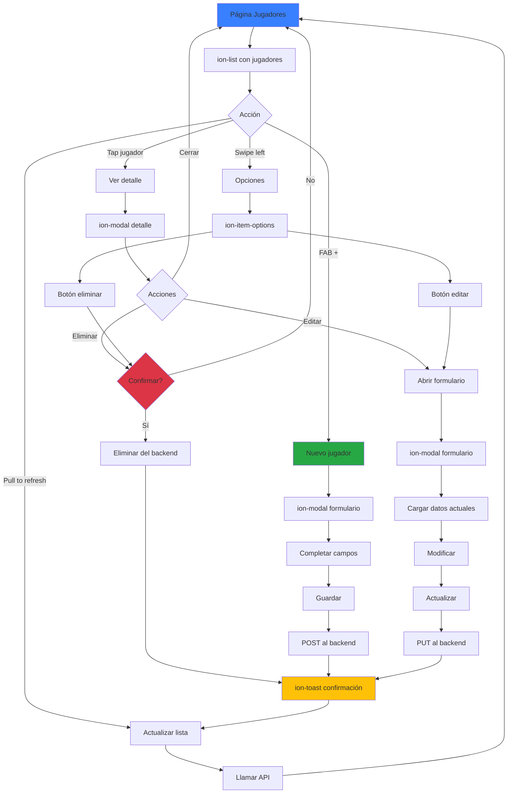

### 3. Flujo de Creación de Partido Mobile

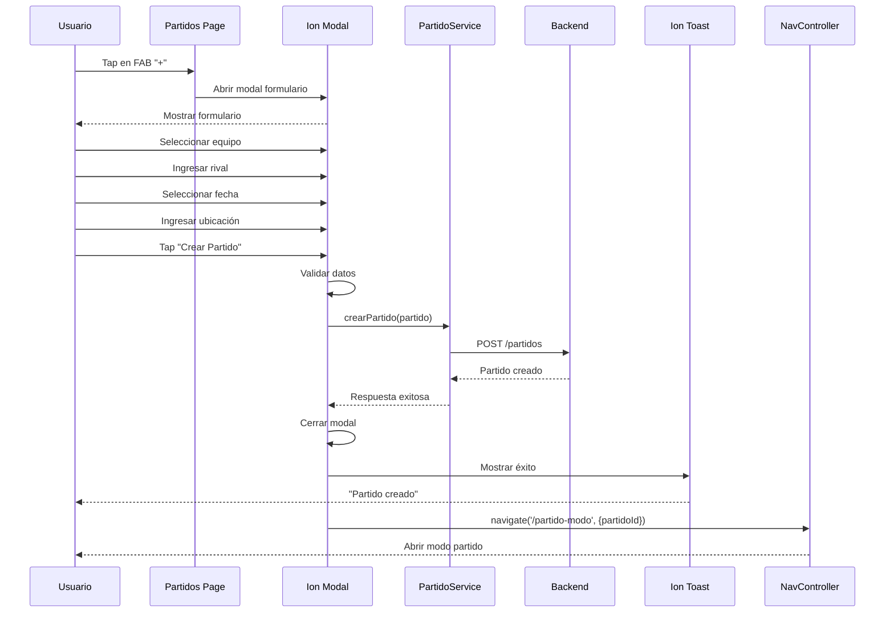

### 4. Flujo de Modo Partido Mobile

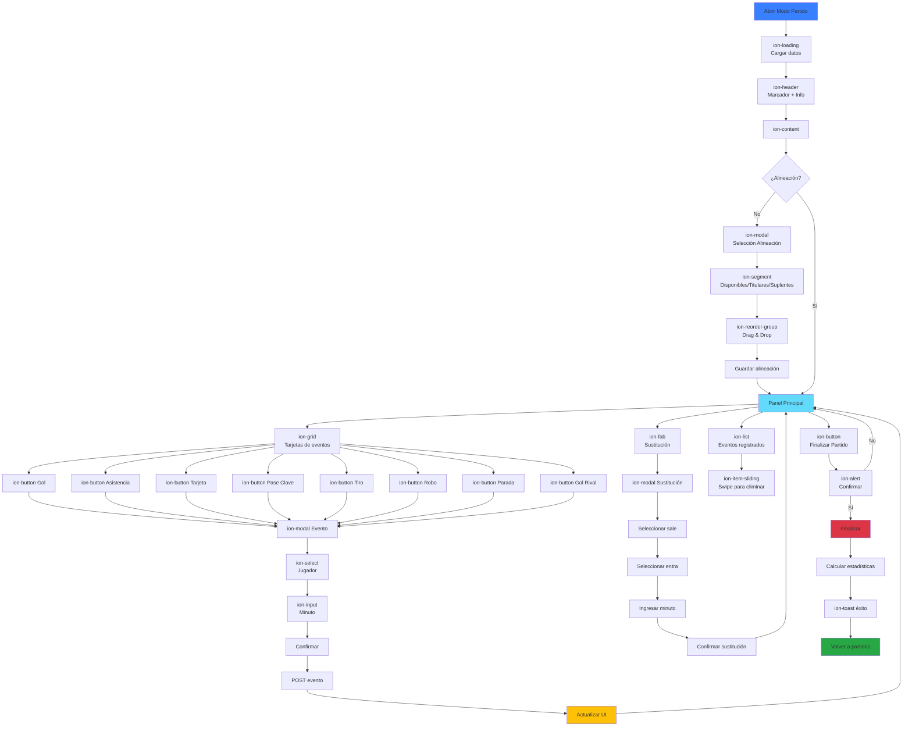

### 5. Flujo de Estadísticas Mobile

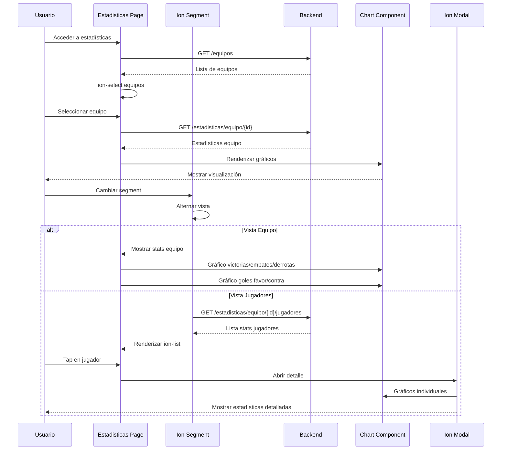

### 6. Flujo de Sincronización Offline

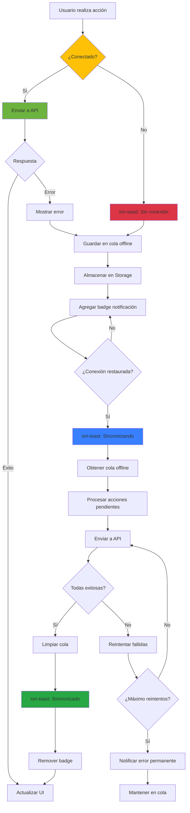

## Componentes Ionic Utilizados

### Layout Components
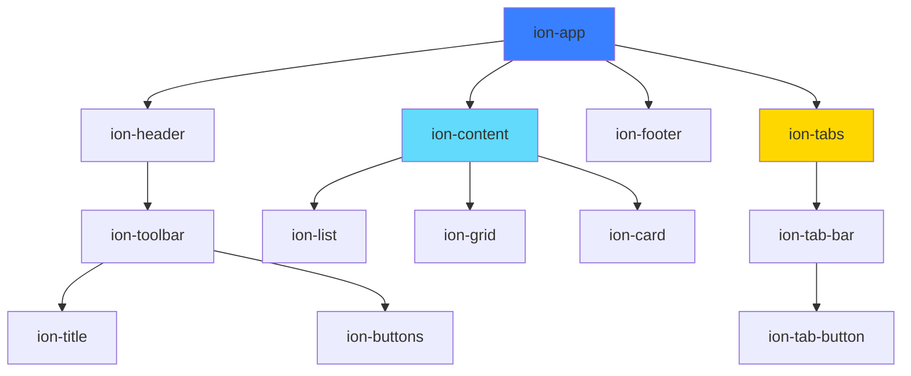

### Interactive Components
- **ion-button**: Botones de acción
- **ion-fab**: Floating Action Button
- **ion-input**: Campos de texto
- **ion-select**: Selectores dropdown
- **ion-toggle**: Switch on/off
- **ion-checkbox**: Casillas de verificación
- **ion-radio**: Botones de radio
- **ion-searchbar**: Barra de búsqueda
- **ion-segment**: Tabs segmentados

### Navigation Components
- **ion-nav**: Navegación stack
- **ion-router-outlet**: Router de Angular
- **ion-back-button**: Botón de retroceso
- **ion-menu**: Menú lateral
- **ion-menu-toggle**: Toggle del menú

### Feedback Components
- **ion-loading**: Indicador de carga
- **ion-toast**: Notificaciones temporales
- **ion-alert**: Diálogos de alerta
- **ion-modal**: Modales fullscreen
- **ion-popover**: Popovers contextuales
- **ion-progress-bar**: Barra de progreso
- **ion-spinner**: Indicador de carga circular

## Características Específicas Mobile

### 1. Gestos Táctiles

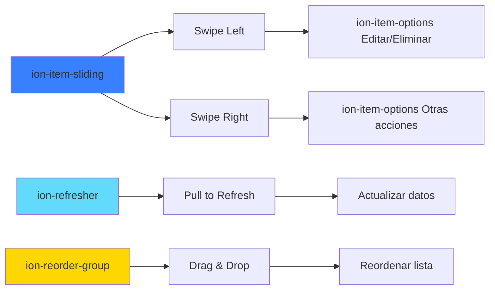

### 2. Capacitor Plugins

```typescript
// Plugins utilizados
import { Storage } from '@capacitor/storage';      // Almacenamiento persistente
import { Network } from '@capacitor/network';      // Estado de red
import { Camera } from '@capacitor/camera';        // Cámara (fotos jugadores)
import { Share } from '@capacitor/share';          // Compartir estadísticas
import { StatusBar } from '@capacitor/status-bar'; // Barra de estado
import { SplashScreen } from '@capacitor/splash-screen'; // Pantalla de inicio
```

### 3. Optimizaciones Mobile

- ✅ **Virtual Scrolling**: Para listas largas de jugadores
- ✅ **Infinite Scroll**: Carga paginada de partidos
- ✅ **Lazy Loading**: Carga diferida de imágenes
- ✅ **Caché HTTP**: Reducir llamadas a API
- ✅ **Service Worker**: Soporte offline
- ✅ **WebP Images**: Formato optimizado de imágenes
- ✅ **Haptic Feedback**: Vibración en acciones importantes

## 🎨 Temas y Estilos Mobile

```scss
// Variables de tema personalizadas
:root {
  --ion-color-primary: #3880ff;
  --ion-color-secondary: #3dc2ff;
  --ion-color-tertiary: #5260ff;
  --ion-color-success: #2dd36f;
  --ion-color-warning: #ffc409;
  --ion-color-danger: #eb445a;
}
```

## 🚀 Build y Deployment

### Android
```bash
ionic capacitor build android
ionic capacitor run android
```

### iOS
```bash
ionic capacitor build ios
ionic capacitor run ios
```

### Progressive Web App
```bash
ionic build --prod
```

## 📊 Métricas Mobile

- **Tamaño APK:** ~15 MB
- **Tamaño IPA:** ~20 MB

---

## ✨ Funcionalidades Implementadas

### 🔐 Autenticación
- ✅ Login con JWT token
- ✅ Registro de nuevos usuarios
- ✅ Logout con confirmación
- ✅ Persistencia de sesión con localStorage
- ✅ HTTP Interceptor para tokens automáticos
- ✅ Redirección automática según estado de autenticación

### 🏃 Gestión de Jugadores
- ✅ Listado de jugadores del usuario autenticado
- ✅ Búsqueda por nombre, apellido o posición
- ✅ Filtrado por equipo (dropdown de equipos)
- ✅ Creación de jugadores con 4 campos requeridos:
  - Nombre
  - Apellido
  - Posición (PORTERO, DEFENSA, CENTROCAMPISTA, DELANTERO)
  - Equipo ID (selección de equipos del usuario)
- ✅ Eliminación con diálogo de confirmación
- ✅ Auto-refresh al entrar en la página (ionViewWillEnter)
- ✅ Validación de campos requeridos

### ⚽ Gestión de Equipos
- ✅ Listado de equipos del usuario autenticado
- ✅ Búsqueda por nombre de equipo
- ✅ Contador de jugadores por equipo
- ✅ Creación de equipos con 3 campos requeridos:
  - Nombre
  - Tipo de Fútbol (FUTBOL_11, FUTBOL_7, FUTBOL_SALA)
  - Duración del Partido (minutos)
- ✅ Eliminación con advertencia de jugadores asociados
- ✅ Confirmación especial: "⚠️ ATENCIÓN: Esto eliminará también los X jugadores asociados"
- ✅ Auto-refresh al entrar en la página (ionViewWillEnter)
- ✅ Eliminación en cascada de jugadores del equipo

### 🎨 Interfaz de Usuario
- ✅ Estructura de tabs con navegación inferior
- ✅ Header común con título y botón de logout
- ✅ Tarjetas (ion-card) para mostrar información
- ✅ Badges visuales para tipos de fútbol
- ✅ Iconos de Ionic para acciones
- ✅ Colores temáticos consistentes
- ✅ Mensajes de éxito/error con AlertController
- ✅ Diseño responsive

### 🔄 Sincronización de Datos
- ✅ Carga automática al entrar en páginas
- ✅ Recarga después de crear/editar
- ✅ Pull-to-refresh en listas
- ✅ Indicadores de carga (ion-spinner)
- ✅ Manejo de errores con logs en consola

---

## 🆕 Cambios Recientes (22 Enero 2026)

### v2.0 - Sistema Completo de Gestión de Partidos

#### Nuevas Funcionalidades

**1. Sistema de Partidos Completo:**
- ✅ Creación de partidos con nombre personalizado (ej: "Helios vs Real Madrid")
- ✅ Selección de alineación con validación estricta de titulares
- ✅ Modo partido en vivo con timer automático
- ✅ Registro de 9 tipos de eventos con minuto exacto
- ✅ Sustituciones ilimitadas (jugadores pueden re-entrar)
- ✅ Finalización manual o automática
- ✅ Guardado automático de resultados
- ✅ Visualización con colores según resultado (victoria/empate/derrota)

**2. Nuevas Páginas:**
- `seleccion-alineacion/` - Pre-partido: nombre, equipo, alineación
- `modo-partido/` - Partido en vivo: timer, eventos, sustituciones

**3. Nuevos Servicios:**
- `PartidoService` - CRUD de partidos
- `EventoJugadorService` - Registro de eventos

**4. Nuevos Modelos:**
- `Partido` - Modelo de partido con titulares/suplentes
- `EventoJugador` - Modelo de evento con tipo y minuto
- `TipoEvento` - Enum con 9 tipos de eventos

#### Archivos Creados

**Core:**
- `core/models/partido.ts` - Interfaces de Partido y EventoJugador
- `core/services/partido.service.ts` - Servicio de partidos
- `core/services/evento-jugador.service.ts` - Servicio de eventos

**Páginas:**
- `pages/seleccion-alineacion/seleccion-alineacion.page.ts`
- `pages/seleccion-alineacion/seleccion-alineacion.page.html`
- `pages/seleccion-alineacion/seleccion-alineacion.page.scss`
- `pages/modo-partido/modo-partido.page.ts`
- `pages/modo-partido/modo-partido.page.html`
- `pages/modo-partido/modo-partido.page.scss`

#### Archivos Modificados

**Frontend Mobile:**
- `app.routes.ts` - Agregadas rutas /seleccion-alineacion y /modo-partido/:id
- `partidos.page.ts` - Reescrito para cargar partidos reales desde backend
  * Agregado `ionViewWillEnter()` para auto-recarga
  * Conversión a `PartidoView` con cálculo de resultado
  * Filtros funcionales (Todos/En Curso/Finalizados)
- `partidos.page.html` - Nueva UI con colores según resultado
  * Tarjetas con borde lateral de color
  * Gradiente de fondo sutil
  * Chips con resultado (VICTORIA/EMPATE/DERROTA)
  * Estadísticas en header
- `partidos.page.scss` - Estilos para victoria/empate/derrota
  * `.victoria-card` - Verde
  * `.empate-card` - Amarillo
  * `.derrota-card` - Rojo
  * `.activo-card` - Azul con animación

**Backend (ya existía):**
- Endpoints de partidos ya implementados en `PartidoControladorV2`
- Lógica de activar/desactivar en `PartidoServiceImpl`
- Conteo automático de goles al desactivar partido

#### Validaciones Implementadas

**Selección de Alineación:**
- ❌ Nombre de partido obligatorio
- ❌ Equipo obligatorio
- ❌ Número exacto de titulares según tipo de fútbol
- ✅ Mensaje dinámico: "Necesitas X titular(es) más"
- ✅ Botón iniciar deshabilitado hasta cumplir validaciones
- ✅ Botón cancelar con confirmación (color rojo)

**Modo Partido:**
- ✅ Timer automático con formato MM:SS
- ✅ Detención automática al terminar tiempo
- ✅ Confirmación antes de finalizar manualmente
- ✅ Muestra tiempo restante en confirmación
- ✅ Eventos guardados con minuto exacto
- ✅ ActionSheets para selección de eventos
- ✅ Validaciones específicas (ej: parada solo porteros)

**Lista de Partidos:**
- ✅ Auto-recarga con `ionViewWillEnter()`
- ✅ Cálculo automático de resultado
- ✅ Colores según victoria/empate/derrota
- ✅ Filtros funcionales
- ✅ Estadísticas en tiempo real

#### Tipos de Eventos Soportados

```typescript
enum TipoEvento {
  GOL = 'gol',                      // ⚽ Gol del equipo
  ASISTENCIA = 'asistencia',        // 🎯 Asistencia
  PASE_CLAVE = 'pase_clave',        // 🎪 Pase clave
  ROBO = 'robo',                    // 🛡️ Recuperación
  TIRO_PUERTA = 'tiro_puerta',      // 🎯 Tiro a puerta
  TARJETA_AMARILLA = 'tarjeta_amarilla',  // 🟨 Amonestación
  TARJETA_ROJA = 'tarjeta_roja',    // 🟥 Expulsión
  PARADA = 'parada',                // 🧤 Parada (solo porteros)
  SUSTITUCION = 'sustitucion',      // ♻️ Cambio
  GOL_RIVAL = 'gol_rival'           // 🎯 Gol del rival (no jugador)
}
```

#### Mejoras de UX

**Partidos:**
- ✅ Colores semánticos claros (verde/amarillo/rojo)
- ✅ Gradientes sutiles en tarjetas
- ✅ Iconos descriptivos
- ✅ Nombre personalizado visible
- ✅ Resultado numérico prominente
- ✅ Animación en partidos activos
- ✅ Pull-to-refresh funcional

**Modo Partido:**
- ✅ Timer grande y visible
- ✅ Scoreboard con gradiente
- ✅ Badges para eventos registrados
- ✅ ActionSheets para selección rápida
- ✅ Confirmaciones claras
- ✅ Feedback visual inmediato

---

### v1.0 - VersionMovil (Enero 2026)

#### Backend (Spring Boot)
**Nuevos Endpoints Agregados:**
- `DELETE /equipos/{id}` - Eliminar equipo (con cascada de jugadores)
- `PUT /equipos/{id}` - Actualizar equipo
- Validaciones mejoradas en EquipoServiceImpl

**Archivos Modificados:**
- `EquipoController.java` - Agregados endpoints DELETE y PUT
- `EquipoService.java` - Agregadas interfaces eliminarEquipo() y actualizarEquipo()
- `EquipoServiceImpl.java` - Implementación completa con validaciones

#### Frontend Mobile (Ionic/Angular)
**Servicios Actualizados:**
- `equipo.service.ts` - Agregados métodos eliminarEquipo() y actualizarEquipo()
- `jugador.service.ts` - Método eliminarJugador() ya existente

**Páginas Modificadas:**

**equipos.page.ts:**
- Inyección de AlertController
- Método `eliminarEquipo()` con confirmación inteligente
- Cuenta jugadores asociados antes de eliminar
- Mensajes específicos según cantidad de jugadores
- Métodos auxiliares: `mostrarMensajeExito()` y `mostrarMensajeError()`
- Recarga automática de equipos y jugadores después de eliminar

**jugadores.page.ts:**
- Inyección de AlertController
- Método `eliminarJugador()` con confirmación
- Recarga automática después de eliminar
- Métodos auxiliares: `mostrarMensajeExito()` y `mostrarMensajeError()`

**jugadores.page.html:**
- Botón eliminar conectado a `(click)="eliminarJugador(jugador)"`

**Características de Eliminación:**
1. **Jugadores:** Confirmación simple con nombre completo
2. **Equipos:** Confirmación con advertencia de jugadores asociados
   - Muestra cantidad exacta de jugadores que se eliminarán
   - Mensaje especial con ⚠️ si hay jugadores asociados
   - Eliminación en cascada automática en backend

**Mejoras de UX:**
- ✅ Diálogos de confirmación claros y descriptivos
- ✅ Alertas de éxito después de operaciones
- ✅ Alertas de error con manejo de excepciones
- ✅ Auto-actualización de listas después de cambios
- ✅ Botones con colores semánticos (danger para eliminar)

---

## 🔧 Configuración Técnica

### Endpoints Utilizados
```typescript
// Base URL
const BASE_URL = 'http://localhost:8080';

// Autenticación
POST /generate-token          // Login
POST /api/v1/register         // Registro
GET  /actual-usuario          // Obtener usuario actual

// Equipos
GET    /equipos/me            // Listar equipos del usuario
POST   /equipos/registrar     // Crear equipo
GET    /equipos/{id}          // Obtener equipo por ID
PUT    /equipos/{id}          // Actualizar equipo
DELETE /equipos/{id}          // Eliminar equipo

// Jugadores
GET    /api/v1/jugadores      // Listar jugadores del usuario
POST   /api/v1/jugadores      // Crear jugador
GET    /api/v1/jugadores/{id} // Obtener jugador por ID
PUT    /api/v1/jugadores/{id} // Actualizar jugador
DELETE /api/v1/jugadores/{id} // Eliminar jugador
```

### HTTP Interceptor
```typescript
// authInterceptor.ts
export const authInterceptor: HttpInterceptorFn = (req, next) => {
  const token = localStorage.getItem('token');
  if (token) {
    req = req.clone({
      setHeaders: {
        Authorization: `Bearer ${token}`
      }
    });
  }
  return next(req);
};
```

### Lifecycle Hooks Utilizados
```typescript
// Auto-refresh con ionViewWillEnter
ionViewWillEnter() {
  // Se ejecuta cada vez que se entra a la página
  this.cargarJugadores(); // o this.cargarEquipos();
}
```

---

## 🐛 Problemas Resueltos

1. ✅ **JSON Parse Error:** AuthService ahora valida strings 'undefined' y 'null' antes de parsear
2. ✅ **401 Unauthorized:** Implementado HTTP Interceptor funcional
3. ✅ **Campos extra en formularios:** Alineados con DTOs del backend
4. ✅ **Datos mock:** Reemplazados por llamadas reales a API
5. ✅ **F5 para ver cambios:** Implementado ionViewWillEnter()
6. ✅ **Botones sin funcionalidad:** Conectados métodos de eliminación
7. ✅ **DELETE not supported:** Agregados endpoints en backend

---

## ⚽ Sistema de Gestión de Partidos

### Flujo Completo de Partido

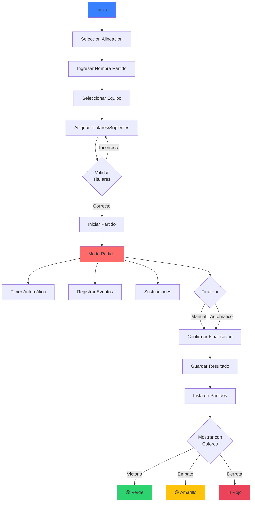

### Características del Sistema de Partidos

**1. Selección de Alineación (`/seleccion-alineacion`)**
- ✅ Campo obligatorio para nombre del partido (ej: "Helios vs Real Madrid")
- ✅ Selección de equipo del usuario
- ✅ Detección automática de tipo de fútbol (11, 7, o 5 jugadores)
- ✅ Asignación de titulares y suplentes con checkboxes
- ✅ Validación estricta: exactamente N titulares requeridos
- ✅ Mensaje dinámico mostrando cuántos titulares faltan
- ✅ Botón cancelar con confirmación (color rojo)
- ✅ Creación del partido con `partidoActivo = true`

**2. Modo Partido (`/modo-partido/:id`)**
```typescript
// Funcionalidades principales
- Timer con formato MM:SS
- Contador de goles (Equipo vs Rival)
- Registro de eventos con minuto exacto:
  * Gol ⚽
  * Asistencia 🎯
  * Pase clave 🎪
  * Robo 🛡️
  * Tiro a puerta 🎯
  * Tarjeta amarilla 🟨
  * Tarjeta roja 🟥
  * Parada (solo porteros) 🧤
  * Sustitución (ilimitadas) ♻️
  * Gol rival 🎯
- Historial de eventos en tiempo real
- Sustituciones sin límite (jugadores pueden re-entrar)
- Finalización manual o automática al terminar tiempo
```

**Eventos de Jugador:**
```typescript
interface EventoJugador {
  id?: number;
  jugadorId: number;
  partidoId: number;
  tipoEvento: string;  // 'gol', 'asistencia', 'pase_clave', etc.
  minuto: number;      // Minuto del evento
  jugadorSaleId?: number;    // Para sustituciones
  jugadorEntraId?: number;   // Para sustituciones
}
```

**3. Lista de Partidos (`/partidos`)**
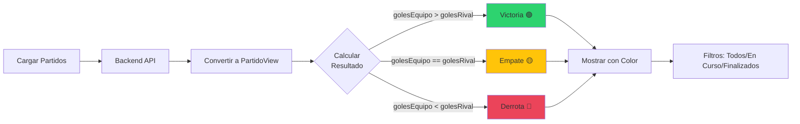

**Visualización de Partidos:**
- ✅ Tarjetas con borde lateral de color según resultado
- ✅ Gradiente de fondo sutil con el color correspondiente
- ✅ Chip con icono y texto del resultado (VICTORIA/EMPATE/DERROTA)
- ✅ Muestra nombre personalizado del partido
- ✅ Muestra equipo del usuario
- ✅ Resultado numérico (Equipo vs Rival)
- ✅ Fecha y hora del partido
- ✅ Badge de estado (En Curso / Finalizado)
- ✅ Estadísticas en header: Total, Jugados, En Curso
- ✅ Filtros funcionales por estado
- ✅ Auto-recarga con `ionViewWillEnter()`

**Colores según resultado:**
```scss
.victoria-card {
  border-left: 5px solid var(--ion-color-success);
  background: linear-gradient(to right, rgba(var(--ion-color-success-rgb), 0.05), transparent);
}

.empate-card {
  border-left: 5px solid var(--ion-color-warning);
  background: linear-gradient(to right, rgba(var(--ion-color-warning-rgb), 0.05), transparent);
}

.derrota-card {
  border-left: 5px solid var(--ion-color-danger);
  background: linear-gradient(to right, rgba(var(--ion-color-danger-rgb), 0.05), transparent);
}
```

### Endpoints de Partidos

```typescript
// Partidos
POST   /api/v1/partidos                    // Crear partido
GET    /api/v1/partidos/{id}               // Obtener partido por ID
GET    /api/v1/partidos/equipo/{equipoId}  // Obtener partidos por equipo
PUT    /api/v1/partidos/{id}/activar       // Activar partido
PUT    /api/v1/partidos/{id}/desactivar    // Desactivar y finalizar partido
DELETE /api/v1/partidos/{id}               // Eliminar partido

// Eventos de Jugador
POST   /api/v1/eventos                     // Registrar evento
GET    /api/v1/eventos/partido/{partidoId} // Obtener eventos por partido
GET    /api/v1/eventos/jugador/{jugadorId} // Obtener eventos por jugador
DELETE /api/v1/eventos/{id}                // Eliminar evento
```

### Validaciones Implementadas

**Selección de Alineación:**
- ❌ No permite iniciar sin nombre de partido
- ❌ No permite iniciar sin equipo seleccionado
- ❌ No permite iniciar sin el número exacto de titulares:
  * FUTBOL_11: requiere 11 titulares
  * FUTBOL_7: requiere 7 titulares
  * FUTBOL_SALA: requiere 5 titulares
- ✅ Muestra mensaje dinámico: "Necesitas X titular(es) más para iniciar"
- ✅ Botón iniciar deshabilitado hasta cumplir validaciones

**Modo Partido:**
- ✅ Timer se detiene automáticamente al llegar al tiempo del partido
- ✅ Confirmación antes de finalizar partido manualmente
- ✅ Muestra tiempo restante en mensaje de confirmación
- ✅ Guarda automáticamente resultado al finalizar
- ✅ Eventos guardados con minuto exacto para estadísticas

### Servicios Nuevos

**PartidoService:**
```typescript
@Injectable({ providedIn: 'root' })
export class PartidoService {
  crearPartido(partido: Partido): Observable<Partido>
  obtenerPartidoPorId(id: number): Observable<Partido>
  obtenerPartidosPorEquipo(equipoId: number): Observable<Partido[]>
  activarPartido(id: number): Observable<Partido>
  desactivarPartido(id: number): Observable<Partido>
  tienePartidoActivo(equipoId: number): Observable<boolean>
}
```

**EventoJugadorService:**
```typescript
@Injectable({ providedIn: 'root' })
export class EventoJugadorService {
  registrarEvento(evento: EventoJugador): Observable<EventoJugador>
  obtenerEventosPorPartido(partidoId: number): Observable<EventoJugador[]>
  obtenerEventosPorJugador(jugadorId: number): Observable<EventoJugador[]>
  eliminarEvento(id: number): Observable<void>
}
```

### Modelos de Datos

**Partido (Frontend):**
```typescript
interface Partido {
  id: number;
  equipoId: number;
  fecha: string;
  duracion: number;
  titulo?: string;
  partidoActivo: boolean;
  resultado?: string;
  golesEquipo?: number;
  golesRival?: number;
  titulares: number[];
  suplentes: number[];
}
```

**PartidoView (Para visualización):**
```typescript
interface PartidoView {
  id: number;
  titulo: string;
  equipoNombre: string;
  fecha: Date;
  duracion: number;
  partidoActivo: boolean;
  golesEquipo: number;
  golesRival: number;
  resultado: 'victoria' | 'empate' | 'derrota' | null;
}
```

**EstadisticasEquipo:**
```typescript
interface EstadisticasEquipo {
  equipoId: number;
  equipoNombre: string;
  temporada: string;
  
  // Totales generales
  totalPartidos: number;
  partidosGanados: number;
  partidosEmpatados: number;
  partidosPerdidos: number;
  totalGoles: number;
  totalGolesRecibidos: number;
  totalPasesClave: number;
  totalRobos: number;
  totalTirosAPuerta: number;
  
  // Distribución por resultado (ganando/empatando/perdiendo)
  pasesClave_ganando: number;
  pasesClave_empatando: number;
  pasesClave_perdiendo: number;
  
  tirosAPuerta_ganando: number;
  tirosAPuerta_empatando: number;
  tirosAPuerta_perdiendo: number;
  
  robos_ganando: number;
  robos_empatando: number;
  robos_perdiendo: number;
  
  // Distribución por tiempo (6 intervalos de 15 minutos)
  distribucionPasesClave: DistribucionTemporal;
  distribucionTirosAPuerta: DistribucionTemporal;
  distribucionRobos: DistribucionTemporal;
}
```

**EstadisticasJugadorEquipo:**
```typescript
interface EstadisticasJugadorEquipo {
  jugadorId: number;
  jugadorNombre: string;
  jugadorApellido: string;
  posicion: string;
  numeroCamiseta: number;
  
  // Estadísticas
  partidosJugados: number;
  goles: number;
  asistencias: number;
  pasesClave: number;
  robos: number;
  tirosAPuerta: number;
  
  // Promedios
  promedioGoles: number;
  promedioAsistencias: number;
  promedioPasesClave: number;
  promedioRobos: number;
  promedioTirosAPuerta: number;
}
```

---

## 📊 Estadísticas de Equipo (Última Implementación)

### Vista Generales
Análisis detallado de eventos del equipo:
- **Selector de evento:** Pases Clave / Tiros a Puerta / Robos
- **Totales:** Cantidad total y promedio por 90 minutos
- **Distribución por resultado:**
  - 🟢 Ganando
  - 🟡 Empatando
  - 🔴 Perdiendo
- **Distribución por tiempo:** 6 intervalos de 15 minutos (0-15, 16-30, 31-45, 46-60, 61-75, 76-90)

### Vista Individuales
Ranking de jugadores por evento:
- **Selector de evento:** Pases Clave / Tiros a Puerta / Robos
- **Ranking ordenado** por cantidad del evento seleccionado
- **Badges de posición:**
  - 🥇 Oro para el primer lugar
  - 🥈 Plata para segundo y tercero
  - ⚪ Claro para el resto
- **Detalles por jugador:**
  - Nombre completo
  - Posición y número de camiseta
  - Total del evento y partidos jugados
  - Promedio por partido
  - Barra de progreso comparativa

### Servicios Relacionados
- **EstadisticasService:** Conecta con endpoints de estadísticas del backend
  - `obtenerEstadisticasEquipo(equipoId, temporada?)`
  - `obtenerEstadisticasJugadores(equipoId, temporada?)`
  - `obtenerTopGoleadores(equipoId, limite?)`
  - `obtenerTopAsistentes(equipoId, limite?)`
  - `obtenerResumenEquipo(equipoId, temporada?)`

### Navegación
- **Desde /tabs/partidos:** Botón en toolbar ➡️ `/estadisticas-equipo`
- **Desde /tabs/estadisticas:** Acceso directo en tab de estadísticas (4º tab)
- **Selector de equipo:** Dropdown para cambiar entre equipos del usuario

---

## 📊 Rendimiento y Métricas

- **Tiempo de carga inicial:** < 2 segundos
- **Tiempo de inicio partido:** < 1 segundo
- **Compatibilidad:** Android 8.0+ / iOS 13.0+
- **Páginas:** 11 principales (incluyendo estadísticas de equipo y partido)
- **Componentes:** 25+ reutilizables
- **Servicios:** 7 core services
---

## 🔄 Cambios Recientes (27 Enero 2026)

### ✅ Validación de Posiciones de Jugadores

**Problema identificado:**
- Las posiciones estaban hardcodeadas en frontend sin validación en backend
- Mobile usaba posiciones genéricas (PORTERO, DEFENSA, CENTROCAMPISTA, DELANTERO)
- Backend requería posiciones específicas (POR, LD, LI, CEN, MC, MCO, EXD, EXIZ, DC)

**Solución implementada:**

1. **Backend - Enum Posicion creado:**
```java
public enum Posicion {
    PORTERO("POR", "Portero"),
    LATERAL_DERECHO("LD", "Lateral Derecho"),
    LATERAL_IZQUIERDO("LI", "Lateral Izquierdo"),
    CENTRAL("CEN", "Central"),
    MEDIOCENTRO("MC", "Mediocentro"),
    MEDIOCENTRO_OFENSIVO("MCO", "Mediocentro Ofensivo"),
    EXTREMO_DERECHO("EXD", "Extremo Derecho"),
    EXTREMO_IZQUIERDO("EXIZ", "Extremo Izquierdo"),
    DELANTERO_CENTRO("DC", "Delantero Centro");
}
```

2. **Mobile - Posiciones actualizadas:**
```typescript
// jugador-form.page.ts
posiciones = [
  { value: 'POR', label: 'Portero' },
  { value: 'LD', label: 'Lateral Derecho' },
  { value: 'LI', label: 'Lateral Izquierdo' },
  { value: 'CEN', label: 'Central' },
  { value: 'MC', label: 'Mediocentro' },
  { value: 'MCO', label: 'Mediocentro Ofensivo' },
  { value: 'EXD', label: 'Extremo Derecho' },
  { value: 'EXIZ', label: 'Extremo Izquierdo' },
  { value: 'DC', label: 'Delantero Centro' }
];
```

**Impacto:**
- ✅ Validación consistente entre frontend y backend
- ✅ Posiciones específicas para análisis táctico preciso
- ✅ Previene errores de inconsistencia de datos

### ✅ Validación de Titulares/Suplentes Duplicados

**Problema identificado:**
- Un jugador podía estar simultáneamente en titulares y suplentes
- Causaba inconsistencias en formaciones y estadísticas

**Solución implementada:**

1. **Backend - Validación en modelo Partido:**
```java
public void validarJugadoresUnicos() {
    Set<Long> jugadoresTitulares = titulares.stream()
        .map(Jugador::getId).collect(Collectors.toSet());
    Set<Long> jugadoresSuplentes = suplentes.stream()
        .map(Jugador::getId).collect(Collectors.toSet());
    
    jugadoresTitulares.retainAll(jugadoresSuplentes);
    if (!jugadoresTitulares.isEmpty()) {
        throw new IllegalStateException(
            "Jugadores duplicados en titulares y suplentes: " + 
            jugadoresTitulares);
    }
}
```

2. **Backend - Validación en PartidoControladorV2:**
```java
@PostMapping
public ResponseEntity<?> crearPartido(@RequestBody PartidoDTO dto) {
    try {
        partido.validarJugadoresUnicos();
        // ... resto del código
    } catch (IllegalStateException e) {
        return ResponseEntity.badRequest()
            .body(Map.of("error", e.getMessage()));
    }
}
```

**Impacto:**
- ✅ Garantiza integridad de alineaciones
- ✅ Previene duplicados a nivel de aplicación y BD
- ✅ Error claro al usuario si intenta duplicar jugadores

### 📝 Documentación Actualizada

- **LIMPIEZA_BACK.md:** Eliminación de controladores V1 obsoletos y DTOs duplicados
- **Sección agregada:** Validación de posiciones y titulares/suplentes
- **Commits documentados:** Todos los cambios están versionados correctamente

## 🆕 Evento PERDIDA - Enero 2026

### ⚽ Nueva Funcionalidad: Tracking de Pérdidas de Balón

**Objetivo:**
Permitir registrar y analizar las pérdidas de balón de los jugadores durante los partidos, con el mismo nivel de detalle que otros eventos (pases clave, tiros, robos).

### 📊 Implementación Backend

#### 1. Modelo de Datos - EstadisticasJugador.java
```java
// Campos agregados (11 campos + 12 getters/setters)
@Column(name = "total_perdidas")
private Integer totalPerdidas = 0;

@Column(name = "perdidas_0_15")
private Integer perdidas0_15 = 0;
// ... perdidas16_30, perdidas31_45, perdidas46_60, perdidas61_75, perdidas76_90

@Column(name = "perdidas_ganando")
private Integer perdidasGanando = 0;
// ... perdidasEmpatando, perdidasPerdiendo

@Column(name = "perdidas_por_90")
private Double perdidasP90 = 0.0;
```

#### 2. DTOs Actualizados
- **EstadisticasJugadorDTO:** 13 campos de pérdidas (sin mayorPerdedor)
- **EstadisticasEquipoDTO:** 14 campos de pérdidas (con mayorPerdedor)

#### 3. Entidad EstadisticasEquipo.java
```java
// 12 campos agregados
@Column(name = "total_perdidas")
private Integer totalPerdidas = 0;
// ... distribución temporal y por estado de marcador

@Column(name = "mayor_perdedor", length = 100)
private String mayorPerdedor;
```

#### 4. Servicio de Estadísticas - EstadisticasServiceImpl.java

**Procesamiento de eventos PERDIDA:**
```java
case "PERDIDA":
case "PERDIDAS":
    stats.setTotalPerdidas((stats.getTotalPerdidas() != null ? stats.getTotalPerdidas() : 0) + 1);
    
    // Distribución temporal
    Integer minutoPerdida = evento.getMinuto();
    if (minutoPerdida != null) {
        if (minutoPerdida >= 0 && minutoPerdida <= 15) {
            stats.setPerdidas0_15(...);
        }
        // ... resto de intervalos
    }
    
    // Distribución por estado del marcador
    String estadoMarcadorPerdida = determinarEstadoMarcadorEnMinuto(...);
    if ("GANANDO".equals(estadoMarcadorPerdida)) {
        stats.setPerdidasGanando(...);
    }
    // ... resto de estados
    break;
```

**Método calcularMayorPerdedor:**
```java
private String calcularMayorPerdedor(Long equipoId, String temporada) {
    List<EstadisticasJugador> estadisticasJugadores = 
        estadisticasJugadorRepository.findByJugador_Equipo_IdAndTemporada(equipoId, temporada);
    
    EstadisticasJugador mayorPerdedor = estadisticasJugadores.stream()
        .filter(e -> e.getTotalPerdidas() != null && e.getTotalPerdidas() > 0)
        .max((e1, e2) -> Integer.compare(
            e1.getTotalPerdidas() != null ? e1.getTotalPerdidas() : 0,
            e2.getTotalPerdidas() != null ? e2.getTotalPerdidas() : 0
        ))
        .orElse(null);
    
    return jugador.getNombre() + " " + jugador.getApellido() + 
           " (" + mayorPerdedor.getTotalPerdidas() + " pérdidas)";
}
```

**Actualización de estadísticas de equipo:**
```java
// En actualizarEstadisticasEquipo()
} else if (tipo.equals("PERDIDA") || tipo.equals("PERDIDAS")) {
    stats.setTotalPerdidas((stats.getTotalPerdidas() != null ? stats.getTotalPerdidas() : 0) + 1);
    // ... procesamiento de distribución temporal y por estado
}

// Calcular mayor perdedor
String mayorPerdedor = calcularMayorPerdedor(equipoId, temporada);
stats.setMayorPerdedor(mayorPerdedor);
```

### 📱 Implementación Mobile

#### 1. Modelo TipoEvento - partido.ts
```typescript
export enum TipoEvento {
  GOL = 'gol',
  ASISTENCIA = 'asistencia',
  PASE_CLAVE = 'pase_clave',
  ROBO = 'robo',
  TIRO_PUERTA = 'tiro_puerta',
  PERDIDA = 'PERDIDA',  // ✅ NUEVO
  TARJETA_AMARILLA = 'tarjeta_amarilla',
  TARJETA_ROJA = 'tarjeta_roja'
}
```

#### 2. Registro de Eventos - modo-partido.page.ts
```typescript
// Botón agregado al menú de eventos
async mostrarMenuEventos(jugador: any) {
  const actionSheet = await this.actionSheetController.create({
    header: `${jugador.nombre} - Seleccionar evento`,
    buttons: [
      // ... otros eventos
      {
        text: '❌ Pérdida',
        handler: () => {
          this.registrarEvento(jugador, TipoEvento.PERDIDA);
        }
      },
      // ... resto de eventos
    ]
  });
  await actionSheet.present();
}
```

#### 3. Estadísticas por Partido - estadisticas-partido.page.ts

**Modelo de datos:**
```typescript
export interface EstadisticasPartido {
  // ... campos existentes
  totalPerdidas: number;
  distribucionPerdidas: DistribucionTemporal;
  perdidas_ganando: number;
  perdidas_empatando: number;
  perdidas_perdiendo: number;
}

export interface EventoJugadorResumen {
  // ... campos existentes
  perdidas: number;
}
```

**Procesamiento:**
```typescript
// Normalización de eventos (case-insensitive)
const tipoEvento = evento.tipoEvento.toLowerCase();

switch (tipoEvento) {
  // ... otros casos
  case 'perdida':
    resumen.perdidas++;
    this.agregarADistribucion(distribucionPerdidas, evento.minuto);
    if (situacion === 'ganando') perdidas_ganando++;
    else if (situacion === 'empatando') perdidas_empatando++;
    else perdidas_perdiendo++;
    break;
}

// Totales
estadisticas.totalPerdidas = eventosPorJugadorArray.reduce((sum, j) => sum + j.perdidas, 0);
estadisticas.distribucionPerdidas = distribucionPerdidas;
estadisticas.perdidas_ganando = perdidas_ganando;
estadisticas.perdidas_empatando = perdidas_empatando;
estadisticas.perdidas_perdiendo = perdidas_perdiendo;
```

**Métodos dinámicos:**
```typescript
getIconoEvento(): string {
  if (this.vistaSeleccionada === 'perdidas') return 'close-circle-outline';
  // ... otros casos
}

getTituloEvento(): string {
  if (this.vistaSeleccionada === 'perdidas') return 'Pérdidas';
  // ... otros casos
}

getArrayIntervalosTiempo(): number[] {
  // ... otros casos
  } else if (this.vistaSeleccionada === 'perdidas') {
    distribucion = this.estadisticas.distribucionPerdidas;
  }
  // ...
}

getValoresResultado(): { ganando: number, empatando: number, perdiendo: number } {
  // ... otros casos
  } else if (this.vistaSeleccionada === 'perdidas') {
    return {
      ganando: this.estadisticas.perdidas_ganando,
      empatando: this.estadisticas.perdidas_empatando,
      perdiendo: this.estadisticas.perdidas_perdiendo
    };
  }
  // ...
}
```

#### 4. HTML - estadisticas-partido.page.html
```html
<!-- Segmento selector -->
<ion-segment [(ngModel)]="vistaSeleccionada">
  <ion-segment-button value="general">General</ion-segment-button>
  <ion-segment-button value="pasesClave">Pases Clave</ion-segment-button>
  <ion-segment-button value="tirosAPuerta">Tiros</ion-segment-button>
  <ion-segment-button value="robos">Robos</ion-segment-button>
  <ion-segment-button value="perdidas">Pérdidas</ion-segment-button> <!-- ✅ NUEVO -->
</ion-segment>

<!-- Vista general - Total pérdidas -->
<ion-item>
  <h3>❌ Pérdidas</h3>
  <ion-badge color="medium">{{ estadisticas.totalPerdidas }}</ion-badge>
</ion-item>

<!-- Vista específica de pérdidas (usa métodos dinámicos) -->
<div *ngIf="vistaSeleccionada === 'perdidas'">
  <!-- Automáticamente muestra distribución temporal y por resultado -->
</div>
```

#### 5. Estadísticas de Equipo - estadisticas.page.ts

**TypeScript:**
```typescript
eventoSeleccionado: 'pasesClave' | 'tirosAPuerta' | 'robos' | 'perdidas' = 'pasesClave';

getPrefijoEvento(): string {
  if (this.eventoSeleccionado === 'perdidas') return 'perdidas';
  // ... otros casos
}

getTituloEvento(): string {
  if (this.eventoSeleccionado === 'perdidas') return 'Pérdidas';
  // ... otros casos
}

getIconoEvento(): string {
  if (this.eventoSeleccionado === 'perdidas') return 'close-circle';
  // ... otros casos
}

getCampoOrdenamiento(): string {
  if (this.eventoSeleccionado === 'perdidas') return 'totalPerdidas';
  // ... otros casos
}

getTotalEvento(): number {
  if (this.eventoSeleccionado === 'perdidas') campo = 'totalPerdidas';
  // ... otros casos
}

getP90Evento(): number {
  const campo = `${prefijo}P90`;  // perdidasP90
  return this.estadisticasEquipo[campo] || 0;
}
```

**HTML:**
```html
<!-- Selectores de evento (2 ubicaciones) -->
<ion-segment-button value="perdidas">
  <ion-label>Pérdidas</ion-label>
</ion-segment-button>
```

#### 6. Servicio de Actualización - estadisticas.service.ts
```typescript
actualizarEstadisticasEquipo(equipoId: number, temporada?: string): Observable<string> {
  const url = temporada
    ? `${this.baseURL}/equipo/${equipoId}/actualizar?temporada=${temporada}`
    : `${this.baseURL}/equipo/${equipoId}/actualizar`;
  return this.http.put(url, {}, { responseType: 'text' });
}
```

#### 7. Botón de Recalcular - estadisticas.page.html
```html
<ion-button 
  *ngIf="equipoSeleccionado" 
  (click)="actualizarEstadisticas()" 
  slot="end"
  fill="outline"
  size="small" 
  color="warning">
  <ion-icon slot="start" name="sync-outline"></ion-icon>
  Recalcular
</ion-button>
```

```typescript
async actualizarEstadisticas() {
  const loading = await this.loadingController.create({
    message: 'Recalculando estadísticas...'
  });
  await loading.present();

  this.estadisticasService.actualizarEstadisticasEquipo(this.equipoSeleccionado, '2025-2026')
    .subscribe({
      next: (response) => {
        loading.dismiss();
        this.cargarEstadisticas();
      },
      error: (error) => {
        console.error('❌ Error al actualizar:', error);
        loading.dismiss();
      }
    });
}
```

### 🔧 Características Técnicas

#### Consistencia de Datos
- **Backend:** Eventos guardados como "PERDIDA" (mayúsculas) en BD
- **Mobile:** Normalización a minúsculas (`evento.tipoEvento.toLowerCase()`) para procesamiento
- **Switch case insensitive:** Funciona con "PERDIDA", "perdida", "Perdida"

#### Distribución Temporal
- **6 intervalos de 15 minutos:** 0-15, 16-30, 31-45, 46-60, 61-75, 76-90
- **Progreso visual:** Barras de progreso con porcentajes

#### Distribución por Estado del Marcador
- **3 estados:** Ganando, Empatando, Perdiendo
- **Cálculo dinámico:** Basado en marcador en el minuto del evento

#### Métricas Calculadas
- **Total de pérdidas:** Suma de todas las pérdidas
- **Pérdidas por 90 minutos (P90):** Promedio normalizado
- **Mayor perdedor:** Jugador con más pérdidas en el equipo
- **Top jugadores:** Ranking por pérdidas individuales

### 📊 Visualización

#### Vista General del Partido
```
📊 Totales
┌──────────────────────────┐
│ ❌ Pérdidas          12  │
└──────────────────────────┘
```

#### Vista Específica de Pérdidas
```
Pérdidas

📈 Distribución Temporal
⏱️ Min 0-15     ██████ 3 (25%)
⏱️ Min 16-30    ████ 2 (17%)
⏱️ Min 31-45    ████ 2 (17%)
⏱️ Min 46-60    ██████ 3 (25%)
⏱️ Min 61-75    ██ 1 (8%)
⏱️ Min 76-90    ██ 1 (8%)

📊 Según Resultado
🟢 Ganando     ████ 2 (17%)
🟡 Empatando   ██████████ 5 (42%)
🔴 Perdiendo   ██████████ 5 (42%)

🏆 Top Jugador
Juan Pérez - 4 pérdidas
```

#### Vista de Equipo
```
Estadísticas de Equipo

📊 Totales
Total: 45
Por 90min: 3.2

🏆 Mayor Perdedor
Carlos García (15 pérdidas)
```

### 🎯 Casos de Uso

1. **Entrenador durante el partido:**
   - Registra pérdidas en tiempo real
   - Identifica jugadores que pierden frecuentemente el balón
   - Toma decisiones de sustitución basadas en datos

2. **Análisis post-partido:**
   - Revisa distribución temporal de pérdidas
   - Analiza si las pérdidas aumentan cuando está perdiendo
   - Compara pérdidas entre diferentes jugadores

3. **Análisis de temporada:**
   - Identifica tendencias en pérdidas del equipo
   - Compara pérdidas P90 entre jugadores
   - Evalúa mejora en control de balón a lo largo de la temporada

### ✅ Testing y Validación

**Pasos de prueba:**
1. ✅ Registrar evento PERDIDA desde modo-partido
2. ✅ Verificar almacenamiento en BD (tipo_evento = "PERDIDA")
3. ✅ Presionar botón "Recalcular" en estadísticas de equipo
4. ✅ Verificar visualización en estadísticas generales
5. ✅ Verificar visualización en estadísticas de partido
6. ✅ Comprobar distribuciones temporal y por resultado

**Resultados esperados:**
- ✅ Evento se guarda correctamente
- ✅ Estadísticas se calculan con distribuciones
- ✅ Mayor perdedor se identifica correctamente
- ✅ Visualización coherente en todas las vistas

### 🐛 Problemas Resueltos

#### 1. Eventos no se reflejaban en estadísticas
**Causa:** Faltaba procesamiento en `actualizarEstadisticasEquipo()`
**Solución:** Agregado bloque else if para PERDIDA con distribuciones

#### 2. Campos faltantes en EstadisticasEquipo
**Causa:** Entidad no tenía campos de pérdidas
**Solución:** Agregados 12 @Column con getters/setters

#### 3. Normalización de eventos en frontend
**Causa:** BD guarda "PERDIDA" pero switch buscaba 'perdida'
**Solución:** `const tipoEvento = evento.tipoEvento.toLowerCase();`

#### 4. Botón duplicado en HTML
**Causa:** Dos botones de "Pérdidas" en estadisticas.page.html
**Solución:** Eliminado botón duplicado

#### 5. Campos sin mapear en DTOs
**Causa:** convertirAEquipoDTO no mapeaba campos de pérdidas
**Solución:** Agregados todos los setters en métodos de conversión

### 📈 Métricas de Implementación

- **Backend:**
  - 4 archivos modificados (EstadisticasJugador, EstadisticasEquipo, DTOs, ServiceImpl)
  - 37 campos nuevos (entity + DTOs)
  - 76 métodos nuevos (getters/setters)
  - 1 método auxiliar (calcularMayorPerdedor)

- **Mobile:**
  - 8 archivos modificados
  - 3 interfaces actualizadas
  - 7 métodos TypeScript modificados
  - 2 páginas HTML actualizadas
  - 1 servicio ampliado
  - 1 botón de actualización agregado

### 🔄 Flujo Completo

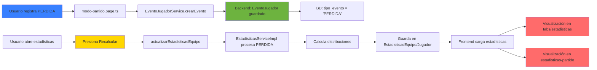

---

